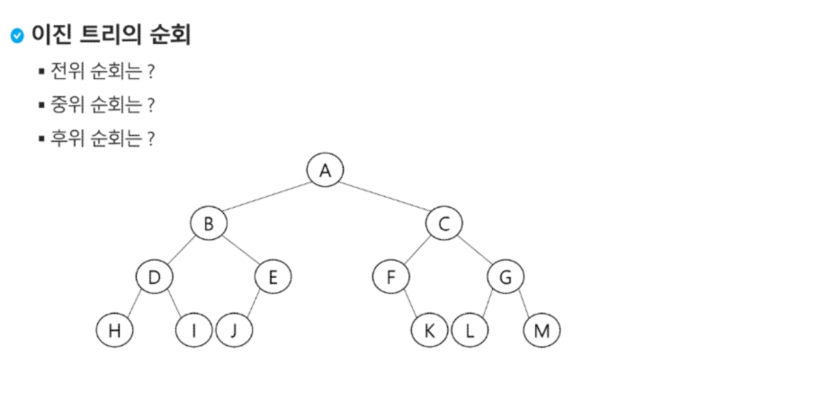
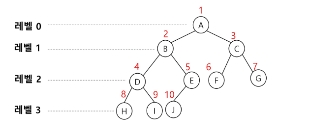

# Tree
2023.08.21(Mon) ~ 2023.08.22(Tue)

-----

## 트리
### 트리의 개념 
- 비 선형 구조
- 원소들 간에 1:n 관계를 가지는 자료구조
- 원소들 간에 계층관계를 가지는 계층형 자료구조
- 상위 원소에서 하위 원소로 내려가면서 확장되는 트리(나무)모양의 구조

### 트리의 정의
한 개 이상의 노드로 이루어진 유한 집합이며 다음 조건을 만족한다
- 노드 중 최상위 노드를 루트라 한다
- 나머지 노드들은 n(>= 0)개의 분리 집합 T1,..,TN으로 분리될 수 있다.
- 이들 T1, ... , TN은 각각 하나의 트리가 되며(재귀적 정의) 루트의 부트리(subtree)라 한다.

### 용어 정리
- 노드 : 트리의 원소
- 간선(edge): 노드를 연결하는 선, 부모 노드와 자식 노드를 연결
- root node : 트리의 시작 노드
- sibling node : 같은 부모 노드의 자식 노드들
- 조상 노드 : 간선을 따라 루트 노드까지 이르는 경로에 있는 모든 노드들
- subtree : 부모 노드와 연결된 간선을 끊었을 때 생성되는 트리
- 자손 노드 : 서브 트리에 있는 하위 레벨의 노드들
- 차수(degree)
  - 노드의 차수 : 노드에 연결된 자식 노드의 수
  - 트리의 차수 : 트리에 있는 노드의 차수 중 가장 큰 값
  - 단말 노드(leaf node) : 차수가 0인 노드, 자식 노드가 없는 노드 
- 높이 
  - 노드의 높이 : 루트에서 노드에 이르는 간선의 수, 노드의 레벨
  - 트리의 높이 : 트리에 있는 노드의 높이 중에서 가장 큰 값. 최대 레벨

## 이진 트리
각 노드가 자식 노드를 최대 2개 까지만 가질 수 있는 트리
- 왼쪽 자식 노드(left child node)와 오른쪽 자식 노드(right child node)
### 이진 트리의 특성
- 레벨 i에서 노드의 최대 개수는 2<sup>i</sup>개
- 높이가 h인 이진 트리가 가질 수 있는 노드의 최소 개수는 (h+1)개가 되며, 최대 개수는 (2<sup>h+1</sup> - 1)개가 된다.
### 이진 트리의 종류
- 포화 이진 트리(Full Binary Tree)
  - 모든 레벨에 노드가 포호상태로 차 있는 이진 트리
  - 높이가 h일 때, 최대의 노드 개수인 (2<sup>h+1</sup> - 1)의 노드를 가진 이진 트리
  - 루트를 1번으로 하여 (2<sup>h+1</sup> - 1)까지 정해진 위치에 대한 노드 번호를 가짐
- 완전 이진 트리(Complete Binary Tree)
  - 높이가 h이고 노드 수가 n개 일때 (단, 2<sup>h</sup> <= n <= 2<sup>h+1</sup>-1 ), 포화 이진 트리의 노드 번호 1번부터 n 번 까지 빈 자리가 없는 이진 트리

- 편향 이진 트리(Skewed Binary Tree)
  - 높이 h에 대한 최소 개수의 노드를 가지면서 한쪽 방향의 자식 노드만을 가진 이진 트리

### 이진 트리 - 순회
**순회(traversal)** 란 트리의 **각 노드를 중복되지 않게 전부 방문(visit)하는 것** 을 말하는데 트리는 **비선형 구조** 이기 때문에 선형구조에서와 같이 선후 연결 관계를 알 수 없다. 
- 3가지 기본적인 순회 방법
  - 전위순회(preorder traversal) : VLR
    - 부모 노드 방문 후, 자식 노드를 좌,우 순서로 방문한다.
  - 중위순회(inorder traversal) : LVR
    - 왼쪽 자식노드, 부모노드, 오른쪽 자식노드 순으로 방문한다.
  - 후위순회(postorder traversal) : LRV
    - 자식 노드를 좌우 순서로 방문한 후, 부모노드로 방문한다.



- 전위 순회 : A B D H I E J C F K G L M
- 중위 순회 : H D I B J E A F K C L G M
- 후위 순회 : H I D J E B K F C L M G A
## 이진 트리의 표현
- 이진 트리에 각 노드번호를 다음과 같이 부여
    
  - 루트의 번호를 1로 함
  - 레벨 n에 있는 노드에 대하여 왼쪽부터 오른쪽으로 2<sup>n</sup>부터 2<sup>n+1</sup> -1 까지 번호를 차례로 부여
  - 노드 번호를 배열의 인덱스로 사용
  - 높이가 h인 이진 트리를 위한 배열의 크기 = 2<sup>h+1</sup>-1
### 노드 번호의 성질
- 노드 번호가 i인 노드의 부모 노드 번호 : i/2
- 노드 번호가 i인 노드의 왼쪽 자식 노드 번호 : 2*i
- 노드 번호가 i인 노드의 오른쪽 자식 노드 번호 : 2*i +1
- 레벨 n의 노드 번호 시작 번호 : 2<sup>n</sup>

### 이진 트리의 저장
- (참고) 간선의 개수 N 일때 node는 총 N+1개

1. 부모 번호를 인덱스로 자식 번호를 저장 
    ```
    for i : 1 -> N
        read p, c
        if (c1[p] == 0)
            c1[p] = c
        else 
            c2[p] = c 
    ```
2. 자식 번호를 인덱스로 부모 번호를 저장 : 조상을 찾거나 루트를 찾을 때 유용
    ```
    for i : 1 -> N
        read p, c
        par[c] = p
    ```
    - 루트 찾기, 조상 찾기
        ```
        # 5번 노드의 조상 찾기
        c = 5
        while a[c] != 0
            c = a[c]
            anc.append(c)
        root = c
        ```

### 배열을 이용한 이진 트리 표현의 단점
- 편향 이진 트리의 경우 사용하지 않는 배열 원소에 대한 메모리 공간 낭비 발생
- 트리의 중간에 새로운 노드를 삽입하거나 기존의 노드를 삭제할 경우 배열의 크기 변경 어려워 비효율적
- 해결 : 연결리스트를 이용해 트리를 표현할 수 있다.
### 연습 문제 

1. 다음 이진 트리 표현에 대하여 전위 순회하여 정점의 번호를 출력하시오
  - 13 : 정점의 개수
  - 1 2 1 3 2 4 3 5 3 6 4 7 5 8 5 9 6 10 6 11 7 12 11 13
```
def preorder(n):
    if n : # 존재하는 정점이면
        print(n) # visit(n)
        preorder(ch1[n]) # 왼쪽 서브트리로 이동
        preorder(ch2[n]) # 오른쪽 서브트리로 이동

V = int(input()) # 정점수 = 마지막 정점 번호
E = V - 1 # tree의 간선 수 = 정점 수 -1
arr = list(map(int, input().split()))

# 부모를 인덱스로 자식을 저장
ch1 = [0] * (V+1)
ch2 = [0] * (V+1)

# 자식을 인덱스로 부모를 저장
par = [0] * (V+1)

for i in range(E):
    p, c = arr[i*2], arr[i*2 +1]
    if ch1[p] == 0:
        ch1[p] = c
    else :
        ch2[p] = c

    par[c] = p

print(ch1) # [0, 2, 4, 5, 7, 8, 10, 12, 0, 0, 0, 13, 0, 0]
print(ch2) # [0, 3, 0, 6, 0, 9, 11, 0, 0, 0, 0, 0, 0, 0]

print(par) # [0, 0, 1, 1, 2, 3, 3, 4, 5, 5, 6, 6, 7, 11]

# root 확인하기
root = 1
while par[root] != 0 :
    root += 1
```
2. 중위순회 예제
```
def inorder(p,N) : # N : 완전 이진트리의 마지막 정점
    if p <= N :
        inorder(p*2, N) # Left
        print(tree[p], end = '') # 중위순회에서 할일
        inorder(p*2+1, N) #Right

T = 10
for tc in range(1, T+1):
    N = int(input())
    tree = [0] * (N+1) #1번부터 N번까지 있는 완전이진트리
    for _ in range(N):
        arr = list(input().split())
        tree[int(arr[0])] = arr[1]

    # 중위순회
    print(f'#{tc} ', end = '')
    inorder(1,N)

    print()
```


### 수식 트리
- 수식을 표현하는 이진트리, 수식 이진 트리라고 부르기도 함
- 연산자는 루트 노드  이거나 가지 노드
- 피연산자는 모두 잎 노드
- 수식 트리의 순회
  - 중위 순회 : A / B * C * D + E (식의 중위 표기법)
  - 후위 순회 : A B / C * D * E + (식의 후위 표기법)
  - 전위 순회 : + * * / A B C D E (식의 전위 표기법)

## 이진탐색 트리
탐색작업을 효율적으로 하기 위한 자료구조
### 이진탐색 트리의 특징
- 모든 원소는 서로 다른 유일한 키를 갖는다
- key(왼쪽 서브트리) < key(루트 노드) < key(오른쪽 서브트리)
- 왼쪽 서브트리와 오른쪽 서브트리도 이진 탐색 트리다.
- 중위 순회하면 오름차순으로 정렬된 값을 얻을 수 있다.

### 이진 탐색 트리 = 연산
- 탐색 연산
  1. 루트에서 시작한다
  2. 탐색할 키 값 x를 루트 노드의 키 값과 비교한다.
    - (키 값 x = 루트노드의 키 값)인 경우 : 원하는 원소를 찾았으므로 탐색연산 성공
    - (키 값 x < 루트노드의 키 값)인 경우 : 루트노드의 왼쪽 서브트리에 대해서 탐색연산 수행
    - (키 값 x > 루트노드의 키 값)인 경우 : 루트노드의 오른쪽 서브트리에 대해서 탐색연산 수행
  3. 서브트리에 대해서 순환적으로 탐색 연산을 반복한다  

- 삽입 연산
  1. 먼저 탐색 연산을 수행
     1. 삽입할 원소와 같은 원소가 트리에 있으면 삽입할 수 없으므로, 같은 원소가 트리에 있는지 탐색하여 확인한다.
     2. 탐색에서 탐색 실패가 결정되는 위치가 삽입 위치가 된다.
  2. 탐색 실패한 위치에 원소를 삽입한다.

### 이진 탐색 트리 - 성능
- 탐색, 삽입, 삭제 시간은 트리의 높이 만큼 시간이 걸린다
  -  O(h), h : BST의 깊이(height)
- 평균인 경우
  - 이진 트리가 균형적으로 생성되어 있는 경우
  - O(log n)
- 최악의 경우
  - 한쪽으로 치우친 경사 이진트리의 경우
  - O(n)
  - 순차탐색과 시간복잡도가 같다.

|검색 알고리즘| 성능 | 비고 |
|---|---|---|
|배열에서의 순차 검색|O(N)|-|
|정렬된 배열에서의 순차 검색|O(N)|-|
|배열에서의 이진 탐색|O(logN)|고정된 배열 크기와 삽입, 삭제 시 추가 연산 필요|
|이진탐색 트리|평균 : O(logN) , 최악의 경우 : O(N)|완전 이진 트리 또는 균형 트리로 바꿀 수 있다면 최악의 경우를 없앨 수 있음|
|완전 이진 트리 / 균형 트리|평균 = 최악 = O(logN)|새로운 원소를 삽입할 때 삽입 시간을 줄임|
|해쉬 검색| O(1) | 추가 저장 공간이 필요|


## 힙 
**완전 이진 트리**에 있는 노드 중 키 값이 가장 큰 노드가 키 값이 가장 작은 노드를 찾기 위해 만든 자료구조<br>
힙의 키를 우선순위로 활용하여 우선순위 큐를 구현할 수 있다.

- 최대 힙
  - 키값이 가장 큰 노드를 찾기 위한 완전 이진 트리
  - 부모노드의 키 값 > 자식 노드의 키 값
  - 루트 노드 : 키 값이 가장 큰 노드
- 최소 힙
  - 키 값이 가장 작은 노드를 찾기 위한 완전 이진 트리
  - 부모노드의 키 값 < 자식 노드의 키 값
  - 루트 노드 : 키 값이 가장 작은 노드

### 힙 연산
- 삽입 
  - 삽입 전의 힙에 삽입할 자리를 확장 > 확장한 자리에 삽입할 원소 저장
  - if 삽입 노드 > 부모 노드 일때, 자리 바꾸기를 통해 자리를 확정함

- 삭제
  - 힙에서는 루트 노드의 원소만을 삭제할 수 있다
  - 루트 노드의 원소를 삭제하여 반환한다
  - 힙의 종류에 따라 최대값 또는 최소값을 구할 수 있다
  - 최대힙 삭제 연산 구현
    ```
    def deq():
        global last
        tmp = heap[1] # 루트 백업
        heap[1] = heap[last] #삭제할 노드의 키를 루트에 복사
        last = -1 # 마지막 노드 삭제
        p = 1 # 루트에 옮긴 값을 자식과 비교
        c = p * 2 # 왼쪽 자식
        while c <= last : # 자식이 하나라도 있으면
            if c + 1 <= last and heap[c] < heap[c+1] : #오른쪽 자식도 있고, 오른쪽 자식이 더 크면
                c += 1 # 비교 대상이 오른쪽 자식 노드
            if heap[p] < heap[c] : # 자식이 더 크면 최대 힙 규칙에 어긋나므로
                heap[p] , heap[c] = heap[c], heap[p]
                p = c # 자식을 새로운 부모로
                c = p * 2 #왼쪽 자식 번호를 계산
            else :
                break # 비교 중단

        return tmp
        
    heap = [0] * 100
    last = 0
    ```

