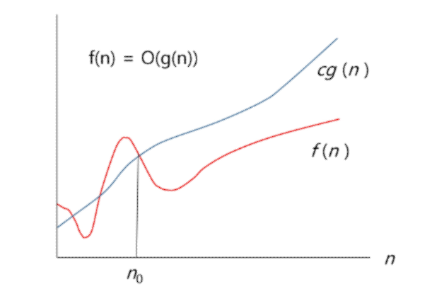
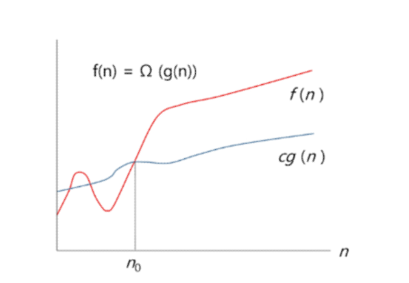

# Start
2023.08.23(Wed) ~ 2023.08.24(Thu)

-----
## 복잡도 분석

### 알고리즘의 효율
- 시간적 복잡도 분석
  - 하드웨어 환경에 따라 처리시간이 달라진다
    - 부동소수 처리 프로세서 존재유무, 나눗셈 가속기능 유무
    - 입출력 장비의 성능, 공유여부
  - 소프트웨어 환경에 따라 처리 시간이 달라진다.
    - 프로그램 언어의 종류
    - 운영체제, 컴파일러의 종류
  - 이러한 환경적 차이로 인해 분석이 어렵다.
- 복잡도의 점근적 표기
  - 시간(또는 공간)복잡도는 입력 크기에 대한 함수로 표기하는데, 이 함수는 주로 여러개의 항을 가지는 다항식이다.
  - 이를 단순한 함수로 표기하기 위해 **점근적 표기**를 사용한다.
  - 입력크기 n이 무한대로 커질때의 복잡도를 간단히 표현하기 위해 사용하는 표기법이다.
    - O(Big-Oh) 표기
    - $\Omega$ (Big-Omega) 표기
    - $\Theta$ (Big-Theta) 표기

### O(Big-Oh) 표기 
- O-표기는 복잡도의 **점근적 상한**을 의미한다.
- 복잡도가 $f(n) = 2n^2 -7n +4$ 라면, $f(n)$의 O-표기는 O(n<sup>2</sup>)이다.
  - 단순히 **실행시간이 n<sup>2</sup>에 비례**하는 알고리즘 이라고 말함
- 단순화된 함수 $n^2$ 에 임의의 상수 c를 곱한 $cn^2$이 n 증가함에 따라 $f(n)$의 상한이 된다( 단, c>0) 



- n이 증가함에 따라 $O(g(n))$이 점근적 상한이라는 것 (즉, $g(n)$이 n<sub>0</sub>보다 큰 모든 n에 대해서 항상 f(n)보다 크다는 것)을 보여준다.

### $\Omega$ (Big-Omega) 표기
- 복잡도의 **점근적 하한**을 의미한다. = **최소 이만한 시간은 걸린다**
- $f(n) = 2n^2 -7n +4$의  $\Omega$ 표기는 $\Omega(n^2)$이다.
- $f(n) = \Omega(n^2)$은 'n 이 증가함에 따라 $2n^2 -7n +4$이 $cn^2$보다 작을 수 없다'라는 의미이다. 이때 상수 c= 1로 놓으면 된다. 


- 복잡도 f(n)과 $\Omega$표기를 그래프로 나타낸 것
- n이 증가함에 따라 $\Omega(g(n))$이 점근적 하한이라는 것(즉, $g(n)$이 n<sub>0</sub>보다 큰 모든 n에 대해서 항상 f(n)보다 작다는 것)을 보여준다.

### $\Theta$ (Big-Theta) 표기
- O-표기와 $\Omega$표기가 같은 경우에 사용
- $f(n) = 2n^2 -7n +4 = O(n^2) = \Omega(n^2)$이므로, $f(n) = \Theta(n^2)$이다
- **$f(n)$은 n이 증가함에 따라 n<sup>2</sup>과 동일한 증가율을 가진다**는 의미

### 자주 사용하는 O-표기

|표기|의미|
|---|---|
|O(1)|상수 시간 (Constant time)|
|O(logn)|로그(대수) 시간 (Logarithmic time)|
|O(n)|선형 시간 (Linear time)|
|O(nlogn)|로그 선형 시간 (Log-linear time)|
|O(n<sup>2</sup>)|제곱 시간 (Quadratic time)|
|O(n<sup>3</sup>)|세제곱 시간 (Cubic time)|
|O(2<sup>n</sup>)|지수 시간 (Exponential time)|


## 비트 연산
### 비트 연산자
|연산자|연산자의 기능|
|:---:|:---:|
|&|비트 단위로 AND 연산|
|\||비트 단위로 OR 연산|
| ^ |비트 단위로 XOR 연산|
|~|단항 연산자로서 피연산자의 모든 비트를 반전|
|<<|피연산자의 비트 열을 왼쪽으로 이동|
|>>|피연산자의 비트 열을 오른쪽으로 이동|

- 1 << n
  - 2<sup>n</sup>의 값을 갖는다.
  - 원소가 n개일 경우의 모든 부분집합의 수를 의미한다.
  - Power set (모든 부분 집합)
    - 공집합과 자기 자신을 포함한 모든 부분집합
    - 각 원소가 포함되거나 포함되지 않는 2가지 경우의 수를 계산하면 모든 부분집합의 수가 계산된다.
- i & (1 << j)
  - 계산 결과는 i의 j번째 비트가 1인지 아닌지를 의미한다.

```
def Bbit_print(i):
    output = ''
    for j in range(7, -1, -1):
        output += '1' if i & (i << j) else "0"
    print(output)

for i in range(-5, 6) :
    print("%3d = " % i , end = '')
    Bbit_print(i)
```