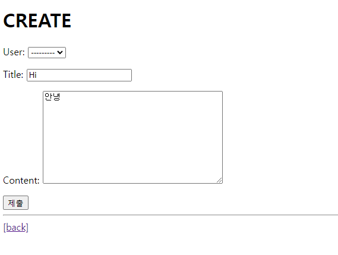
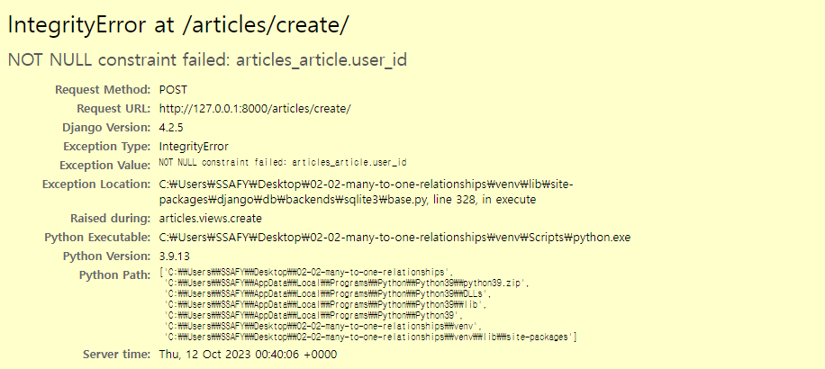
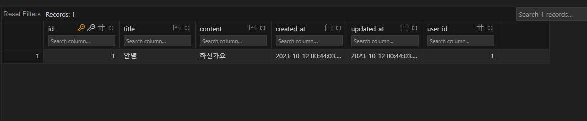

# Many to one relationships 2

2023.10.11 (Thu)
-----
## 개요
**Article(N) - User(1)**
- 0개 이상의 게시글은 1명의 회원에 의해 작성 될 수 있다.
**Comment(N) - User(1)**
- 0개 이상의 댓글은 1명의 회원에 의해 작성 될 수 있다.
## Article & User
### Article - User 모델 관계 설정
- User 외래 키 정의
    ```
    # articles/models.py

    from django.conf import settings

    class Article(models.Model):
        user = models.ForeignKey(settings.AUTH_USER_MODEL, on_delete = models.CASCADE)
        title = models.CharField(max_length=10)
        content = models.TextField()
        created_at = models.DateTimeField(auto_now_add=True)
        updated_at = models.DateTimeField(auto_now=True)
    ```
    - User 모델을 참조하는 2가지 방법

    | |get_user_model()|settings.AUTH_USER_MODEL|
    |:---:|:---:|:---:|
    |반환 값| User Object (객체) | accounts.User (문자열) |
    |사용 위치| models.py가 아닌 다른 모든 위치 | models.py |

    > User모델은 직접 참조하지 않음을 알아두자!
### Migration 
```
$ python manage.py makemigrations
```

- 기본적으로 모든 컬럼은 NOT NULL 제약조건이 있기 때문에 데이터가 없이는 새로운 필드가 추가되지 못함 -> 기본값 설정 필요
- 1을 입력하고 Enter 진행<br>


- 추가되는 외래키 user_id에 어떤 데이터를 넣을 것인지 직접 입력해야 함
- 마찬가지로 1 입력하고 Enter 진행
- 그러면 기존에 작성된 게시글이 있다면 모두 1번 회원이 작성한 것으로 처리됨

```
$ python manage.py migrate
```

### 게시글 CREATE
- 기존 ArticleForm 출력 변화 확인
  - User 모델에 대한 외래 키 데이터 입력을 위해 불필요한 input이 출력
    
- ArticleForm 출력 필드 수정
    ```
    # articles/forms.py

    class ArticleForm(forms.ModelForm):
        class Meta:
            model = Article
            fields = ('title','content',)
    ```
    - 에러 발생 : user_id 필드 데이터가 누락되었기 때문
    
- 게시글 작성 시 작성자 정보가 함께 저장될 수 있도록 save의 commit 옵션 활용
    ```
    # articles/views.py

    @login_required
    def create(request):
        if request.method == 'POST':
            form = ArticleForm(request.POST)
            if form.is_valid():
                article = form.save(commit=False)
                article.user = request.user
                article.save()
                return redirect('articles:detail', article.pk)
        else:
            ...
    ```

- 게시글 작성 후 테이블 확인
    
### 게시글 READ
- 각 게시글의 작성자 이름 출력
    ```
    <!-- articles/index.html -->

    
    <p>작성자 : {{article.user }}</p>
    <p>글 번호 : {{ article.pk }}</p>
    <a href="">
        <p>글 제목 : {{ article.title }}</p>
    </a>
    <p>글 내용 : {{ article.content }}</p>
    <hr>
    
    ```

    ```
    <!-- articles/detail.html -->

    <h2>DETAIL</h2>
    ...
    <p>작성자 : {{article.user }}</p>
    ```

### 게시글 UPDATE
- 게시글 수정 요청 사용자와 게시글 작성 사용자를 비교하여 본인의 게시글만 수정할 수 있도록 하기
    ```
    # articles/views.py

    @login_required
    def update(request, pk):
        article = Article.objects.get(pk=pk)
        if request.user == article.user :
            if request.method == 'POST':
                form = ArticleForm(request.POST, instance=article)
                if form.is_valid:
                    form.save()
                    return redirect('articles:detail', article.pk)
            else:
                form = ArticleForm(instance=article)
        else :
            return redirect('article:index')
        context = {
            'article': article,
            'form': form,
        }
        return render(request, 'articles/update.html', context)
    ```
- 해당 게시글의 작성자가 아니라면 수정/삭제 버튼을 출력하지 않도록 하기
    ```
    <!-- articles/detail.html -->

    
    <a href="">UPDATE</a>
    <form action="" method="POST">
        
        <input type="submit" value="삭제">
    </form>
    
    ```

### 게시글 DELETE
- 삭제를 요청하려는 사람과 게시글을 작성한 사람을 비교하여 본인의 게시글만 삭제할 수 있도록 하기
    ```
    # articles/views.py

    @login_required
    def delete(request, pk):
        article = Article.objects.get(pk=pk)
        if request.user == article.user :
            article.delete()
        return redirect('articles:index')
    ```
## Comment & User
### Comment - User 모델 관계 설정
- User 외래 키 정의
    ```
    class Comment(models.Model):
        article = models.ForeignKey(Article, on_delete=models.CASCADE)
        user = models.ForeignKey(settings.AUTH_USER_MODEL, on_delete = models.CASCADE)
        ...
    ```
### Migration
- 이전 Article - User 모델 관계 설정 때와 동일한 상황
- 기존 Comment 테이블에 새로운 칼럼이 빈 값으로 추가될 수 없기 때문에 기본 값 설정 과정이 필요
### 댓글 CREATE
- 댓글 작성 시 작성자 정보가 함께 저장할 수 있도록 작성
    ```
    def comments_create(request, pk):
        article = Article.objects.get(pk=pk)
        comment_form = CommentForm(request.POST)
        if comment_form.is_valid():
            comment = comment_form.save(commit=False)
            comment.article = article
            comment.user = request.user
            comment_form.save()
            return redirect('articles:detail', article.pk)
        ...
    ```
### 댓글 READ
- 댓글 출력 시 댓글 작성자와 함께 출력
    ```
    <!-- articles/detail.html -->

    
    <li>
    <p>작성자명 : {{comment.user}}</p>
    <p>내용 : {{ comment.content }} </p>
    </li>
    
    ...
    ```
### 댓글 DELETE
- 댓글 삭제 요청 사용자와 댓글 작성 사용자를 비교하여 본인의 댓글만 삭제할 수 있도록 하기
    ```
    # articles/views.py

    def comments_delete(request, article_pk, comment_pk):
        comment = Comment.objects.get(pk=comment_pk)
        if comment.user == request.user:
            comment.delete()
        return redirect('articles:detail', article_pk)
    ```
- 해당 댓글의 작성자가 아니라면 댓글 삭제 버튼을 출력하지 않도록 함

    ```
    <!-- articles/detail.html -->

        
      <form action="" method="POST">
        
        <input type="submit" value="삭제">
      </form>
    
    ```

### 참고
- 인증된 사용자만 댓글 작성 및 삭제 by `@login_required`
    ```
    @login_required
    def delete(request, pk):
        pass


    @login_required
    def update(request, pk):
        pass
    ```
