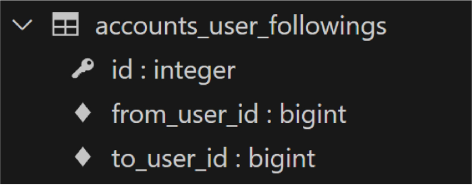
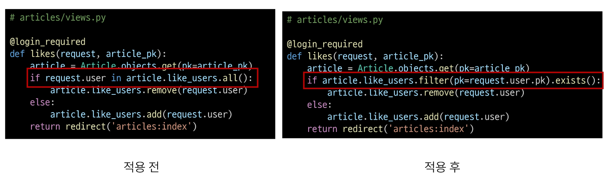
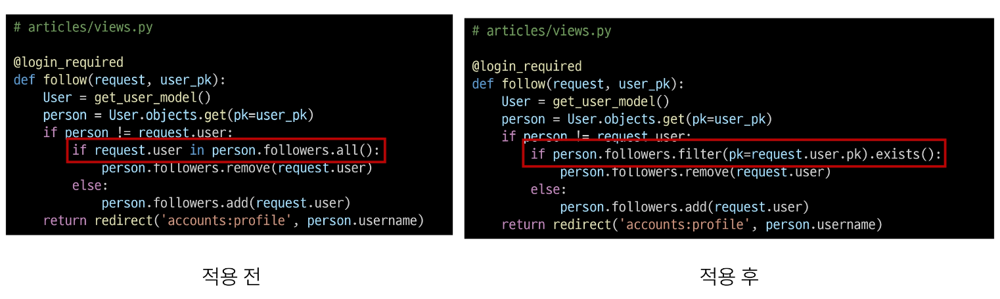
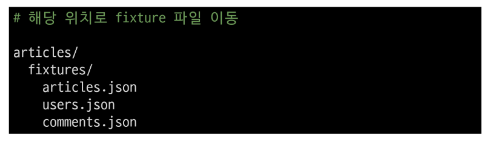

# Many to many relationships 2

2023.10.17 (Tue)
-----

## Many to many relationships 2 : 팔로우
### 프로필
각 회원의 개인 프로필 페이지에 팔로우 기능을 구현하기 위해 프로필 페이지를 먼저 구현
- url 작성
    ```
    # accounts/urls.py

    app_name = 'accounts'
    urlpatterns = [
        ...
        path('profile/<str:username>/', views.profile, name='profile'),
    ```
- view 함수 작성
    ```
    # accounts/views.py

    from django.contrib.auth import get_user_model

    def profile(request, username):
        # User의 Detail 페이지
        # User를 조회
        User = get_user_model()
        person = User.objects.get(username=username)
        context = {
            'person': person,
        }
        return render(request, 'accounts/profile.html', context)
    ```
- profile 템플릿 작성
    ```
    <!-- accounts/profile.html -->

    <h1>{{ person.username }}님의 프로필</h1>

    <hr>

    <h2>작성한 게시글</h2>
    
    <p>{{ article.title }}</p>
    

    <hr>

    <h2>작성한 댓글</h2>
    
    <p>{{ comment.content }}</p>
    

    <hr>

    <h2>좋아요를 누른 게시글</h2>
    
    <p>{{ article.title }}</p>
    
    ```
- 프로필 페이지로 이동할 수 있는 링크 작성
    ```
    <!-- articles/index.html -->

    <a href="">내 프로필</a>

    작성자 : <a href="">{{ article.user }}</a>
    ```
### 팔로우 기능 구현
**User(M) - User(N)** : 0명 이상의 회원은 0명 이상의 회원과 관련
> 회원은 0명 이상의 팔로워를 가질 수 있고, 0명 이상의 다른 회원들을 팔로잉 할 수 있음

- ManyToManyField 작성
    ```
    # accounts/models.py

    class User(AbstractUser):
        followings = models.ManyToManyField('self', symmetrical=False, related_name='followers')
    ```
    - 참조 : 내가 팔로우하는 사람들 (팔로잉, followings)
    - 역참조: 상대방 입장에서 나는 팔로워 중 한 명 (팔로워, followers)
    - 바뀌어도 상관 없으나 관계 조회 시 생각하기 편한 방향으로 정한 것

- Migrations 진행 후 중개 테이블 확인<br>
    

- url 작성
    ```
    # accounts/urls.py

    app_name = 'accounts'
    urlpatterns = [
        ...
        path('<int:user_pk>/follow/', views.follow, name='follow'),
    ]
    ```
- view 함수 작성
    ```
    # accounts/views.py

    def follow(request, user_pk):
        User = get_user_model()
        you = User.objects.get(pk=user_pk)
        me = request.user
        
        if me != you:
            # 내가 상대방의 팔로워 목록에 있다면
            if me in you.followers.all():
                # 팔로우 취소
                you.followers.remove(me)
                # me.followings.remove(you)
            else:
                you.followers.add(me)
                # me.followings.add(you)
        return redirect('accounts:profile', you.username)
    ```
- 프로필 유저의 팔로잉, 팔로워 수 & 팔로우, 언팔로우 버튼 작성
    ```
    <!-- accounts/profile.html -->

    <div>
    <div>
        팔로잉 : {{ person.followings.all|length }} / 팔로워 : {{ person.followers.all|length }}
    </div>
    
        <div>
        <form action="" method="POST">
            
            
            <input type="submit" value="Unfollow">
            
            <input type="submit" value="Follow">
            
        </form>
        </div>
    
    </div>
    ```
### 참고
- .exists()
  - QuerySet에 결과가 포함되어 있으면 True를 반환하고 결과가 포함되어 있지 않으면 False를 반환
  - 큰 QuerySet에 있는 특정 객체 검색에 유용
  - exist 적용 예시<br>
     <br>
    <br>
## Django Fixtures
### Fixtures
> Django가 데이터베이스로 가져오는 방법을 알고 있는 데이터 모음 <br>**데이터베이스 구조에 맞추어 작성되어 있음**
- 초기 데이터 제공 : Fixtures의 사용 목적
- 초기 데이터의 필요성 : Django 프로젝트의 앱을 처음 설정할 때 동일하게 준비된 데이터로 데이터베이스를 미리 채우는 것이 필요한 순간이 있음
  - fixtures를 사용해 앱에 initial data 제공
### Fixtures 활용
- 사전준비 
  - M:N까지 모두 작성된 Django 프로젝트에서 유저, 게시글, 댓글 등 각 데이터를 최소 2~3개 이상 생성해두기 
- fixtures 관련 명령어
  - dumpdata : 생성(데이터 추출)
    - 추출한 데이터는 json형식으로 저장
    ```
    # 작성 예시

    python manage.py dumpdata [app_name[.ModelName] app_name[.ModelName]]...] > filename.json

    python manage.py dumpdata --indent 4 articles.article > articles.json
    python manage.py dumpdata --indent 4 articles.user > users.json
    python manage.py dumpdata --indent 4 articles.comment > comments.json
    ```
  - loaddata : 로드(데이터 입력)
    - Fixtures 데이터를 데이터베이스로 불러오기
    - `app_name/fixtures` : Fixtures 파일 기본 경로
      - Django는 설치된 모든 app의 디렉토리에서 fixtures 폴더 이후의 경로로 fixtures 파일을 찾아 load
  - load data 활용
    - db.sqlite3 파일 삭제 후 migrate 진행<br>
        
    - load 후 데이터가 잘 입력되었는지 확인
        ```
        python manage.py loaddata articles.json users.json comments.json
        ```
  - loaddata 순서 주의사항
    - 만약 loaddata를 한번에 실행하지 않고 하나씩 실행한다면 모델 관계에 따라 load 하는 순서가 중요할 수 있음
      - comment는 article에 대한 key 및 user에 대한 key가 필요
      - article은 user에 대한 key가 필요
    - 즉, 현재 모델 관계에서는 user -> article -> comment 순으로 data를 넣어야 오류가 발생하지 않음
        ```
        python manage.py loaddata users.json
        python manage.py loaddata articles.json
        python manage.py loaddata comments.json
        ```
  
### 참고
- 모든 모델을 한번에 dump하기
```
# 3개의 모델을 하나의 json 파일로
python manage.py dumpdata --indent 4 articles.article articles.comment accounts.user > data.json

# 모든 모델을 json 파일로
python manage.py dumpdata --indent 4 > data.json
```
- loaddata 시 encoding codec 관련 에러가 발생하는 경우 
  - dumpdata 시 추가 옵션 작성 
    ```
    python -Xutf8 manage.py dumpdata [생략]
    ```
  - 메모장 활용
    - 인코딩을 utf8로 선택 후 저장
- **Fixtures 파일을 직접 만들지 말 것** 
  - 반드시 dumpdata 명령어를 사용하여 생성
## Improve Query
### 사전 준비
**Improve query**
> 같은 결과를 얻기 위해 DB 측에 보내는 쿼리 개수를 점차 줄여 조회하기
- 데이터
  - 게시글 10개 / 댓글 100개 / 유저 5개
- 모델 관계
  - N:1 - Article:User / Comment:Article / Comment:Article
  - N:M - Article:User
```
python manage.py migrate
python manage.py loaddata users.json articles.json commens.json
```
### annotate
SQL의 GROUP BY 쿼리를 사용
- 게시글을 조회하면서 댓글 개수까지 한번에 조회해서 가져오기
    ```
    # views.py

    def index_1(request):
        # articles = Article.objects.order_by('-pk')
        articles = Article.objects.annotate(Count('comment')).order_by('-pk')
        context = {
            'articles': articles,
        }
        return render(request, 'articles/index_1.html', context)
    ```

    ```
    <!-- index_1.html -->

    <p>댓글개수 : {{ article.comment__count }}</p>
    ```
### select_related
SQL의 INNER JOIN 쿼리를 사용 , 1:1 또는 N:1 참조 관계에서 사용
- 게시글을 조회하면서 유저 정보까지 한번에 조회해서 가져오기

    ```
    # views.py

    def index_2(request):
        # articles = Article.objects.order_by('-pk')
        articles = Article.objects.select_related('user').order_by('-pk')
        context = {
            'articles': articles,
        }
        return render(request, 'articles/index_2.html', context)
    ```
    ```
    <!-- index_2.html -->

    
    <h3>작성자 : {{ article.user.username }}</h3>
    <p>제목 : {{ article.title }}</p>
    <hr>
    
    ```

### prefetch_related
M:N 또는 N:1 역참조 관계에서 사용, SQL이 아닌 Python을 사용한 JOIN을 진행
- 게시글을 조회하면서 참조된 댓글 까지 한번에 조회해서 가져오기
    ```
    # views.py

    def index_3(request):
        # articles = Article.objects.order_by('-pk')
        articles = Article.objects.prefetch_related('comment_set').order_by('-pk')
        context = {
            'articles': articles,
        }
        return render(request, 'articles/index_3.html', context)
    ```

    ```
    <!-- index_3.html -->

    
    <p>제목 : {{ article.title }}</p>
    <p>댓글 목록</p>
    
        <p>{{ comment.content }}</p>
    
    <hr>
    
    ```
### select_related & prefetch_related
- 게시글 + 각 게시글의 댓글 목록 + 댓글의 작성자를 한번에 조회
    ```
    # views.py


    from django.db.models import Prefetch


    def index_4(request):
        articles = Article.objects.order_by('-pk')
        # articles = Article.objects.prefetch_related('comment_set').order_by('-pk')
        articles = Article.objects.prefetch_related(
            Prefetch('comment_set', queryset=Comment.objects.select_related('user'))
        ).order_by('-pk')

        context = {
            'articles': articles,
        }
        return render(request, 'articles/index_4.html', context)
    ```
    ```
    <!-- index_4.html -->

    
    <p>제목 : {{ article.title }}</p>
    <p>댓글 목록</p>
    
        <p>{{ comment.user.username }} : {{ comment.content }}</p>
    
    <hr>
    
    ```