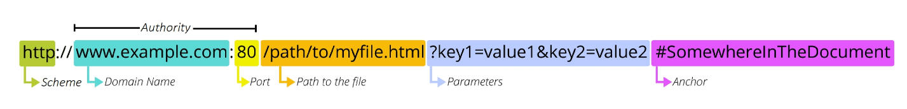
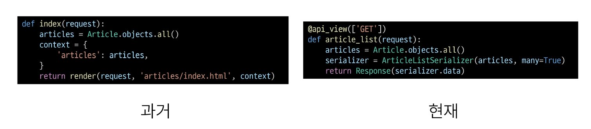
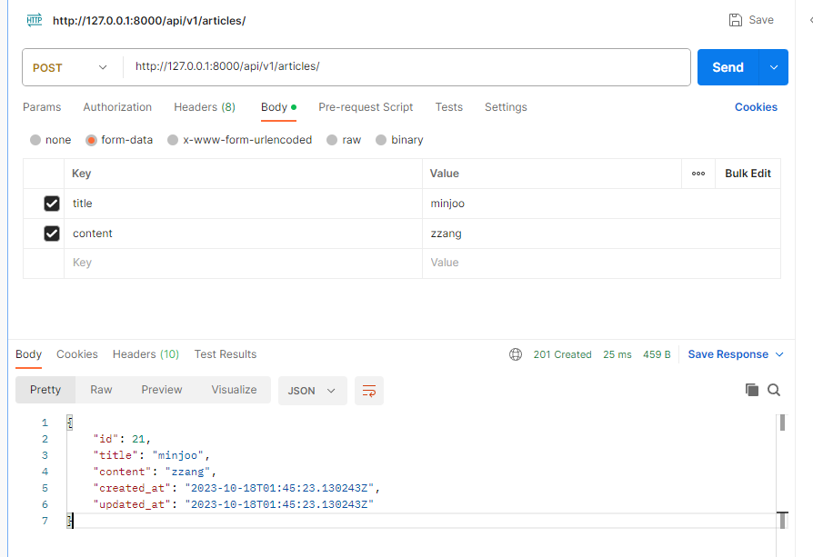
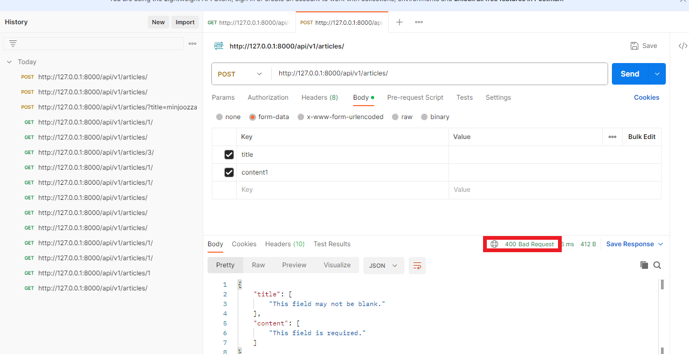
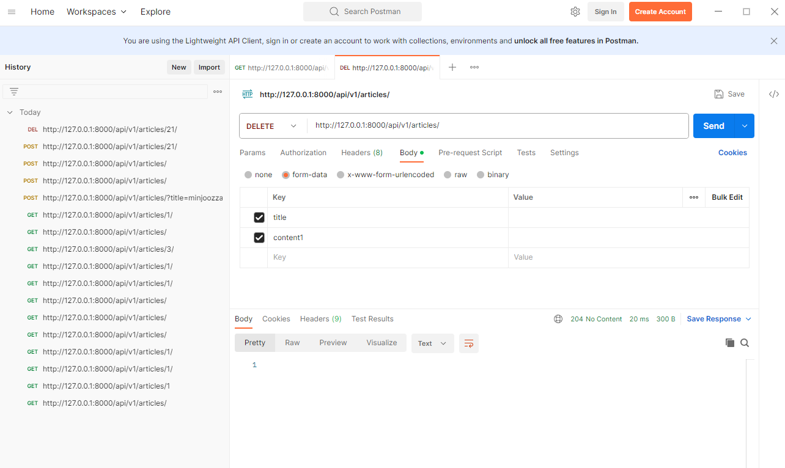
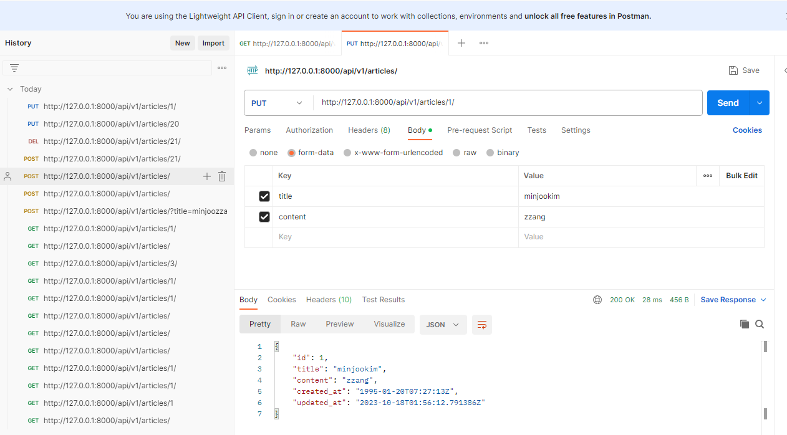

# Django REST framework 1

2023.10.18 (Wed)
-----
## REST API
### API
> 애플리케이션과 프로그래밍으로 소통하는 방법
클라이언트-서버 처럼 서로 다른 프로그램에서 요청과 응답을 받을 수 있도록 만든 체계
- Web API
  - 웹 서버 또는 웹 브라우저를 위한 API
  - 현대 웹 개발은 하나부터 열까지 직접 개발하기보다 여러 Open API들을 활용하는 추세
  - 대표적인 Third Party OPEN API : YouTube , GoogleMap, 등
### REST
> API Server를 개발하기 위한 일종의 소프트웨어 설계 방법론

- RESTful API
  - REST원리를 따르는 시스템을 RESTful하다고 부름
  - **자원을 정의**하고 **자원에 대한 주소를 지정**하는 전반적인 방법을 서술  

### REST API
> REST라는 설계 디자인 약속을 지켜 구현한 API
- REST에서 자원을 정의하고 주소를 지정하는 방법
  - 자원의 식별 : URL
  - 자원의 행위 : HTTP Methods
  - 자원의 표현 : JSON 데이터, 궁극적으로 표현되는 데이터 결과물
### 자원의 식별
- URI; Uniform Resource Identifier (통합 자원 식별자)
  - 인터넷에서 리소스(자원)을 식별하는 문자열
  - 가장 일반적인 URI는 웹 주소로 알려진 URL
- URL; Uniform Resource Locator (통합 자원 위치)
  - 웹에서 주어진 리소스의 주소
  - 네트워크 상에서 리소스가 어디 있는지를 알려주기 위한 약속<br>
    
    - Schema (or Protocol)
      - 브라우저가 리소스를 요청하는데 사용해야 하는 규약
      - URL의 첫 부분은 브라우저가 어떤 규약을 사용하는지를 나타냄
      - 기본적으로 웹은 HTTP(S)를 요구하며 메일을 열기 위한 mailto:, 파일을 전송하기 위한 ftp: 등 다른 프로토콜도 존재
    - Domain Name
      - 요청중인 웹 서버를 나타냄
      - 어떤 웹 서버가 요구되는지를 가리키며 직접 IP주소를 사용하는 것도 가능하지만, 사람이 외우기 어렵기 때문에 주로 Domain Name으로 사용
      - 예를 들어 도메인 google.com의 IP주소는 142.251.42.142
    - Port 
      - 웹 서버의 리소스에 접근하는데 사용되는 기술적인 문(Gate)
      - HTTP 프로토콜의 표준 포트
        - HTTP - 80
        - HTTPS - 443
      - 표준 포트만 생략 가능
    - Path
      - 웹 서버의 리소스 경로
      - 초기에는 실제 파일이 위치한 물리적 위치를 나타냈지만, 오늘날은 실제 위치가 아닌 추상화된 형태의 구조를 표현
      - 예를 들어 articles/create/가 실제 articles 폴더안에 create 폴더안을 나타내는 것은 아님
    - Parameters 
      - 웹 서버에 제공하는 추가적인 데이터
      - '&'기호로 구분되는 key-value 쌍 목록
      - 서버는 리소스를 응답하기 전에 이러한 파라미터를 사용하여 추가 작업을 수행할 수 있음
    - Anchor
      - 일종의 '북마크'를 나타내며 브라우저에 해당 지점에 있는 콘텐츠를 표시
      - fragment identifier(부분 식별자)라고 부르는 '#'이후 부분은 서버에 전송되지 않음
      - https://docs.djangoproject.com/en/4.2/intro/install/#quick-install-guide 요청에서 `#quick-install-guide`는 서버에 전달되지 않고 브라우저에게 해당 지점으로 이동할 수 있도록 함
### 자원의 행위
**HTTP Request Methods**
>리소스에 대한 행위(수행하고자 하는 동작)를 정의, **HTTP verbs**라고도 함
- 대표 HTTP Request Methods
  - GET
    - 서버에 리소스의 표현을 요청
    - GET을 사용하는 요청은 데이터만 검색해야 함
  - POST 
    - 데이터를 지정된 리소스에 제출
    - 서버의 상태를 변경
  - PUT 
    - 요청한 주소의 리소스를 수정
  - DELETE
    - 지정된 리소스를 삭제
**HTTP response status codes**
> 특정 HTTP 요청이 성공적으로 완료되었는지 여부를 나타냄
- Informational responses (100-199)
- Successful responses (200-299)
- Redirection messages (300-399)
- Client error responses (400-499)
- Server error responses (500-599)

### 자원의 표현
- 그동안 서버가 응답(자원을 표현)했던 것
  - 지금까지 Django 서버는 사용자에게 페이지(html)만 응답하고 있었음
  - 하지만 서버가 응답할 수 있는 것을 페이지 뿐만 아니라 다양한 데이터 타입을 응답할 수 있음
  - REST API는 이중에서도 JSON타입으로 응답하는 것을 권장
- 응답 데이터 타입의 변화
  - 페이지(html)만을 응답하는 서버 -> JSON 데이터를 응답하는 REST API 서버로의 변환
  - Django는 더이상 Template 부분에 대한 역할을 담당하지 않게 되며, Front-end와 Back-end가 분리되어 구성됨
  - **이제부터 Django를 사용해 RESTful API 서버를 구축할 것**

### 사전 준비
- migrate 진행
    ```
    python manage.py migrate
    ```
- 준비된 fitxures 파일을 load 하여 실습용 초기 데이터 입력
    ```
    python manage.py loaddata articles.json
    ```
- 준비된 python-request-sample.py 확인
```
```
## DRF
### DRF ; Django REST framework
> Django에서 RESTful API 서버를 쉽게 구축할 수 있도록 도와주는 오픈소스 라이브러리

### Serialization ; 직렬화
> 여러 시스템에서 활용하기 위해 데이터 구조나 객체 상태를 나중에 재구성 할 수 있는 포맷으로 변환하는 과정 <br> 어떤 언어나 환경에서도 나중에 쉽게 사용할 수 있는 포맷으로 변환하는 과정

## DRF with Single Model
### 프로젝트 준비
- 가상 환경 생성, 활성화 및 패키지 설치
- migrate 진행
    ```
    python manage.py migrate
    ```
- 준비된 fitxures 파일을 load 하여 실습용 초기 데이터 입력
    ```
    python manage.py loaddata articles.json
    ```
- Postman 설치
  - API를 구축하고 사용하기 위한 플랫폼
  - API를 빠르게 만들 수 있는 여러 도구 및 기능을 제공
### GET
- GET-List
  - 게시글 데이터 목록 조회하기
  - 게시글 데이터 목록을 제공하는 ArticlesListSerializer 정의
 
    ```
    # articles/serializers.py

    from rest_framework import serializers
    from .models import Article

    class ArticleListSerializer(serializers.ModelSerializer):
        class Meta:
            model = Article 
            fields = ('id', 'title', 'content',)
    ```
      - ModelSerializer: Django 모델과 연결된 Serializer 클래스
  - url 및 view 함수 작성
    ```
    # articles/urls.py

    urlpatterns = [
        path('articles/', views.article_list),
    ]

    ```
    ```
    # articles/views.py

    from rest_framework.response import Response
    from rest_framework.decorators import api_view
    from .models import Article
    from .serializers import ArticleListSerializer

    @api_view(['GET'])
    def article_list(request):
        articles = Article.objects.all()
        serializer = ArticleListSerializer(articles, many = True)
        return Response(serializer.data)
    ```
    - 이전 POST 함수는 똑같은 데이터를 HTML에 출력되도록 페이지와 함께 응답했다면 , 현재는 JSON 데이터로 serialization하여 페이지 없이 응답<br>
    
    - 'api_view' decorator
      - DRF view 함수에서는 필수로 작성되며 view 함수를 실행하기 전 HTTP 메서드를 확인
      - 기본적으로 GET 메서드만 허용되며 다른 메서드 요청에 대해서는 405 Method Not Allowed로 응답
      - DRF view 함수가 응답해야 하는 HTTP 메서드 목록을 작성

- GET-Detail
  - 단일 게시글 데이터 조회하기
  - 각 게시글의 상세 정보를 제공하는 ArticleSerializer 정의
    ```
    # articles/serializers.py

    class ArticleSerializer(serializers.ModelSerializer):
        class Meta:
            model = Article 
            fields = '__all__'
    ```
  - url 및 view 함수 작성 
    ```
    # articles/urls.py

    urlpatterns = [
        ...,
        path('articles/<int:article_pk>/', views.article_detail)
    ]
    ```
    ```
    # articles/views.py

    from .serializers import ArticleListSerializer , ArticleSerializer


    @api_view(['GET'])
    def article_detail(request, article_pk):
        article = Article.objects.get(pk = article_pk)
        serializer = ArticleSerializer(article)
        return Response(serializer.data)
    ```

### POST
- 게시글 데이터 생성하기
- 데이터 생성이 성공했을 경우 201 Created를 응답
- 데이터 생성이 실패했을 경우 400 Bad request를 응답

- article_list view 함수 구조 변경 (method에 따른 분기 처리)
```
from rest_framework import status

@api_view(['GET', 'POST'])
def article_list(request):
    if request.method == 'GET' :
        articles = Article.objects.all()
        serializer = ArticleListSerializer(articles, many = True)
        return Response(serializer.data)
    elif request.method == 'POST' :
        serializer = ArticleSerializer(data=request.data)
        if serializer.is_valid():
            serializer.save()
            return Response(serializer.data, status = status.HTTP_201_CREATED)
        return Response(serializer.errors, status = status.HTTP_400_BAD_REQUEST)
```
- 응답 확인
  - 성공<br>
    
  - 실패<br>
    
### DELETE
- 게시글 데이터 삭제하기
- 요청에 대한 데이터 삭제가 성공했을 경우는 204 No Content 응답
    ```
    # articles/views.py

    @api_view(['GET','DELETE'])
    def article_detail(request, article_pk):
        article = Article.objects.get(pk = article_pk)
        if request.method == 'GET':
            serializer = ArticleSerializer(article)
            return Response(serializer.data)
        elif request.method == 'DELETE' :
            article.delete()
            return Response(status = status.HTTP_204_NO_CONTENT)
    ```
- 응답 확인<br>
    

### PUT
- 게시글 데이터 수정하기
- 요청에 대한 데이터 수정이 성공했을 경우는 200 OK 응답
    ```
    @api_view(['GET','DELETE','PUT'])
    def article_detail(request, article_pk):
        article = Article.objects.get(pk = article_pk)
        ...
        elif request.method == 'PUT':
            serializer = ArticleSerializer(article, data = request.data)
            if serializer.is_valid():
                serializer.save()
                return Response(serializer.data, status= status.HTTP_200_OK)
            return Response(serializer.errors, status = status.HTTP_400_BAD_REQUEST)    
    ```
- 응답 확인<br>
    
### 참고
- raise_exception
  - is_valid()는 유효성 검사 오류가 있는 경우 ValidationError 예외를 발생시키는 raise_exception 인자를 사용할 수 있음
  - DRF에서 제공하는 기본 예외처리기에 의해 자동으로 처리되며 기본적으로 HTTP 400 응답을 반환
    ```
    @api_view(['GET','DELETE','PUT'])
    def article_detail(request, article_pk):
        article = Article.objects.get(pk = article_pk)
        ...
        elif request.method == 'PUT':
            serializer = ArticleSerializer(article, data = request.data)
            if serializer.is_valid(raise_exception = True):
                serializer.save()
                return Response(serializer.data, status= status.HTTP_200_OK)
            # return Response(serializer.errors, status = status.HTTP_400_BAD_REQUEST)  
    # raise_exception인자를 사용하면 is_valid 함수 fail 시의 return 값을 안줘도 됨(주석처리)
    ```