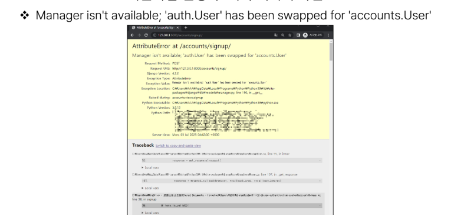

# Django Authentication System 1

2023.10.05 (Thu)
-----
## 회원 가입
> User 객체를 Create 하는 과정
**UserCreationForm()** : 회원 가입시 사용자 입력 데이터를 받을 built-in ModelForm 
### 회원 가입 페이지 작성
```
# accounts/urls.py

app_name = 'accounts'
urlpatterns = [
    ...
    path('signup/', views.signup, name='signup'),
]
```

```
# accounts/views.py

from django.contrib.auth.forms import UserCreationForm

def signup(request):
    if request.method == 'POST':
        pass
    else:
        form = UserCreationForm()
    context = {
        'form': form,
    }
    return render(request, 'accounts/signup.html', context)
```

```
<!-- accounts/signup.html -->

<h1>회원가입</h1>
<form action="" method="POST">
  
  {{ form.as_p }}
  <input type="submit">
</form>
```
### 회원 가입 로직 작성
```
# accounts/views.py

# error 코드

from django.contrib.auth.forms import UserCreationForm

def signup(request):
    if request.method == 'POST':
        form = form = UserCreationForm(request.POST)
        if form.is_valid():
            form.save()
            return redirect('articles:index')
    else:
        form = UserCreationForm()
    context = {
        'form': form,
    }
    return render(request, 'accounts/signup.html', context)
```
- 회원 가입 로직 에러
   
   - 회원가입에 사용하는 UserCreationForm이 우리가 대체한 커스텀 유저 모델이 아닌 기존 유저 모델로 인해 작성된 클래스이기 때문
> CustomUserModel을 사용하려면 **UserCreationForm**과 **UserChangeForm** 을 다시 작성해야함

```
# account/forms.py

from django.contrib.auth.forms import UserCreationForm, UserChangeForm
from django.contrib.auth import get_user_model


class CustomUserCreationForm(UserCreationForm):
    class Meta(UserCreationForm.Meta):
        model = get_user_model()


class CustomUserChangeForm(UserChangeForm):
    class Meta(UserChangeForm.Meta):
        model = get_user_model()
```
- get_user_model() : **현재 프로젝트에서 활성화된 사용자 모델(active user model)**을 반환하는 함수
- User 모델을 직접 참조하지 않는 이유
  -  get_user_model() 을 사용해 User 모델을 참조하면 커스텀 User 모델을 자동으로 반환해주기 때문
```
# accounts/views.py

from .forms import CustomUserCreationForm, CustomUserChangeForm

def signup(request):
    if request.method == 'POST':
        form = CustomUserCreationForm(request.POST)
        if form.is_valid():
            form.save()
            return redirect('articles:index')
    else:
        form = CustomUserCreationForm()
    context = {
        'form': form,
    }
    return render(request, 'accounts/signup.html', context)
```

## 회원 탈퇴
> User 객체를 Delete 하는 과정

### 회원 탈퇴 로직 작성
```
# accounts/urls.py

app_name = 'accounts'
urlpatterns = [
    ...
    path('delete/', views.delete, name='delete'),
]
```

```
# accounts/views.py

def delete(request):
    request.user.delete()
    return redirect('articles:index')
```

```
<!-- articles/index.html -->

<form action="" method="POST">
  
  <input type="submit" value="회원탈퇴">
</form>
```

## 회원정보 수정
> User 객체를 Update 하는 과정
**UserChangeForm()** : 회원정보 수정 시 사용자 입력 데이터를 받을 bulit-in ModelForm

### 회원정보 수정 페이지 작성

```
# accounts/urls.py

app_name = 'accounts'
urlpatterns = [
    ...
    path('update/', views.update, name='update'),
]
```
```
# accounts/views.py

def update(request):
    if request.method == 'POST':
        pass
    else:
        form = CustomUserChangeForm(instance=request.user)
    context = {
        'form': form,
    }
    return render(request, 'accounts/update.html', context)
```
```
<!-- accounts/update.html -->

<h1>회원정보수정</h1>
<form action="" method="POST">
   
   {{ form.as_p }}
   <input type="submit">
</form>
```

```
<!-- articles/index.html -->

<a href="">회원정보수정</a>
```

- UserChangeForm 사용 시 문제점
   
   - User 모델의 모든 정보들(fields)까지 모두 출력되어 수정이 가능하기 때문에 일반 사용자들이 접근해서는 안되는 정보는 출력하지 않도록 해야 함
   - 해결 : **CustomUserChangeForm**에서 접근 가능한 필드를 조정
   - 참고 : [User Model의 필드 목록 확인](https://docs.djangoproject.com/en/4.2/ref/contrib/auth/)


```
# account/forms.py

class CustomUserChangeForm(UserChangeForm):
    class Meta(UserChangeForm.Meta):
        model = get_user_model()
        fields = ('first_name', 'last_name', 'email')
```

### 회원정보 수정 로직 작성

```
# accounts/views.py

def update(request):
    if request.method == 'POST':
        form = CustomUserChangeForm(request.POST, instance=request.user)
        if form.is_valid():
            form.save()
            return redirect('articles:index')
    else:
        form = CustomUserChangeForm(instance=request.user)
    context = {
        'form': form,
    }
    return render(request, 'accounts/update.html', context)
```
## 비밀번호 변경
> 인증된 사용자의 Session 데이터를 Update 하는 과정

**PasswordChangeForm()** : 비밀번호 변경 시 사용자 입력 데이터를 받을 bulit-in ModelForm

### 비밀번호 변경 페이지 작성
```
# crud/urls.py

from accounts import views

urlpatterns = [
    ...
    path('<int:user_pk>/password/', views.change_password, name='change_password'),
]
```

```
# accounts/view.py

from django.contrib.auth.forms import AuthenticationForm, PasswordChangeForm

def change_password(request, user_pk):
    if request.method == 'POST':
        pass
    else:
        form = PasswordChangeForm(request.user)
    context = {
        'form': form,
    }
    return render(request, 'accounts/change_password.html', context)
```

```
<!-- accounts/change_password.html -->

<h1>비밀번호 변경</h1>
<form action="" method="POST">
  
  {{ form.as_p }}
  <input type="submit">
</form>
```
### 비밀번호 변경 로직 작성

```
# accounts/view.py

def change_password(request, user_pk):
    if request.method == 'POST':
        form = PasswordChangeForm(request.user, request.POST)
        if form.is_valid():
            user = form.save()
            return redirect('articles:index')
    else:
        form = PasswordChangeForm(request.user)
    context = {
        'form': form,
    }
    return render(request, 'accounts/change_password.html', context)
```
### 세션 무효화 방지하기
- 비밀번호가 변경되면 기존 세션과의 회원 인증 정보가 일치하지 않게 되어버려 로그인 상태가 유지되지 못하고 로그아웃 처리됨
- 비밀번호가 변경되면서 기존 세션과의 회원 인증 정보가 일치하지 않기 때문

**update_session_auth_hash(request, user)** : 암호 변경 시 세션 무효화를 막아주는 함수 
- 암호가 변경되면 새로운 password의 Session Data로 기존 session을 자동으로 갱신

```
# accounts/view.py

from django.contrib.auth import update_session_auth_hash

def change_password(request, user_pk):
    if request.method == 'POST':
        form = PasswordChangeForm(request.user, request.POST)
        if form.is_valid():
            user = form.save()
            update_session_auth_hash(request, user)
            return redirect('articles:index')
    else:
        form = PasswordChangeForm(request.user)
    context = {
        'form': form,
    }
    return render(request, 'accounts/change_password.html', context)
```

## 로그인 사용자에 대한 접근 제한
### 방법 1. is_authenticated 속성
> 사용자가 인증되었는지 여부를 알 수 있는 User model의 속성
- 모든 User 인스턴스에 대해 항상 True인 읽기 전용 속성이며, 비인증 사용자에 대해서는 항상 False
- 로그인과 비로그인 상태에서 화면에 출력되는 링크를 다르게 설정하기
   ```
   <!-- articles/index.html -->

   
   <h3>{{ user.username }}님 안녕하세요!</h3>
   <form action="" method="POST">
      
      <input type="submit" value="LOGOUT">
   </form>
   <form action="" method="POST">
      
      <input type="submit" value="회원탈퇴">
   </form>
   <a href="">회원정보수정</a>
   
   <a href="">LOGIN</a>
   <a href="">SIGNUP</a>
   
   ```
- 인증된 사용자라면 로그인/회원가입 로직을 수행할 수 없도록 하기
   ```
   # accounts/view.py

   def login(request):
      if request.user.is_authenticated:
         return redirect('articles:index')
      ...

   def signup(request):
      if request.user.is_authenticated:
         return redirect('articles:index')
      ...
   ```
### 방법 2. login_required 데코레이터
> 인증된 사용자에 대해서만 view 함수를 실행시키는 데코레이터
- 비인증 사용자의 경우 /accounts/login/ 주소로 redirect 시킴


- 인증된 사용자만 게시글을 작성/수정/삭제 할 수 있도록 수정
   ```
   # articles/view.py

   from django.contrib.auth.decorators import login_required


   @login_required
   def create(request):
      pass
   @login_required
   def delete(request, pk):
      pass


   @login_required
   def update(request, pk):
      pass
   ```

- 인증된 사용자만 로그아웃/탈퇴/수정/비밀번호 변경 할 수 있도록 수정

   ```
   # accounts/view.py

   from django.contrib.auth.decorators import login_required

   @login_required
   def logout(request):
      pass

   @login_required
   def delete(request):
      pass

   @login_required
   def update(request):
      pass

   @login_required
   def change_password(request, user_pk):
      pass
   ```

### 참고
- 회원가입 후 로그인까지 이어서 진행하려면?
   ```
   # accounts/views.py

   def signup(request):
      if request.method == 'POST':
         form = CustomUserCreationForm(request.POST)
         if form.is_valid():
               user = form.save()
               auth_login(request, user) # 로그인까지 이어서 하자
               return redirect('articles:index')
      else:
         form = CustomUserCreationForm()
      context = {
         'form': form,
      }
      return render(request, 'accounts/signup.html', context)
   ```

- 탈퇴와 함께 기존 사용자의 Session Data 삭제 방법
   - 사용자 객체 삭제 이후 로그아웃 함수 호출
   - 단 , **탈퇴 후 로그아웃**의 순서가 바뀌면 안됨
   - 먼저 로그아웃이 진행되면 해당 요청 객체 정보가 없어지기 때문에 탈퇴에 필요한 유저 정보 또한 없어지기 때문

   ```
   # accounts/views.py

   @login_required
   def delete(request):
      request.user.delete()
      auth_logout(request)
   ```