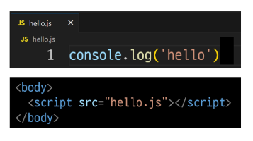
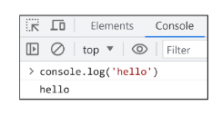
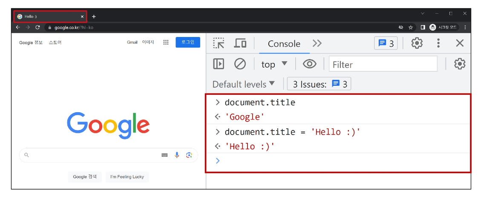
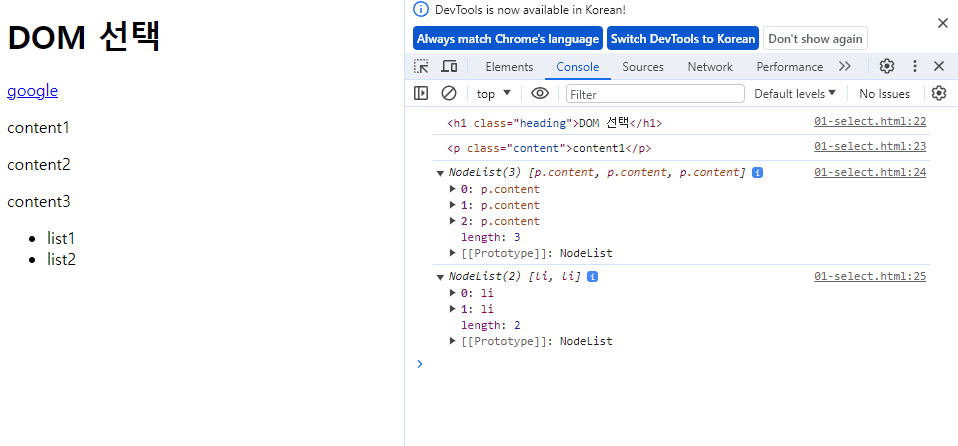

# Introduction of JavaScript

2023.10.23 (Mon)
-----

## JavaScript and DOM
### DOM
**웹 브라우저에서의 JavaScript** : 웹 페이지의 동적인 기능을 구현
- JavaScripy 실행 환경 종류
  - HTML script tag 
    ```
    <body>
    <script>
        console.log('hello')
    </script>
    </body>
    ```
  - js 확장자 파일<br>
    
  - 브라우저 Console<br>
    

**DOM**
> 웹 페이지(Document)를 구조화된 객체로 제공하여 프로그래밍 언어가 페이지 구조에 접근할 수 있는 방법을 제공
<br> 문서 구조, 스타일, 내용 등을 변경할 수 있도록 함
- DOM 특징
  - DOM 에서 모든 요소, 속성, 텍스트는 하나의 객체
  - 모두 document 객체의 자식으로 구성됨
- DOM tree
  - 브라우저는 HTML 문서를 해석하여 DOM tree 라는 객체 트리로 구조화
  - 객체 간 상속 구조가 존재
- 브라우저가 웹 페이지를 불러오는 과정
  - 웹 페이지는 웹 브라우저를 통해 해석되어 웹 브라우저 화면에 나타남
- DOM 핵심
  - 문서의 요소들을 객체로 제공하여 다른 프로그래밍 언어에서 접근하고 조작할 수 있는 방법을 제공하는 API

**'document'객체**
- 웹 페이지 객체
- DOM Tree의 진입점
- 페이지를 구성하는 모든 객체 요소를 포함
- 'document'객체 예시
  - HTML의 `<title>` 변경하기 <br>
    

### DOM 선택
**DOM 조작 시 기억해야 할 것**<br>
웹 페이지를 동적으로 만들기 == 웹 페이지를 조작하기 <br>
- 조작 순서
  1. 조작 하고자 하는 요소를 선택 (또는 탐색)
  2. 선택된 요소의 콘텐츠 또는 속성을 조작
- 선택 메서드
    ```
    <!-- select.html -->

    <body>
    <h1 class="heading">DOM 선택</h1>
    <a href="https://www.google.com/">google</a>
    <p class="content">content1</p>
    <p class="content">content2</p>
    <p class="content">content3</p>
    <ul>
        <li>list1</li>
        <li>list2</li>
    </ul>
    <script>
        console.log(document.querySelector('.heading'))
        console.log(document.querySelector('.content'))
        console.log(document.querySelectorAll('.content'))
        console.log(document.querySelectorAll('ul > li'))
    </script>
    </body>
    ```
    
  - document.querySelector(selector) : 제공한 선택자와 일치하는 element 한 개 선택
    - 제공한 CSS selector를 만족하는 첫번째 element 객체를 반환 (없다면 null 반환)
  - document.querySelectorAll(selector) : 제공한 선택자와 일치하는 여러 element를 선택
    - 제공한 CSS selector를 만족하는 NodeList를 반환

### DOM 조작
- 클래스 속성 조작
  - classList property : 요소의 클래스 목록을 DOMTokenList(유사 배열)형태로 반환
  - classList 메서드
    - element.classList.add() : 지정한 클래스 값을 추가
    - element.classList.remove() : 지정한 클래스 값을 제거
    - element.classList.toggle(): 클래스가 존재한다면 제거하고 false를 반환 (존재하지 않으면 클래스를 추가하고 true 반환)
  - add()와 remove()메서드를 사용해 지정한 클래스 값을 추가 혹은 제거
  - 클래스 조작 실습
    ```
    <style>
    .red {
        color: crimson;
    }
    </style>
    ```
    ```
    const h1Tag = document.querySelector('.heading')
    console.log(h1Tag)
    console.log(h1Tag.classList)

    h1Tag.classList.add('red')
    console.log(h1Tag.classList)

    h1Tag.classList.remove('red')
    console.log(h1Tag.classList)

    h1Tag.classList.toggle('red')
    console.log(h1Tag.classList)
    ```
- 일반 속성 조작
  - 속성 조작 메서드
    - Element.getAttribute()
      - 해당 요소에 지정된 값을 반환(조회)
    - Element.setAttribute(name, value)
      - 지정된 요소의 속성 값을 설정
      - 속성이 이미 있으면 기존 값을 갱신(그렇지 않으면 지정된 이름과 값으로 새 속성이 추가)
    - Element.removeAttribute()
      - 요소에서 지정된 이름을 가진 속성 제거
  - 속성 조작 실습
    ```
    const aTag = document.querySelector('a')
    console.log(aTag)

    aTag.setAttribute('href', 'https://www.naver.com/')
    console.log(aTag.getAttribute('href'))

    aTag.removeAttribute('href')
    console.log(aTag.getAttribute('href'))
    ```
- HTML 콘텐츠 조작
  - textContent property : 요소의 텍스트 콘텐츠를 표현
  - HTML 콘텐츠 조작 실습
    ```
    const h1Tag = document.querySelector('.heading')
    console.log(h1Tag)
    console.log(h1Tag.textContent)

    // h1 요소의 콘텐츠를 수정
    h1Tag.textContent = '싸피'
    console.log(h1Tag.textContent)
    ```

- DOM 요소 조작
  - DOM 요소 조작 메서드
    - document.createElement(tagName)
      - 작성한 tagName의 HTML요소를 생성하여 반환
    - Node.appendChild()
      - 한 Node를 특정 부모 Node의 자식 NodeList 중 마지막 자식으로 삽입
      - 추가된 Node 객체를 반환
    - Node.removeChild()
      - DOM에서 자식 Node를 제거
      - 제거된 Node를 반환
  - DOM 요소 조작 실습
    ```
    // 1. 요소 생성
    const h1Tag = document.createElement('h1')
    console.log(h1Tag)

    // 2. 값 추가(속성, 클래스 속성, 콘텐츠...)
    h1Tag.textContent = '제목입니다.'
    console.log(h1Tag)

    // 3. 완성한 요소를 문서에 추가
    divTag.appendChild(h1Tag)
    console.log(divTag)

    // 4. 요소 삭제
    divTag.removeChild(h1Tag)
    ```
- style 조작
  - style property : 해당 요소의 모든 style 속성 목록을 포함하는 속성
  - style 조작 실습
    ```
    const pTag = document.querySelector('p')
    console.log(pTag)
    console.log(pTag.style)
    pTag.style.color = 'crimson'
    pTag.style.fontSize = '3rem'
    pTag.style.border = '1px solid black'
    console.log(pTag.style)
    ```
### 참고
- Node
  - DOM의 기본 단위
  - DOM 트리의 각 부분은 Node라는 객체로 표현됨 
    - Document Node : HTML 문서 전체를 나타내는 노드
    - Element Node : HTML 요소를 나타내는 노드 ex) `<p>`
    - Text Node : HTML 텍스트, Element Node내의 텍스트 컨텐츠를 나타냄
    - Attribute Node : HTML 요소의 속성을 나타내는 노드
- NodeList
  - DOM 메서드를 사용해 선택한 Node의 목록
  - 배열과 유사한 구조를 가짐
  - Index로만 각 항목에 접근 가능
  - 다양한 배열 메서드 사용 가능
  - `querySelectorAll()`에 의해 반환되는 NodeList는 DOM의 변경사항을 실시간으로 반영하지 않음
- Element
  - Node의 하위 유형
  - Element는 DOM 트리에서 HTML 요소를 나타내는 특별한 유형의 Node
  - 예를 들어 `<p>`, `<div>`,`<span>`,`<body>` 등의 HTML 태그들이 Element 노드를 생성
  - Node의 속성과 메서드를 모두 가지고 있으며 추가적으로 요소 특화된 기능(ex. className, innerHTML, id 등)을 가지고 있음 
  - **모든 Element는 Node이지만, 모든 Node가 Element인 것은 아님**
- Dom 속성 확인 Tip
  - 개발자도구 - Elements - Properties
  - 해당 요소의 모든 DOM 속성 확인 가능
- Parsing(구문 분석, 해석) : 브라우저가 문자열을 해석하여 DOM Tree로 만드는 과정