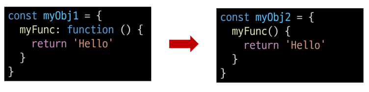

# JavaScript Reference data types

2023.10.25 (Wed)
-----
## 함수
### 개요
**Function**
> 참조 자료형에 속하며 모든 함수는 Function object 
### 함수 정의
- 함수 구조
    ```
    function name ([param[, param,[..., param]]]){
        statements
        return value
    }
    ```
  - 함수 이름
  - 함수의 매개변수
  - 함수의 body를 구성하는 statement
  - return 값이 없다면 undefined를 반환
- 함수 정의 2가지 방법
  - 선언식(function declaration)
    ```
    function add (num1, num2) {
        return num1 + num2
    }

    add(1,2) // 3
    ```
  - 표현식(function expression)
    ```
    const sub = function (num1, num2) {
        return num1 - num2
    }

    sub(2, 1) // 1
    ```
    - 선언식과 달리 표현식으로 정의한 함수는 호이스팅 되지 않으므로 함수를 정의하기 전에 먼저 사용할 수 없음

| | 선언식 | 표현식 |
|---|---|---|
|특징|- 익명 함수 사용 불가능<br> - 호이스팅 있음 |- 익명 함수 사용 가능<br> - 호이스팅 없음 |
|기타| | 사용 권장 |


### 매개변수
- 기본 함수 매개변수 (Default funcion parameter)
  - 값이 없거나 undefined가 전달될 경우 이름 붙은 매개변수를 기본값으로 초기화
  
- 나머지 매개변수
  - 임의의 수의 인자를 '배열'로 허용하여 가변 인자를 나타내는 방법
  - 작성 규칙
    - 함수 정의 시 나머지 매개변수 하나만 작성할 수 있음
    - 나머지 매개변수는 함수 정의에서 매개변수 마지막에 위치해야함
    ```
    const myFunc = function (num1, num2, ...restArgs) {
        return [num1, num2, restArgs]
    }

    console.log(myFunc(1, 2, 3, 4, 5)) // [1, 2, [3, 4, 5]]
    console.log(myFunc(1, 2)) // [1, 2, []]
    ```
- 매개변수와 인자의 개수 불일치
  - 매개변수 > 인자 개수 : 누락된 인자는 undefined로 할당
        ```
        const threeArgs = function (num1, num2, num3) {
            return [num1, num2, num3]
        }

        console.log(threeArgs()) // [undefined, undefined, undefined]
        console.log(threeArgs(1)) // [1, undefined, undefined]
        console.log(threeArgs(2, 3)) // [2, 3, undefined]
        ```
  - 매개변수 < 인자 개수 : 초과 입력한 인자는 사용하지 않음

        ```
        const noArgs = function () {
            return 0
        }

        console.log(noArgs(1, 2, 3)) // 0

        const twoArgs = function (num1, num2) {
            return [num1, num2]
        }

        console.log(twoArgs(1, 2, 3)) // [1, 2]
        ```
### Spread syntax
**...** : 전개 구문
- 전개 구문
  - 배열이나 문자열과 같이 반복 가능한 항목을 펼치는 것 (확장, 전개)
  - 전개 대상에 따라 역할이 다름
    - 배열이나 객체의 요소를 개별적인 값으로 분리하거나 다른 배열이나 객체의 요소를 현재 배열이나 객체에 추가하는 등
  - 함수와의 사용
    - 함수 호출 시 인자 확장
    - 나머지 매개변수 (압축)
  - 객체와의 사용 (객체 파트에서 진행)
  - 배열과의 활용 (배열 파트에서 진행)
- 전개 구문 활용
  - 함수와의 사용
    - 함수 호출 시 인자 확장
        ```
        function myFunc(x, y, z) {
            return x + y + z
        }

        let numbers = [1, 2, 3]

        console.log(myFunc(...numbers)) // 6
        ```
    - 나머지 매개변수 (압축)
        ```
        function myFunc2(x, y, ...restArgs) {
            return [x, y, restArgs]
        }

        console.log(myFunc2(1, 2, 3, 4, 5)) // [1, 2, [3, 4, 5]]
        console.log(myFunc2(1, 2)) // [1, 2, []]
        ```
### 화살표 함수
**화살표 함수 표현식 (Arrow function expressions)** : 함수 표현식의 간결한 표현법
- 화살표 함수 작성 결과
  - 이전
    ```
    const arrow1 = function (name) {
        return `hello, ${name}`
    }
    ```
  - 이후
    ```
    const arrow2 = name => `hello, ${name}`
    ```
- 화살표 함수 작성 과정
  1. function 키워드 제거 후 매개변수와 중괄호 사이에 화살표 (=>) 작성
        ```
        const arrow2 = (name) => { return `hello, ${name}` }
        ```
  2. 함수의 매개변수가 하나뿐이라면, 매개 변수의 () 제거 가능 (단, 생략하지 않는 것을 권장)
        ```
        const arrow3 = name => { return `hello, ${name}` }
        ```
  3. 함수 본문의 표현식이 한 줄이라면, {}와 return 제거 가능
        ```
        const arrow4 = name => `hello, ${name}`
        ```
### 참고
- 화살표 함수 심화
```
// 1. 인자가 없다면 () or _ 로 표시 가능
const noArgs1  = () => `No args`
const noArgs2 = _ => `No args`

// 2-1. object를 return 한다면 return을 명시적으로 작성해야 함
const returnObject1 = () => { return { key : 'value' } }

// 2-2. return을 작성하지 않으려면 객체를 소괄호로 감싸야 함
const returnObject2 = () => ({key : 'value'})
```
## 객체

### 개요
**Object** : 키로 구분된 데이터 집합(data collection)을 저장하는 자료형
### 구조 및 속성
- 객체 구조
  - 중괄호를 이용해 작성
  - 중괄호 안에는 key : value 쌍으로 구성된 속성(property)를 여러 개 작성 가능
  - key는 문자형만 허용
  - value는 모든 자료형 허용
    ```
    const user = {
        name: 'Alice',
        'key with space': true,
        greeting: function () {
        return 'hello'
        }
    }
    ```
- 속성 참조
  - 점('.', chaining operator) 또는 대괄호([])로 객체 요소 접근
  - key 이름에 띄어쓰기 같은 구분자가 있으면 대괄호 접근만 가능
    ```
    // 조회
    console.log(user.name) // Alice
    console.log(user['key with space']) // true

    // 추가
    user.address = 'korea'
    console.log(user) // {name: 'Alice', key with space: true, address: 'korea', greeting: ƒ}

    // 수정
    user.name = 'Bella'
    console.log(user.name) // Bella

    // 삭제
    delete user.name
    console.log(user) // {key with space: true, address: 'korea', greeting: ƒ}
    ```
- 'in' 연산자
  - 속성이 객체에 존재하는지 여부를 확인
    ```
    <!-- console.log('greeting' in user) // true
    console.log('country' in user) // false -->
    ```
### 객체와 함수
**Method** : 객체 속성에 정의된 함수
- Method 사용 예시
  - `object.method()` 방식으로 호출
  - 메서드는 객체를 '행동'할 수 있게 함
    ```
    console.log(user.greeting()) // hello
    ```
### this
> this 키워드를 사용해 객체에 대한 특정한 작업을 수행할 수 있음 <br>
**this keyword** : 함수나 메서드를 호출한 객체를 가리키는 키워드 <br>
    > 함수 내에서 객체의 속성 및 메서드에 접근하기 위해 사용
- Method & this 사용 예시
    ```
    const user = {
        name: 'Alice',
        'key with space': true,
        greeting: function () {
        return 'hello my name is ${this.name}'
        }

    console.log(person.greeting()) // hello my name is Alice
    }
- JavaScript에서 this는 함수를 **호출하는 방법**에 따라 가리키는 대상이 다름 <br>
    |호출방법|대상|
    |---|---|
    |단순 호출|전역 객체|
    |메서드 호출|메서드를 호출한 객체|

1. 단순 호출 시 this 
   - 가리키는 대상 => 전역 객체
    ```
    const myFunc = function () {
        return this
    }
    console.log(myFunc()) // window
    ```
2. 메서드 호출 시 this
   - 가리키는 대상 => 메서드를 호출한 객체
    ```
    const myObj = {
        data: 1,
        myFunc: function () {
        return this
        }
    }
    console.log(myObj.myFunc()) // myObj
    ```
3. 중첩된 함수에서의 this 문제점과 해결책
   - 문제: forEach의 인자로 작성된 콜 백 함수는 일반적인 함수 호출이기 때문에 this가 전역 객체를 가리킴
   ```
   const myObj2 = {
       numbers: [1, 2, 3],
       myFunc: function () {
       this.numbers.forEach(function (number) {
           console.log(this) // window
       })
       }
   }
   console.log(myObj2.myFunc())
   ```
   - 해결 : 화살표 함수는 자신만의 this를 가지지 않기 때문에 외부 함수에서의 this 값을 가져옴
        ```
        const myObj3 = {
            numbers: [1, 2, 3],
            myFunc: function () {
            this.numbers.forEach((number) => {
                console.log(this) // myObj3
            })
            }
        }
        console.log(myObj3.myFunc())
        ```

- JavaScript 'this' 정리
  - JS에서 this는 함수가 호출되는 방식에 따라 결정되는 현재 객체를 나타냄
  - JS의 함수는 호출될 때 this를 암묵적으로 전달 받음
  - Python의 self와 Java의 this가 선언 시 값이 이미 정해지는 것에 비해 JS의 **this는 함수가 호출되기 전까지 값이 할당되지 않고 호출 시에 결정**됨 (동적 할당)
### 추가 객체 문법
- 단축 속성
  - 키 이름과 값으로 쓰이는 변수의 이름이 같은 경우 단축 구문을 사용할 수 있음<br>
    
- 단축 메서드
  - 메서드 선언 시 function 키워드 생략 가능<br>
    

- 계산된 속성 
  - 키가 대괄호([])로 둘러싸여 있는 속성 
  - 고정된 값이 아닌 변수 값을 사용할 수 있음
    ```
    const product = prompt('물건 이름을 입력해주세요')
    const prefix = 'my'
    const suffix = 'property'

    const bag = {
        [product]: 5,
        [prefix + suffix]: 'value',
    }

    console.log(bag) // {연필: 5, myproperty: 'value'}
    ```
- 구조 분해 할당
  - 배열 또는 객체를 분해하여 속성을 변수에 쉽게 할당할 수 있는 문법 <br>
    
- 구조 분해 할당 활용
  - '함수의 매개변수'로 객체 구조 분해 할당 활용 가능
    ```
    function printInfo({ name, age, city }) {
        console.log(`이름: ${name}, 나이: ${age}, 도시: ${city}`)
    }

    const person = {
        name: 'Bob',
        age: 35,
        city: 'London',
    }

    // 함수 호출 시 객체를 구조 분해하여 함수의 매개변수로 전달
    printInfo(person) // '이름: Bob, 나이: 35, 도시: London'
    ```
- Object with '전개 구문'
  - 객체 복사 : 객체 내부에서 객체 전개
  - 얕은 복사에 활용 가능
    ```
    const obj = { b: 2, c: 3, d: 4 }
    const newObj = { a: 1, ...obj, e: 5 }
    console.log(newObj) // {a: 1, b: 2, c: 3, d: 4, e: 5}
    ```
- 유용한 객체 메서드
  - Object.keys()
  - Object.values()
    ```
    const profile = {
        name: 'Alice',
        age: 30,
    }

    console.log(Object.keys(profile)) // ['name', 'age']
    console.log(Object.values(profile)) // ['Alice', 30]
    ```
- Optional chaining('?.')
  - 속성이 없는 중첩 객체를 에러 없이 접근할 수 있음
  - 만약 참조 대상이 null 또는 undefined라면 에러가 발생하는 것 대신 평가를 멈추고 undefined를 반환
    ```
    const user = {
        name: 'Alice',
        greeting: function () {
        return 'hello'
        }
    }

    // console.log(user.address.street) // Uncaught TypeError: Cannot read properties of undefined (reading 'street')
    console.log(user.address?.street) // undefined

    // console.log(user.nonMethod()) // Uncaught TypeError: user.nonMethod is not a function
    console.log(user.nonMethod?.()) // undefined
    ```
  - Optional chaiing이 없다면 다음과 같이 '&&'연산자를 사용해야 함
    ```
    console.log(user.address && user.address.street) // undefined
    ```
  - Optional chaining 장점
    - 참조가 누락될 가능성이 있는 경우 연결된 속성으로 접근할 때 더 짧고 간단한 표현식을 작성할 수 있음
    - 어떤 속성이 필요한지에 대한 보증이 확실하지 않은 경우게 객체의 내용을 보다 편리하게 탐색할 수 있음
  - Optional chaining 주의사항
    - Optional chaining은 존재하지 않아도 괜찮은 대상에만 사용해야 함 (남용 x) : 왼쪽 평가 대상이 없어도 괜찮은 경우에만 선택적으로 사용
        ```
        // 위 예시 코드 논리상 user는 반드시 있어야 하지만 address는 필수 값이 아님
        // user에 값을 할당하지 않은 문제가 있을 때 바로 알아낼 수 있어야 하기 때문

        // Bad
        user?.address?.street

        // Good
        user.address?.street
        ```
    - Optional chaining 앞의 변수는 반드시 선언되어 있어야 함
        ```
        console.log(myObj?.address) // Uncaught ReferenceError: myObj is not defined
        ```
    - Optional chaining 요약
      - `obj?.prop` : obj가 존재하면 obj.prop을 반환하고 그렇지 않으면 undefined를 반환
      - `obj?.[prop]` : obj가 존재하면 obj[prop]을 반환하고 그렇지 않으면 undefined를 반환
      - `obj?.method()` : obj가 존재하면 obj.method()를 호출하고 그렇지 않으면 undefined를 반환

### JSON
- JSON
  - JavaScript Object Notation
  - Key-Value 형태로 이루어진 자료 표기법 
  - JavaScript의 Object와 유사한 구조를 가지고 있지만 JSON은 형식이 있는 '문자열'
  - JS에서 JSON을 사용하기 위해서는 Object 자료형으로 변경해야 함
- Object <-> JSON 변환하기
    ```
    const jsObject = {
        coffee: 'Americano',
        iceCream: 'Cookie and cream',
    }

    // Object -> JSON
    const objToJson = JSON.stringify(jsObject)
    console.log(objToJson)  // {"coffee":"Americano","iceCream":"Cookie and cream"}
    console.log(typeof objToJson)  // string

    // JSON -> Object
    const jsonToObj = JSON.parse(objToJson)
    console.log(jsonToObj)  // { coffee: 'Americano', iceCream: 'Cookie and cream' }
    console.log(typeof jsonToObj)  // object
    ```
### 참고
- new 연산자
  - 사용자 정의 객체 타입을 생성
  - 매개변수 
    - constructor : 객체 인스턴스의 타입을 기술(명세)하는 함수
    - arguments : constructor와 함께 호출될 값 목록
  - new 연산자 활용
    ```
    function Member(name, age, sId) {
        this.name = name
        this.age = age
        this.sId = sId
    }

    const member3 = new Member('Bella', 21, 20226543)

    console.log(member3) // Member { name: 'Bella', age: 21, sId: 20226543 }
    console.log(member3.name) // Bella
    ```
- JS 'this'장단점
  - 장점 : 함수(메서드)를 하나만 만들어 여러 객체에서 재사용할 수 있다는 것
  - 단점 : 이런 유연함이 실수로 이어질 수 있다는 것
  - 따라서 개발자는 this의 동작 방식을 충분히 이해하고 장점을 취하면서 실수를 피하는 데에 집중


## 배열

### 개요

**Array(배열)**
> 순서가 있는 데이터 집합을 저장하는 자료구조
- 배열 구조
  - 대괄호([])를 이용해 작성
  - 배열 요소 자료형 : 제약 없음
  - length 속성을 사용해 배열에 담긴 요소가 몇 개인지 알 수 있음
    ```
    const names = ['Alice', 'Bella', 'Cathy',]

    console.log(names[0]) // Alice
    console.log(names[1]) // Bella
    console.log(names[2]) // Cathy

    console.log(names.length) // 3
    ```
### 배열과 메서드
- 주요 메서드
    |메서드|역할|
    |:---:|:---:|
    | push / pop | 배열 끝 요소를 추가 / 제거 |
    | unshift / shift | 배열 앞 요소를 추가 / 제거 |
- pop() : 배열 끝 요소를 제거하고, 제거한 요소를 반환
    ```
    console.log(names.pop()) // Cathy
    console.log(names) // ['Alice', 'Bella']
    ```
- push() : 배열 끝에 요소를 추가
    ```
    names.push('Dan')
    console.log(names) // ['Alice', 'Bella', 'Dan']
    ```
- shift() : 배열 앞 요소를 제거하고, 제거한 요소를 반환
    ```
    console.log(names.shift()) // Alice
    console.log(names) // ['Bella', 'Dan']
    ```
- unshift() : 배열 앞에 요소를 추가
    ```
    names.unshift('Eric')
    console.log(names) // ['Eric', 'Bella', 'Dan']
    ```
### Array helper method 
> **배열을 순회하며 특정 로직을 수행**하는 메서드 <br>
> 메서드 호출 시 인자로 함수를 받는 것이 특징 (콜백 함수)

|메서드|역할|
|:---:|:---:|
| forEach | 인자로 주어진 함수(콜백함수)를 배열 요소 각각에 대해 실행 |
| map | 배열 내의 모든 요소 각각에 대해 함수(콜백함수)를 호출하고, 함수 호출 결과를 모아 새로운 배열을 반환 |

- forEach() 구조
    ```
    arr.forEach(callback(item[, index[, array]]))
    ``` 
  - 콜백함수는 3가지 매개변수로 구성
    - item : 처리할 배열의 요소
    - index : 처리할 배열 요소의 인덱스 (선택 인자)
    - array : forEach를 호출한 배열 (선택 인자)
    ```
    arr.forEach(function (item, index, array)) {
        // do something
    }
    ``` 
  - 반환 값 : undefined
- forEach 활용
    ```
    const names = ['Alice', 'Bella', 'Cathy',]

    // 일반 함수
    names.forEach(function (item, index, array) {
        console.log(`${item} / ${index} / ${array}`)
    })

    // 화살표 함수
    names.forEach((item, index, array) => {
        console.log(`${item} / ${index} / ${array}`)
    })
    ```
  - 출력 결과<br>
    
- 콜백 함수 : 다른 함수에 인자로 전달되는 함수
  - 외부 함수내에서 호출되어 일종의 루틴이나 특정 작업을 진행
  - 콜백 함수 예시<br>
    

- map 구조
    ```
    const newArr = array.map (item, index, array) {
        // do something
    }
    ```
  - item : 처리할 배열의 요소
  - index : 처리할 배열 요소의 인덱스 (선택 인자)
  - array : forEach를 호출한 배열 (선택 인자)
  - 반환값 : 배열의 각 요소에 대해 실행한 **callback의 결과를 모은 새로운 배열**<br>
    > 기본적으로 forEach 동작 원리와 같지만 forEach와 달리 새로운 배열을 반환함
- map 활용
    ```
    // 1
    const names = ['Alice', 'Bella', 'Cathy',]

    const result1 = names.map(function (name) {
        return name.length
    })

    const result2 = names.map((name) => {
        return name.length
    })

    console.log(result1) // [5, 5, 5]
    console.log(result2) // [5, 5, 5]
    ```
    ```
    // 2
    const numbers = [1, 2, 3,]

    const doubleNumber = numbers.map((number) => {
        return number * 2
    })

    console.log(doubleNumber) // [2, 4, 6]
    ```
- python에서의 map 함수와 비교<br>
    

- 배열 순회 종합

    |방식|특징|비고|
    |:---:|---|---|
    |for loop|- 배열의 인덱스를 이용하여 각 요소에 접근 <br> - break, continue 사용 가능 | |
    |for...of|- 배열 요소에 바로 접근 가능<br> - break, continue 사용 가능 | |
    |forEach|- 간결하고 가독성이 높음 <br> - callback함수를 이용하여 각 요소를 조작하기 용이 <br> - break, continue 사용 불가능| 사용 권장 |
### 추가 배열 문법
- Array with '전개 구문'
  - 배열 복사
    ```
    let parts = ['어깨', '무릎']
    let lyrics = ['머리', ...parts, '발']

    console.log(lytics) // ['머리', '어깨', '무릎', '발']
    ```
- 기타 Array Helper Methods : MDN 문서를 참고해 사용해보기

    |메서드|역할|
    |:---:|:---:|
    | filter | 콜백 함수의 반환 값이 참인 요소들만 모아서 새로운 배열을 반환 |
    | find | 콜백 함수의 반환 값이 참이면 해당 요소를 반환 |
    | some | 배열의 요소 중 하나라도 판별 함수를 통과하면 참을 반환 |
    | every | 배열의 모든 요소가 판별 함수를 통과하면 참을 반환 |

### 참고
- 콜백함수 구조를 사용하는 이유
  - 함수의 재사용성 측면
    - 함수를 호출하는 코드에서 콜백 함수의 동작을 자유롭게 변경할 수 있음
    - 예를 들어, map함수는 콜백 함수를 인자로 받아 배열의 각 요소를 순회하며 콜백 함수를 실행
    - 이때, 콜백 함수는 각 요소를 변환하는 로직을 담당하므로, map 함수를 호출하는 코드는 간결하고 가독성이 높아짐
  - 비동기적 처리 측면 <br>
    
    - setTimeout 함수는 콜백 함수를 인자로 받아 일정 시간이 지난 후에 실행됨
    - 이때, setTimeout 함수는 비동기적으로 콜백 함수를 실행하므로, 다른 코드의 실행을 방해하지 않음

- 배열은 객체다
  - 배열은 키와 속성들을 담고 있는 참조 타입의 객체
  - 배열은 인덱스를 키로 가지며 length 프로퍼티를 갖는 특수한 객체
  - 배열의 요소를 대괄호 접근법을 사용해 접근하는 건 객체 문법과 같음
  - 다만 배열의 키는 숫자라는 점
  - 숫자형 키를 사용함으로써 배열은 객체 기본 기능 이외에도 순서가 있는 컬렉션을 제어하게 해주는 특별한 메서드를 제공
    ```
    const names = ['Alice', 'Bella', 'Cathy',]
    console.log(Object.getOwnPropertyDescriptors(names))
    ```