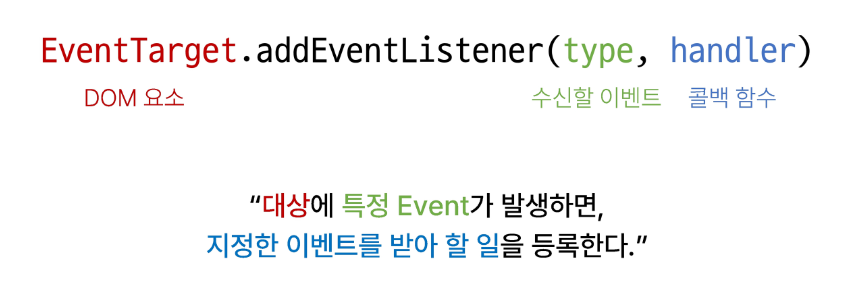

# Controlling event

2023.10.26 (Thu)
-----
## 이벤트
### 개요
- 웹에서의 이벤트
  - 버튼을 클릭했을 때 팝업 창이 출력되는 것
  - 마우스 커서의 위치에 따라 드래그 앤 드롭하는 것
  - 사용자의 키보드 입력 값에 따라 새로운 요소를 생성하는 것
    > 일상에서의 이벤트처럼 웹에서도 이벤트를 통해 특정 동작을 수행한다

### event
> 무언가 일어났다는 신호, 사건<br>
> **모든 DOM 요소는 이러한  event를 만들어 냄**
- event object
  - DOM에서 이벤트가 발생했을 때 생성되는 객체
  - 이벤트 종류
    - mouse, input, keyboard, touch
    - [Event 종류 MDN 문서](https://developer.mozilla.org/en-US/docs/web/api/event)

> DOM 요소는 event를 받고 받은 event를 '처리'(event handler)할 수 있음

### event handler
이벤트가 발생했을 때 실행되는 함수
> 사용자의 행동에 어떻게 반응할지를 JavaScript 코드로 표현한 것
- `.addEventListener()`
  - 특정 이벤트를 DOM 요고사 수신할 때마다 콜백 함수를 호출<br>
  
  - type 
    - 수신할 이벤트 이름
    - 문자열로 작성 (ex.'click')
  - handler
    - 발생한 이벤트 객체를 수신하는 콜백 함수
    - 콜백 함수는 발생한 Event object를 유일한 매개변수로 받음

- addEventListener 활용 : "버튼을 클릭하면 버튼 요소 출력하기"
  - 요소에 addEventListener를 부착하게 되면 내부의 this 값은 대상 요소를 가리키게 됨 (event 객체의 currentTarget 속성 값과 동일)
```

``` 
  

### 버블링

## event handler 활용

### event handler 활용 실습
1. 버튼을 클릭하면 숫자를 1씩 증가해서 출력하기
2. 사용자의 입력 값을 실시간으로 출력하기
3. 사용자의 입력 값을 실시간으로 출력 - '+' 버튼을 클릭하면 출력한 값의 CSS 스타일을 변경하기
4. todo 프로그램 구현
5. 로또 번호 생성기 구현

### 이벤트 기본 동작 취소