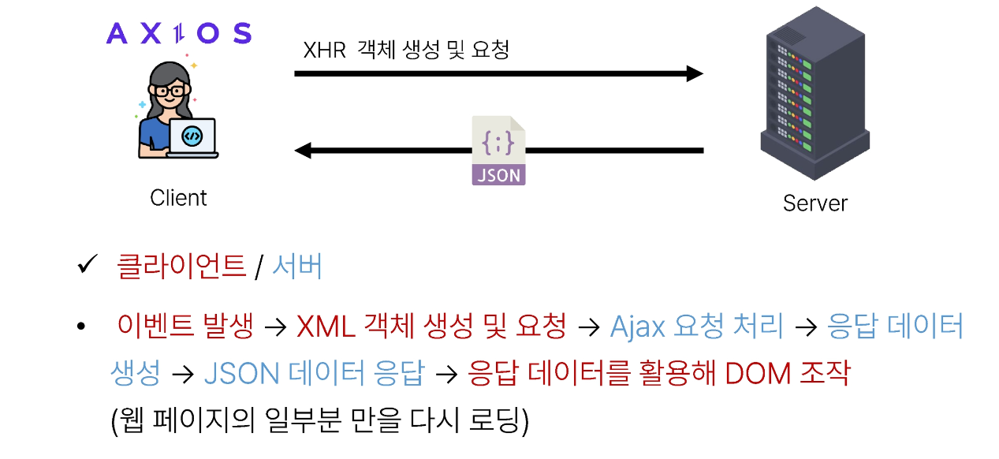
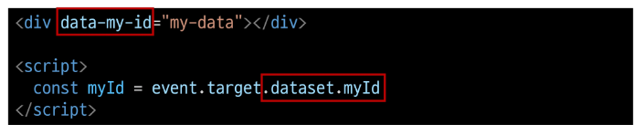

# Ajax with Django

2023.10.31 (Tue)
-----

## Ajax와 서버
**Ajax ; Asynchronous JavaScripy + XML** 
> JavaScript의 비동기 구조와 XML 객체를 활용해 비동기적으로 서버와 통신하여 웹 페이지의 일부분만을 업데이트하는 웹 개발 기술

- Ajax를 활용한 클라이언트 서버 간 동작
    

## Ajax with follow
### 사전 준비
1. M:N까지 진행한 Django 프로젝트 준비
2. 가상 환경 생성 및 활성화, 패키지 설치

### Ajax 적용
- 프로필 페이지에 axios CDN 작성
    ```
    <script src="https://cdn.jsdelivr.net/npm/axios/dist/axios.min.js"></script>

    <script>

    </script>
    ```
- form 요소 선택을 위해 id 속성 지정 및 선택
    ```
    <!-- accounts/profile.html -->

    <!-- action과 method 속성은 삭제 (요청은 axios로 대체되기 때문) -->
    <form id="follow-form">
      ...
    </form>
    ```
    ```
    <!-- accounts/profile.html -->

    // 1. form 요소 선택
    const formTag = document.querySelector('#follow-form')
    ```

- form 요소에 이벤트 핸들러 작성 및 submit 이벤트의 기본 동작 취소
    ```
    <!-- accounts/profile.html -->

    // 2. form 요소에 이벤트 리스너 부착
    formTag.addEventListener('submit', function (event) {
      // 3. submit 이벤트 기본 동작 취소
      event.preventDefault()
    })
    ```

- axios 요청 작성 : url에 작성할 user pk는 어떻게 작성해야 할까? csrftoken은 어떻게 보내야 할까?
  - url에 작성할 user pk 가져오기
        ```
        <!-- accounts/profile.html -->

        <form id="follow-form" data-user-id="{{ person.pk }}">
        ```
        ```
        <!-- accounts/profile.html -->

        formTag.addEventListener('submit', function (event) {
          event.preventDefault()

          // form 요소에 지정한 data 속성 접근하기
          const userId = formTag.dataset.userId
        })
        ```
  - 'data-*' 속성 [참고](https://developer.mozilla.org/ko/docs/Web/HTML/Global_attributes/data-*)
    - 사용자 지정 데이터 특성을 만들어 임의의 데이터를 HTML과 DOM 사이에서 교환할 수 있는 방법
  - data-* 사용 예시<br>
    
    - 모든 사용자 지정 데이터는 JS에서 `dataset`속성을 통해 사용
    - 주의사항
      - 대소문자 여부에 상관없이 **xml**문자로 시작 불가
      - 세미콜론 포함 불가
      - 대문자 포함 불가
  - 요청 url 작성 마무리
        ```
        <!-- accounts/profile.html -->

        formTag.addEventListener('submit', function (event) {
        event.preventDefault()
        const userId = formTag.dataset.userId

        // axios로 비동기적으로 팔로우/언팔로우를 요청
        axios({
            url: `/accounts/${userId}/follow/`,
            method: 'post',
        })
        ...
        })
        ```
  - csrf 값을 가진 input 요소를 직접 선택 후 axios에 작성하기 <br>[참고](https://docs.djangoproject.com/en/4.2/howto/csrf/)
        ```
        <!-- accounts/profile.html -->

        const formTag = document.querySelector('#follow-form')
        // csrftoken value 값 선택
        const csrftoken = document.querySelector('[name=csrfmiddlewaretoken]').value

        formTag.addEventListener('submit', function (event) {
        event.preventDefault()
        const userId = formTag.dataset.userId

        axios({
            url: `/accounts/${userId}/follow/`,
            method: 'post',
            // headers에 csrf 토큰 추가
            headers: {'X-CSRFToken': csrftoken},
        })
        })
        ```
- 팔로우 버튼을 토글하기 위해서는 현재 팔로우 상태인지 언팔로우 상태인지에 대한 상태 확인이 필요 > Django의 view 함수에서 팔로우 여부를 파악할 수 있는 변수를 추가로 생성해 JSON 타입으로 응답하기
    ```
    # accounts/views.py

    from django.http import JsonResponse

    @login_required
    def follow(request, user_pk):
        User = get_user_model()
        you = User.objects.get(pk=user_pk)
        me = request.user

        # 팔로우 상태 여부를 JS에게 전달할 데이터 작성
        # 응답은 더 이상 HTML 문서가 아닌 JSON 데이터로 응답
        if me != you:
            if me in you.followers.all():
                you.followers.remove(me)
                is_followed = False
            else:
                you.followers.add(me)
                is_followed = True
            context = {
                'is_followed': is_followed,
                'followings_count': you.followings.count(),
                'followers_count': you.followers.count(),
            }
            return JsonResponse(context)
        return redirect('accounts:profile', you.username)
    ```
- 응답 데이터 is_followed에 따라 팔로우 버튼을 토글하기
    ```
    <!-- accounts/profile.html -->

    axios({
    url: `/accounts/${userId}/follow/`,
    method: 'post',
    headers: {'X-CSRFToken': csrftoken},
    })
    .then((response) => {
        console.log(response.data)
        // 7. Django에서 보낸 follow 여부를 알 수 있는 변수를 저장
        const isFollowed = response.data.is_followed
        // 8. 팔로우 버튼 선택
        const followBtn = document.querySelector('#follow-form > input[type=submit]:nth-child(2)')
        // 9. 팔로우 버튼 토글
        if (isFollowed === true) {
        followBtn.value = 'Unfollow'
        } else {
        followBtn.value = 'Follow'
        }
    })
    ```
- "팔로잉 수와 팔로워 수 비동기 적용"
    ```
    <!-- accounts/profile.html -->


    <!-- 해당 요소를 선택할 수 있도록 span 태그와 id 속성 작성 -->

    <div>
    팔로잉 : <span id="followings-count">{{ person.followings.all|length }}</span> / 
    팔로워 : <span id="followers-count">{{ person.followers.all|length }}</span>
    </div>
    ```
    ```
    # accounts/views.py

    @login_required
    def follow(request, user_pk):
        ...
        if me != you:
            if me in you.followers.all():
                you.followers.remove(me)
                is_followed = False
            else:
                you.followers.add(me)
                is_followed = True
            context = {
                'is_followed': is_followed,
                # Django view 함수에서 팔로워, 팔로잉 인원 수 연산을 진행하여 결과를 응답으로 전달
                'followings_count': you.followings.count(),
                'followers_count': you.followers.count(),
            }
            return JsonResponse(context)
        return redirect('accounts:profile', you.username)
    ```
    ```
    <!-- accounts/profile.html -->

    axios({
    url: `/accounts/${userId}/follow/`,
    method: 'post',
    headers: {'X-CSRFToken': csrftoken},
    })
    .then((response) => {
        console.log(response.data)
        const isFollowed = response.data.is_followed
        const followBtn = document.querySelector('#follow-form > input[type=submit]:nth-child(2)')
        if (isFollowed === true) {
        followBtn.value = 'Unfollow'
        } else {
        followBtn.value = 'Follow'
        }

        // 각 span 태그를 선택
        const followingsCountTag = document.querySelector('#followings-count')
        const followersCountTag = document.querySelector('#followers-count')
        
        // 응답 데이터의 연산 결과를 각 태그의 인원수 값 변경에 적용
        followingsCountTag.textContent = response.data.followings_count
        followersCountTag.textContent = response.data.followers_count
    })
    .catch((error) => {
        console.log(error)
    })
    ```


## Ajax with likes
### Ajax 좋아요 적용 시 유의사항
- Ajax 적용은 팔로우와 모두 동일
- 단, 팔로우와 달리 좋아요 버튼은 한 페이지에 여러 개가 존재
  - forEach()
  - querySelectorAll()

### Ajax 적용
**HTML**
```
<form class= "likes-forms" data-article-id = "{{ article.pk }}">
  
  
    <input type="submit" value="좋아요 취소" id = "like-{{article.pk}}">
  
    <input type="submit" value="좋아요" id = "like-{{article.pk}}">
  
</form>
```
**View 함수**
```
# articles/views.py

@login_required
def likes(request, article_pk):
    article = Article.objects.get(pk=article_pk)
    if request.user in article.like_users.all():
        article.like_users.remove(request.user)
        is_liked = False
    else:
        article.like_users.add(request.user)
        is_liked = True
    context = {
        'is_liked' : is_liked,
    }
    return JsonResponse(context)
```

**JavaScript**
```
<script src="https://cdn.jsdelivr.net/npm/axios/dist/axios.min.js"></script>
<script>
  const formTags = document.querySelectorAll('.likes-forms')
  const csrftoken = document.querySelector('[name=csrfmiddlewaretoken]').value

  formTags.forEach((formTag) => {
    formTag.addEventListener('submit',function(event){
      event.preventDefault()
      const articleId = formTag.dataset.articleId

      axios({
        url: `/articles/${articleId}/likes/`,
        method : 'post',
        headers: {'X-CSRFToken': csrftoken},
      })
        .then((response) => {
          console.log(response)
          const is_liked = response.data.is_liked
          const likeBtn = document.querySelector(`#like-${articleId}`)

          if (is_liked === true) {
            likeBtn.value = '좋아요 취소'
          } else {
            likeBtn.value = '좋아요'
          }
        })
        .catch((error) => {
          console.log(error)
        })
    })
  })

</script>
```