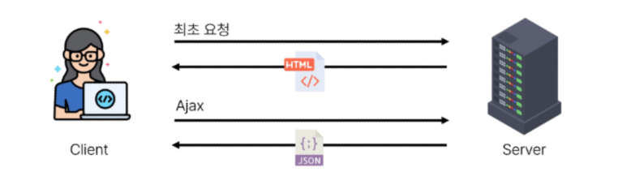

# Introduction of Vue

2023.11.01 (Wed)
-----

## Front-end Development
### Client-side frameworks
**Front-end Development**
> 웹사이트와 웹 애플리케이션의 사용자 인터페이스(UI)와 사용자 경험(UX)을 만들고 디자인하는 것 <br>
> HTML, CSS, JavaScript 등을 활용하여 사용자가 직접 상호작용하는 부분을 개발

**Client-side frameworks**
> 클라이언트 측에서 UI와 상호작용을 개발하기 위해 사용되는 JS 기반 프레임워크

- Client-side frameworks가 필요한 이유
  - 웹에서 하는 일이 많아짐 (단순히 무언가를 읽는 곳 -> 무언가를 하는 곳)
    - 현대적이고 복잡한 대화형 웹사이트를 **웹 애플리케이션**이라 부름
    - JS 기반의 Client-side frameworks의 출현으로 매우 동적인 대화형 애플리케이션을 훨씬 더 쉽게 구축할 수 있게 됨
  - 다루는 데이터가 많아짐
    - application의 기본 데이터를 안정적으로 추적하고 업데이트(렌더링, 추가, 삭제 등)하는 도구가 필요

### SPA; Single Page Application

**SPA; Single Page Application**<br>
> 페이지 한 개로 구성된 웹 애플리케이션<br>
> 웹 애플리케이션의 초기 로딩 후 새로운 페이지 요청 없이 동적으로 화면을 갱신하며 사용자와 상호작용하는 웹 애플리케이션<br>
> **CSR 방식**

1. 서버로부터 필요한 모든 정적 HTML을 처음에 한번 가져옴
2. 브라우저가 페이지를 로드하면 Vue 프레임워크는 각 HTML 요소에 적절한 JS 코드를 실행(이벤트에 응답, 데이터 요청 후 UI 업데이트 등)

**CSR; Client Side Rendering**<br>
Client에서 화면을 렌더링하는 방식

1. 브라우저는 페이지에 필요한 최소한의 HTML 페이지와 JS를 다운로드
2. 그런다음 JS를 사용하여 DOM을 업데이트하고 페이지를 렌더링

- CSR 장점
  - 빠른 속도
    - 페이지의 일부를 다시 렌더링할 수 있으므로 동일한 웹사이트의 다른 페이지로 이동하는 것이 일반적으로 더 빠름
    - 서버로 전송되는 데이터의 양을 최소화
  - 사용자 경험
    - 새로고침이 발생하지 않아 네이티브 앱과 유사한 사용자 경험을 제공
  - Front-end와 Back-end의 명확한 분리
    - Front-end는 UI 렌더링 및 사용자 상호 작용 처리를 담당 & Back-end는 데이터 및 API 제공을 담당
    - 대규모 애플리케이션을 더 쉽게 개발하고 유지 관리 가능
- CSR 단점
  - 초기 구동속도가 느림
    - 전체 페이지를 보기 전에 약간의 지연을 느낄 수 있음
    - JS가 다운로드, 구분 분석 및 실행될 때까지 페이지가 완전히 렌더링 되지 않기 때문
  - SEO 문제
    - 페이지를 나중에 그려 나가는 것이기 때문에 검색에 잘 노출되지 않을 수 있음
## Vue
### What is Vue ? 
> 사용자 인터페이스를 구축하기 위한 JavaScript 프레임워크

- Vue를 학습하는 이유
  - 쉬운 학습 곡선 및 간편한 문법
    - 새로운 개발자들도 빠르게 학습할 수 있음
  - 반응성 시스템
    - 데이터 변경에 따라 자동으로 화면이 업데이트되는 기능을 제공
  - 모듈화 및 유연한 구조
    - 애플리케이션을 컴포넌트 조각으로 나눌 수 있음
    - 코드의 재사용성을 높이고 유지보수를 용이하게 함

```
<!-- first-vue.html -->

<body>
  <div id="app"> 
    <h1> {{ message }}</h1>
    <button @click="count++">
      Count is : {{ count }}
    </button>
  </div>
  <script src="https://unpkg.com/vue@3/dist/vue.global.js"></script>
  <script>
    const { createApp, ref } = Vue

    const app = createApp({
      setup() {
        const message = ref('Hello vue!')
        const count = ref(0)
        return{
          message,
          count
        }
      }
    })

    app.mount('#app')

  </script>
</body>
```
- Vue의 2가지 핵심 기능
  - 선언적 렌더링(Declarative Rendering)
    - HTML을 확장하는 템플릿 구문을 사용하여 HTML이 JavaScript 데이터를 기반으로 어떻게 보이는지 설명할 수 있음
  - 반응형(Reactivity)
    - JavaScript 상태 변경사항을 자동으로 추적하고 변경사항이 발생할 때 DOM을 효율적으로 업데이트

### Vue Tutorial
- Vue를 사용하는 방법
  - CDN 방식
  - NPM 설치 방식 (CDN 방식 이후 진행)

- CDN 및 Application instance 작성
```
<script src="https://unpkg.com/vue@3/dist/vue.global.js"></script>
<script>
  const { createApp } = Vue
  const app = createApp({}) // Application instance
</script>
```
- Application instance
  - 모든 Vue Application은 createApp 함수로 새 Application instance를 생성하는 것으로 시작
- app.mount()
```
<div id="app"></div>

<script src="https://unpkg.com/vue@3/dist/vue.global.js"></script>
<script>
  const { createApp } = Vue
  const app = createApp({}) 
  app.mount("#app")
</script>
```
  - 컨테이너 요소에 application instance를 탑재(연결)
  - 각 앱 인스턴스에 대해 mount()는 한 번만 호출할 수 있음
- ref()
  > 반응형 상태(데이터)를 선언하는 함수 (Declaring Reactive State)<br>
  > 반응형을 가지는 참조 변수를 만드는 것 (ref === reactive reference)
    ```
    const { createApp, ref } = Vue

    const app = createApp({
    setup() {
        const message = ref('Hello vue!')
        console.log(message) // ref 객체
        console.log(message.value) // Hello vue!
    }
    })
    ```
  - 인자를 받아 `.value` 속성이 있는 ref객체로 wrapping하여 반환
  - ref로 선언된 변수의 값이 변경되면, 해당 값을 사용하는 템플릿에서 자동으로 업데이트
  - 인자는 어떠한 타입도 가능
    ```
    // 2. Mustache syntax를 사용하여 메시지 값을 기반으로 동적 텍스트를 렌더링
    <div id="app"> 
    <h1> {{ message }}</h1>
    // 3. 콘텐츠는 식별자나 경로에만 국한되지 않으며 유효한 JS 표현식을 사용할 수 있음
    <h1> {{ message.split('').reverse().join('') }}</h1>
    </div>


    const app = createApp({
    setup() {
        const message = ref('Hello vue!')
        return{
        message // 1. 반환된 객체의 속성은 template에서 사용할 수 있음
        }
    }
    })
    ```
  - 템플릿의 참조에 접근하려면 setup함수에서 선언 및 반환 필요
  - 템플릿에서 ref를 사용할 때는 `.value`를 작성할 필요 없음

- Vue 기본 구조
  - createApp()에 전달되는 객체는 Vue 컴포넌트(Component)
  - 컴포넌트의 상태는 setup() 함수 내에서 선언되어야 하며 객체를 반환해야 함

- Event Listeners in Vue 
    ```
    <body>
    <div id = "app">
        <button v-on:click = "increment"> {{ count }}</button>
    </div>
    
    <script src="https://unpkg.com/vue@3/dist/vue.global.js"></script>
    <script>
        const { createApp, ref } = Vue
        const app = createApp({
        setup() {
            const count = ref(0)
            const increment = function (){
            count.value++
            }
            return {
            count,
            increment
            }
        }
        })
        app.mount('#app')
    </script>
    </body>
    ```
  - 'v-on' directive를 사용하여 DOM 이벤트를 수신할 수 있음
  - 함수 내에서 refs를 변경하여 구성 요소 상태를 업데이트

### 참고
- ref unwrap 시 주의사항 : "템플릿에서의 unwrap은 ref가 최상위 속성인 경우에만 적용가능"
    ```
    <!-- bad -->
    const object = { id: ref(0) }

    {{ object.id +1 }}

    // 출력 결과 : [object Object]1
    ```
  - object는 최상위 속성이지만 object.id는 그렇지 않음
  - 표현식을 평가할 때 object.id가 unwrap되지 않고 ref 객체로 남아있기 때문에 결과가 제대로 출력되지 않음
    ```
    <!-- good -->
    const { id } = object
    {{ id + 1}}

    // 출력 결과 : 1
    ```
  - 단, ref가 {{ }}의 최종 평가 값인 경우는 unwrap 가능
    - `object.id`는 `{{object.id.value}}`와 동일
  

- Why Refs? : 일반 변수 대신 굳이 `.value`가 포함된 ref가 필요한 이유?
  - Vue는 템플릿에서 ref를 사용하고 나중에 ref의 값을 변경하면 자동으로 변경사항을 감지하고 그에 따라 DOM을 업데이트 함 ('의존성 추적 기반의 반응형 시스템')
  - Vue는 렌더링 중에 사용된 모든 ref를 추적하며, 나중에 ref가 변경되면 이를 추적하는 구성 요소에 대해 다시 렌더링
    > JS에서는 일반 변수의 접근 또는 변형을 감지할 방법이 없기 때문 [참고](https://vuejs.org/guide/essentials/reactivity-fundamentals.html#why-refs)

- CSR & SSR
  - CSR과 SSR은 흑과 백이 아님. 내 서비스에 적합한 렌더링 방식을 적절하게 활용할 수 있어야 함
  - SPA 서비스에서도 SSR을 지원하는 Framework가 발전하고 있음 (Vue의 Nuxt.js , React의 Next.js, Angular Universal)