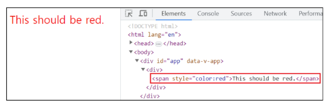
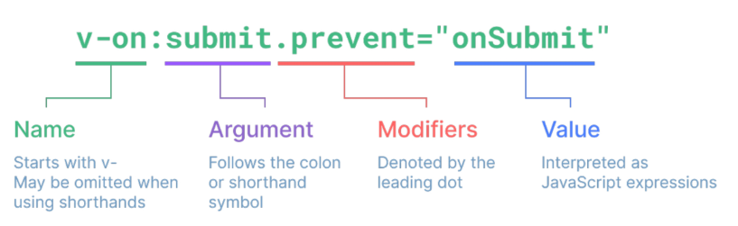
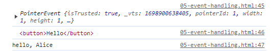
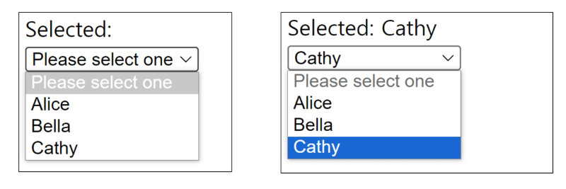

# Basic Syntax - 01

2023.11.02 (Thu)
-----
## Template Syntax
> DOM을 기본 구성 요소 인스턴스의 데이터에 선언적으로 바인딩(Vue Instance와 DOM을 연결)할 수 있는 HTML 기반 템플릿 구문을 사용

### Text Interpolation
```
<p>Message : {{ msg }}>/p
```
- 데이터 바인딩의 가장 기본적인 형태
- 이중 중괄호 구문(Mustache syntax)을 사용
- Mustache syntax는 해당 구성 요소 인스턴스의 msg 속성 값으로 대체
- msg 속성이 변경될 때마다 업데이트 됨

### Raw HTML
```
<div v-html="rawHtml"></div>
```
```
const rawHtml = ref('<span style="color:red">This should be red.</span>')
```

- Mustache syntax는 데이터를 일반 텍스트로 해석하기 때문에 실제 HTML을 출력하려면 v-html을 사용해야 함
### Attibute Bindings
```
<div v-bind:id="dynamicId"></div>
```
```
const dynamicId = ref('my-id')
```
- Mustache syntax는 HTML 속성 내에서 사용할 수 없기 때문에 v-bind를 사용
- HTML의 id 속성 값을 vue의 dynamicId 속성과 동기화 되도록 함
- 바인딩 값이 null이나 undefined인 경우 렌더링 요소에서 제거됨
  
### JavaScript Expressions
```
<div>{{ number + 1 }}</div>
<div>{{ ok ? 'Yes' : 'No' }}</div>
<div>{{ msg.split('').reverse().join('') }}</div>
<div v-bind:id="`list-${id}`"></div>
```
- Vue는 모든 데이터 바인딩 내에서 JS 표현식의 모든 기능을 지원
- Vue 템플릿에서 JS 표현식을 사용할 수 있는 위치
  - Mustache syntax 내부
  - 모든 directive 속성 값 (v-로 시작하는 특수 속성)
### Expressions 주의사항
- 각 바인딩에는 하나의 단일 표현식만 포함될 수 있음
  - 표현식은 값으로 평가할 수 있는 코드 조각 (return 뒤에 사용할 수 있는 코드여야 함)
- 작동하지 않는 경우
```
<!-- 표현식이 아닌 선언식 -->
{{const number = 1}}

<!-- 흐름제어도 작도하지 않음. 삼항 표현식을 사용 -->
{{ if (ok) return message }}
```

### Directive
> 'v-'접두사가 있는 특수 속성
- Directive 특징
  - Directive의 속성 값은 단일 JS 표현식이어야 함 (v-for, v-on 제외)
  - 표현식 값이 변경될 때 DOM에 반응적으로 업데이트를 적용
  - 예시 : v-if 는 seen 표현식 값의 T/F를 기반으로 <p>요소를 제거/삽입<br>
        `<p v-if= "seen">Hi There</p>`

**Directive 전체 구문** <br>

- Directive - Arguments
  - 일부 directive는 directive 뒤에 콜론(:)으로 표시되는 인자를 사용할 수 있음
  - 아래 예시의 href는 HTML a 요소의 href 속성 값을 myUrl 값에 바인딩 하도록 하는 v-binde의 인자
    ```
    <a v-bind:href="myUrl">Link</a>
    ```
  - 아래 예시의 click은 이벤트 수신할 이벤트 이름을 작성하는 작성하는 v-on의 인자
    ```
    <button v-on:click="doSomething">Button</button>
    ```

- Directive - Modifiers
  - .(dot)으로 표시되는 특수 접미사로, directive가 특별한 방식으로 바인딩되어야 함을 나타냄
  - 예를들어 .prevent는 발생한 이벤트에서 event.preventDefault()를 호출하도록 v-on에 지시하는 modifier
    ```
    <form @submit.prevent="onSubmit">
      <input type="submit">
    </form>
    ```
- Built-in Directives
  - v-text
  - v-show
  - v-if
  - v-for
  - [etc](https://vuejs.org/api/built-in-directives.html)
## Dynamically data binding
### v-bind
> 하나 이상의 속성 또는 컴포넌트 데이터를 표현식에 동적으로 바인딩
- v-bind 사용처
  - Attribute Bindings
  - Class and Style Bindings
### Attribute Bindings
- HTML의 속성 값을 Vue의 상태 속성 값과 동기화 되도록 함
  ```
  
  <a v-bind:href="myUrl">Link</a>
  ```
- v-bind shorthand(약어) : ':'(colon)
  ```
  <!-- shorthand -->
  
  <a :href="myUrl">Link</a>
  ```
- Dynamic attribute name (동적 인자 이름)
  - 대괄호로 감싸서 directive argument에 JavaScript 표현식을 사용할 수도 있음
  - JavaScript 표현식에 따라 동적으로 평가된 값이 최종 argument 값으로 사용됨
  ```
  <button :[key]="myValue"></button>
  ```
- Attibute Bindings 예시

  ```
  <body>
    <div id="app">
      
      <a :href="myUrl">Link</a>
      <p :[dynamicattr]="dynamicValue">.....</p>
    </div>

    <script src="https://unpkg.com/vue@3/dist/vue.global.js"></script>
    <script>
      const { createApp, ref } = Vue

      const app = createApp({
        setup() {
          const imageSrc = ref('https://picsum.photos/200/')
          const myUrl = ref('https://www.google.co.kr/')
          const dynamicattr = ref('title')
          const dynamicValue = ref('Hello')
          return {
            imageSrc,
            myUrl,
            dynamicattr,
            dynamicValue
          }
        }
      })

      app.mount('#app')
    </script>
  </body>
  ```
### Class and Style Bindings

- Class and Style Bindings 특징
  - 클래스와 스타일은 모두 속성이므로 v-bind를 사용하여 다른 속성과 마찬가지로 동적으로 문자열 값을 할당할 수 있음
  - 그러나 단순히 문자열 연결을 사용하여 이러한 값을 생성하는 것은 번거롭고 오류가 발생하기가 쉬움
  - Vue는 클래스 및 스타일과 함께 v-bind를 사용할 때 객체 또는 배열을 활용한 개선 사항을 제공
- Class and Style Bindings 가 가능한 경우
  - Binding HTML Classes
    - Binding to Objects
    - Binding to Arrays
  - Binding Inline Styles
    - Binding to Objects
    - Binding to Arrays
- 1.1 Binding HTML Classes - Binding to Objects
  - 객체를 `:class`에 전달하여 클래스를 동적으로 전환할 수 있음
  - 예시 1) isActive의 T/F에 의해 active 클래스의 존재가 결정됨
    ```
    <!-- Vue.js -->
    const isActive = ref(true)

    <!-- html -->
    <div :class = "{ active: isActive }">Text</div>
    ```
  - 객체에 더 많은 필드를 포함하여 여러 클래스를 전환할 수 있음
  - 예시 2) :class directive를 일반 클래스 속성과 함께 사용 가능
  ```
  <body>
    <div id="app">

      <!-- Binding to Objects -->
      <div :class="{ active: isActive }">Text</div>
      <div class="static" :class="{ active: isActive, 'text-primary': hasInfo }">Text</div>
      <div class="static" :class="classObj">Text</div>
    </div>

    <script src="https://unpkg.com/vue@3/dist/vue.global.js"></script>
    <script>
      const { createApp, ref } = Vue

      const app = createApp({
        setup() {
          const isActive = ref(true)
          const hasInfo = ref(true)
          // ref는 반응 객체의 
          const classObj = ref({
            active: isActive, 
            'text-primary': hasInfo
          })
          return {
            isActive,
            hasInfo,
            classObj
          }
        }
      })

      app.mount('#app')
    </script>
  </body>
  ```
- 1.2 Binding HTML Classes - Binding to Arrays
  - :class를 배열에 바인딩하여 클래스 목록을 적용할 수 있음
  - 배열 구문 내에서 객체 구문 사용
  ```
  <body>
    <div id="app">

      <!-- Binding to Arrays -->

      <!-- :class를 배열에 바인딩 -->
      <div :class="[activeClass, infoClass]">Text</div>

      <!-- 배열 구문 내에서 객체 구문 사용 -->
      <div :class="[{ active: isActive }, infoClass]">Text</div>
    </div>

    <script src="https://unpkg.com/vue@3/dist/vue.global.js"></script>
    <script>
      const { createApp, ref } = Vue

      const app = createApp({
        setup() {
          const activeClass = ref('active')
          const infoClass = ref('text-primary')
          return {
            activeClass,
            infoClass
          }
        }
      })

      app.mount('#app')
    </script>
  </body>
  ```
- 2.1 Binding Inline Styles - Binding to Objects
  - :style은 JavaScript 객체 값에 대한 바인딩을 지원(HTML style 속성에 해당)
  ```
  <body>
    <div id="app">

      <!-- Binding to Objects -->
      <div :style="{ color: activeColor, fontSize: fontSize + 'px'}">Text</div>

      <!-- 실제 CSS에서 사용하는 것처럼 :style은 kebab-cased 키 문자열도 지원 (단, camelCase 작성을 권장) -->
      <div :style="{ 'font-size': fontSize + 'px'}">Text</div>
      
      <!-- 템플릿을 더 깔끔하게 작성하려면 스타일 객체에 직접 바인딩하는 것을 권장 -->
      <div :style="styleObj">Text</div>
    </div>

    <script src="https://unpkg.com/vue@3/dist/vue.global.js"></script>
    <script>
      const { createApp, ref } = Vue

      const app = createApp({
        setup() {
          const activeColor = ref('crimson')
          const fontSize = ref(50)
          const styleObj = ref({
            color: activeColor, 
            fontSize: fontSize.value + 'px'
          })
          const styleObj2 = ref({
            color: 'blue',
            border: '1px solid black'
          })
          return {
            activeColor,
            fontSize,
            styleObj,
          }
        }
      })

      app.mount('#app')
    </script>
  </body>
  ```

- 2.2 Binding Inline Styles - Binding to Arrays
  - 여러 스타일 객체의 배열에 :style을 바인딩할 수 있음
  - 작성한 객체는 병합되어 동일한 요소에 적용
  ```
  <body>
    <div id="app">

      <!-- Binding to Arrays -->
      <div :style="[styleObj, styleObj2]">Text</div>
    </div>

    <script src="https://unpkg.com/vue@3/dist/vue.global.js"></script>
    <script>
      const { createApp, ref } = Vue

      const app = createApp({
        setup() {
          const activeColor = ref('crimson')
          const fontSize = ref(50)
          const styleObj = ref({
            color: activeColor, 
            fontSize: fontSize.value + 'px'
          })
          const styleObj2 = ref({
            color: 'blue',
            border: '1px solid black'
          })
          return {
            activeColor,
            fontSize,
            styleObj,
            styleObj2
          }
        }
      })

      app.mount('#app')
    </script>
  </body>
  ```

**[v-bind 종합](https://vuejs.org/api/built-in-directives.html#v-bind)**

## Event Handling
### v-on
> DOM 요소에 이벤트 리스너를 연결 및 수신
- v-on 구성
  ```
  v-on:event="handler"
  ```
  - handler 종류
    - Inline handlers : 이벤트가 trigger될 때 실행 될 JavaScript 코드
    - Method handlers : 컴포넌트에 정의된 메서드 이름
  - v-on storthand (약어)
    - '@'
    ```
    @event="handler"
    ```
- Inline handlers
  - Inline handlers는 주로 간단한 상황에 사용
  ```
  const count = ref(0)
  ```
  ```
  <button @click="count++">Add 1</button>
  <p>Count: {{ count }}</p>
  ```
- Method handlers
  - Inline handlers로는 불가능한 대부분의 상황에서 사용
  ```
  const count = ref(0)
  const name = ref('Alice')
  <!-- Method handlers는 이를 트리거하는 기본 DOM Event 객체를 자동으로 수신 -->
  const myFunc = function (event) {
    console.log(event)
    console.log(event.currentTarget)
    console.log(`hello, ${name.value}`)
  }
  ```

  ```
  <button @click="myFunc">Hello</button>
  ```
  
- Inline Handlers에서의 메서드 호출
  - 메서드 이름에 직접 바인딩하는 대신 Inline Handlers에서 메서드를 호출할 수도 있음
  - 이렇게 하면 기본 이벤트 대신 사용자 지정 인자를 전달할 수 있음
  ```
  const greeting = function (message){
    console.log(message)
  }
  ```

  ```
  <button @click="greeting('hello')">Say hello</button>
  <button @click="greeting('bye')">Say bye</button>
  ```
- Inline Handlers에서의 event 인자에 접근하기
  - Inline Handlers에서 원래 DOM이벤트에 접근하기
  - $event 변수를 사용하여 메서드에 전달
  ```
  const warning = function (message, event){
    console.log(message)
    console.log(event)
  }
  ```
  ```
  <button @click="warning('경고입니다.', $event)">Submit</button>
  ```
- Event Modifiers
  - Vue는 v-on에 대한 Event Modifiers를 제공해 `event.preventDefault()`와 같은 구문을 메서드에서 작성하지 않도록 함
  - stop, prevent, self 등 다양한 modifiers를 제공
  ```
  <form @submit.prevent="onSubmit">
    <input type="submit">
  </form>
  <a @click.stop.prevent="onLink">Link</a>
  ```
  - Modifiers는 chained 되게끔 작성할 수 있으며 이때는 작성된 순서로 실행되기 때문에 작성 순서에 유의
- Key Modifiers
  - Vue는 키보드 이벤트를 수신할 때 특정 키에 관한 별도 modifiers를 사용할 수 있음
  ```
  <input type="text" @keyup.enter="onSubmit">
  ```
**[v-on 종합](https://vuejs.org/api/built-in-directives.html#v-on)**
## Form Input Bindings
### Form Input Bindings
- form을 처리할 때 사용자가 input에 입력하는 값을 실시간으로 JavaScript 상태에 동기화 해야 하는 경우(양방향 바인딩)
- 양방향 바인딩 방법
  - v-bind와 v-on을 함께 사용
  - v-model 사용
- v-bind와 v-on을 함께 사용
  - v-bind를 사용하여 input 요소의 value 속성 값을 입력 값으로 사용
  - v-on을 사용하여 input 이벤트가 발생할 때마다 input요소의 value 값을 별도 반응형 변수에 저장하는 핸들러를 호출
  ```
  const inputText1 = ref('')
  const onInput = function (event) {
    inputText1.value = event.currentTarget.value
    }
  ```

  ```
  <p>{{ inputText1 }}</p>
  <input type="text" @input="onInput" :value="inputText1">
  ```

### v-model
> form input 요소 도는 컴포넌트에서 양방향 바인딩을 만듦
- v-model 사용
  - v-model을 사용하여 사용자 입력데이터와 반응형 변수를 실시간 동기화
  ```
  const inputText2 = ref('')
  ```
  ```
  <p>{{ inputText2 }}</p>
  <input type="text" v-model="inputText2">
  ```
  - IME가 필요한 언어(한국어, 중국어, 일본어 등)의 경우 v-model이 제대로 업데이트되지 않음
  - 해당 언어에 대해 올바르게 응답하려면 v-bind와 v-on 방법을 사용해야 함

- v-model 활용
  - v-model과 다양한 입력(input) 양식
    - v-model은 단순 text input 뿐만 아니라 Checkbox, Radio, Select 등 다양한 타입의 사용자 입력 방식과 함께 사용 가능
  - Checkbox 활용
    - 단일 체크박스와 boolean값 활용
      ```
      const checked = ref(false)
      ```
      ```
      <!-- single checkbox -->
      <input type="checkbox" id="checkbox" v-model="checked">
      <label for="checkbox">{{ checked }}</label>
      ```
    - 여러 체크박스와 배열 활용 : 해당 배열에는 현재 선택된 체크박스의 값이 포함됨
      ```
      const checkedNames = ref([])
      ```

      ```
      <!-- multiple checkbox -->
      <div>Checked names: {{ checkedNames }}</div>

      <input type="checkbox" id="alice" value="Alice" v-model="checkedNames">
      <label for="alice">Alice</label>

      <input type="checkbox" id="bella" value="Bella" v-model="checkedNames">
      <label for="bella">Bella</label>
      ```
    - select에서 v-model 표현식의 초기 값이 어떤 option과도 일치하지 않는 경우 select 요소는 선택되지 않은(unselected) 상태로 렌더링 됨
      ```
      const selected = ref('')
      ```

      ```
      <!-- single select -->
      <div>Selected: {{ selected }}</div>

      <select v-model="selected">
        <option disabled value="">Please select one</option>
        <option>Alice</option>
        <option>Bella</option>
        <option>Cathy</option>
      </select>
      ```
    
**[v-model 종합](https://vuejs.org/api/built-in-directives.html#v-model)**


### 참고
- IME(Input Method Editor)
  - 사용자가 입력 장치에서 기본적으로 사용할 수 없는 문자(비영어권 언어)를 입력할 수 있도록 하는 운영 체제 구성 프로그램
  - 일반적으로 키보드 키보다 자모가 더 많은 언어에서 사용해야 함
  - IME가 동작하는 방식과 Vue의 양방향 바인딩(v-model)동작 방식이 상충하기 때문에 한국어 입력 시 예상대로 동작하지 않았던 것