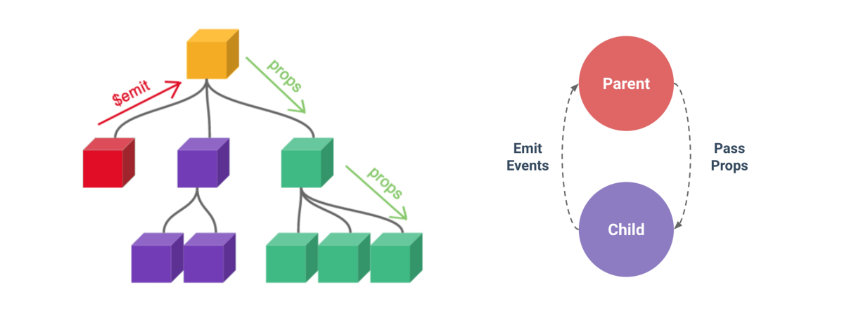
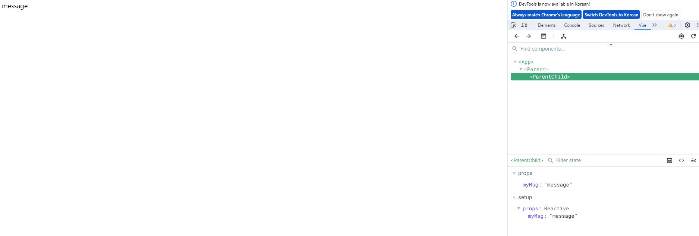
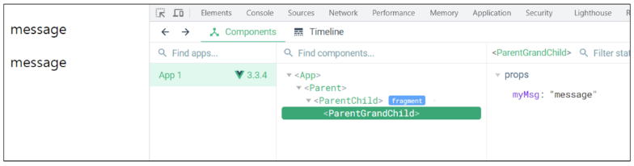
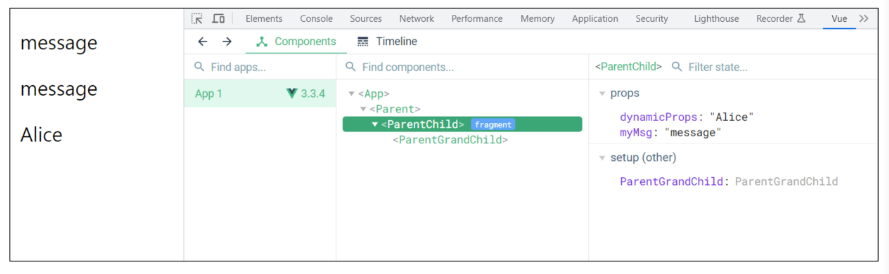
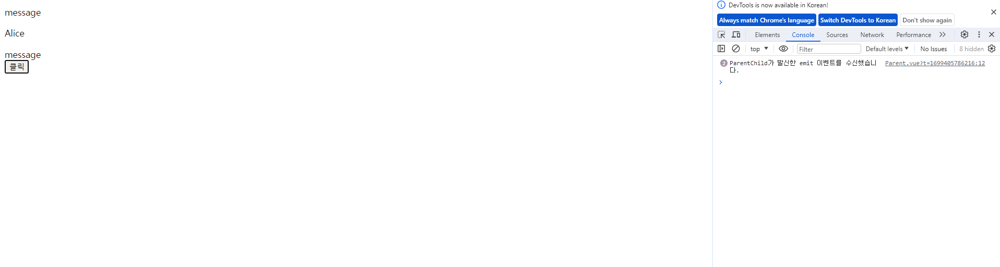
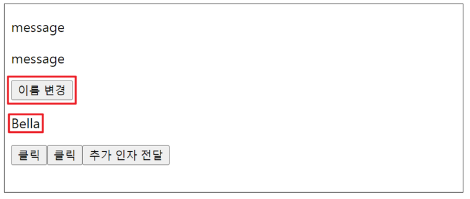
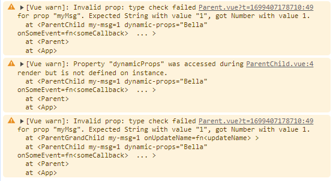

# Component State Flow

2023.11.08 (Wed)
-----
## Passing Props
### 개요
- 같은 데이터 하지만 다른 컴포넌트
  - 동일한 사진 데이터가 한 화면에 다양한 위치에서 여러번 출력 되고 있을 때, 공통된 부모 컴포넌트에서 관리하자!

<br>
- 부모는 자식에게 데이터를 전달(Passing Props)하며, 자식은 자신에게 일어난 일을 부모에게 알림(Emit event)

**Props**
> 부모 컴포넌트로부터 자식 컴포넌트로 데이터를 전달하는데 사용되는 속성

**One-Way Data Flow**
> 모든 props는 자식 속성과 부모 속성 사이에 하향식 단방향 바인딩을 형성(one-way-down binding)  

- Props 특징
  - 부모 속성이 업데이트되면 자식으로 흐르지만 그 반대는 안됨
  - 즉, 자식 컴포넌트 내부에서 props를 변경하려고 시도해서는 안되며 불가능
  - 또한 부모 컴포넌트가 업데이트될 때마다 자식 컴포넌트의 모든 props 가 최신 값으로 업데이트 됨
    > 부모 컴포넌트에서만 변경하고 이를 내려 받는 자식 컴포넌트는 자연스럽게 갱신

- 단방향인 이유
  - 하위 컴포넌트가 실수로 상위 컴포넌트의 상태를 변경하여 앱에서의 데이터 흐름을 이해하기 어렵게 만드는 것을 방지하기 위함

### 사전 준비
**1. vue 프로젝트 생성<br>**
**2. 초기 생성된 컴포넌트 모두 삭제 (App.vue 제외)<br>**
**3. src/assets 내부 파일 모두 삭제<br>**
**4. main.js 해당 코드 삭제<br>**
```
import './assets/main.css'
```
**5. App > Parent > ParentChild 컴포넌트 관계 작성<br>**
- App 컴포넌트 작성
    ```
    <template>
    <div>

        <Parent />


    </div>
    </template>

    <script setup>
    import Parent from '@/components/Parent.vue';
    </script>

    <style scoped>

    </style>
    ```
- Parent 컴포넌트 작성
    ```
    <template>
        <div>
    
        <ParentChild />
    
    
        </div>
    </template>
    
    <script setup>
    import ParentChild from '@/components/ParentChild.vue';
    </script>
    
    <style scoped>
    
    </style>
    ```

- ParentChild 컴포넌트 작성
    ```
    <template>
        <div>

        </div>
    </template>

    <script setup>

    </script>

    <style scoped>

    </style>
    ```

### Props 선언
> 부모 컴포넌트에서 보낸 props를 사용하기 위해서는 자식 컴포넌트에서 명시적인 props 선언이 필요

- 부모 컴포넌트 Parent에서 자식 컴포넌트 ParentChild에 보낼 props 작성
```
<template>
    <div>
  
      <ParentChild my-msg = "message"/> 
      
      <!-- my-msg : prop 이름 -->
      <!-- "message" : prop 값 -->
      <!-- html 속성 값은 camel case 쓰지 않으므로 kebab case로 작성 -->

  
    </div>
</template>
```
- Props 선언 2가지 방식
  - 문자열 배열을 사용한 선언 : defineProps()를 사용하여 props를 선언
    ```
    <script setup>

    // 1. 문자열 배열 선언
    defineProps(["myMsg"])
    // vue에서는 kebab case로 작성

    </script>
    ```
  - 객체를 사용한 선언 : 객체 선언 문법의 각 객체 속성의 키는 props의 이름이 되며, 객체 속성의 값은 값이 될 데이터의 타입에 해당하는 생성자 함수(Number, String...)여야 함
    ```
    <script setup>

    // 2. 객체를 사용한 선언
    defineProps({
        myMsg : String
    })

    </script>
    ```
  - **객체 선언 문법 사용 권장**

- props 데이터 사용
  - 템플릿에서 반응형 변수와 같은 방식으로 활용
    ```
    <div>
        {{ myMsg }}
    </div>
    ```

  - props를 객체로 반환하므로 필요한 경우 JavaScript에서 접근 가능
    ```
    <script setup>

    // JS 접근
    const props = defineProps({
        myMsg : String
    })

    console.log(props) // Proxy(Object) {myMsg: 'message'}
    console.log(props.myMsg) // message

    </script>
    ```
- prop 출력 결과<br>
    
<br>

**한 단계 더 prop 내려 보내기<br>**
- ParentChild를 부모로 갖는 ParentGrandChild 컴포넌트 생성 및 등록
    ```
    <!-- ParentGrandChild -->
    <template>
        <div></div>
    </template>

    <script setup>
    </script>
    ```
    ```
    <!-- ParentChild -->
    <template>
        <div>
            {{ myMsg }}
            <ParentGrandChild />
        </div>
    </template>

    <script setup>
    import ParentGrandChild from '@/components/ParentGrandChild.vue';
    </script>

    <style scoped>

    </style>
    ```
- ParentChild 컴포넌트에서 Parent로 부터 받은 prop인 myMsg를 ParentGrandChild에게 전달
    ```
    <template>
        <div>
        <p>{{ myMsg }}</p> 
            <ParentGrandChild :my-msg ="myMsg"  />
        </div>
    </template>
    ```
    ```
    <template>
        <div>
            {{ myMsg }}
        </div>
    </template>

    <script setup>
    defineProps({
        myMsg : String
    })

    </script>
    ```
- 출력 결과 확인
  - ParentGrandChild가 받아서 출력하는 prop은 Parent에 정의 되어있는 prop이며 Parent가 prop을 변경할 경우 이를 전달받고 있는 ParentChild, ParentGrandChild에서도 모두 업데이트 됨<br>
    

### Props 세부사항
**1. Props Name Casing (Props 이름 컨벤션)<br>**
- 선언 및 템플릿 참조 시 (-> camelCase)
    ```
    <p>{{ myMsg }}</p> 
    ```
    ```
    defineProps({
        myMsg : String
    })
    ```
- 자식 컴포넌트로 전달 시 (->kebab-case) : 기술적으로 camelCase도 가능하나 HTML 속성 표기법과 동일하게 kebab-case로 표기할 것을 권장
    ```
    <ParentChild my-msg="message"  /> 
    ```   

**2. Static Props & Dynamic Props<br>**
- 지금까지 작성한 것은 Static(정적) props
- v-bind를 사용하여 동적으로 할당된 props를 사용할 수 있음

- 1. Dynamic props 정의
    ```
    <!-- Parent.vue -->

    <template>
        <div>
    
        <ParentChild 
        my-msg="message"  
        :dynamic-props="name"
        /> 
        </div>
    </template>
    ```
    ```
    <!-- Parent.vue -->

    <script setup>

    import {ref} from 'vue'

    const name = ref('Alice')

    </script>
    ```
- 2. Dynamic props 선언 및 출력
    ```
    <!-- ParentChild.vue -->

    <script setup>
        const props = defineProps({
            myMsg : String,
            dynamicProps : String,
        })
    </script>
    ```
    ```
    <!-- ParentChild.vue -->

    <template>
        <div>
            <p>{{dynamicProps}}</p>
        </div>
    </template>
    ```

- 3. Dynamic props 출력 확인<br>
    

## Component Events
### 개요<br>

- 부모는 자식에게 데이터를 전달(Passing Props)하며, 자식은 자신에게 일어난 일을 부모에게 알림(Emit event)
- **부모가 prop 데이터를 변경하도록 소리쳐야 한다.**
<br>

**`$emit()`<br>**
> 자식 컴포넌트가 이벤트를 발생시켜 부모 컴포넌트로 데이터를 전달하는 역할의 메서드
> `$` 표기는 Vue 인스턴스나 컴포넌트 내에서 제공되는 전역 속성이나 메서드를 식별하기 위한 접두어

- emit 메서드 구조
    ```
    $emit(event, ...args)
    ```
  - event : 커스텀 이벤트 이름
  - args : 추가 인자

### Event 발신 및 수신
- $emit을 사용하여 템플릿 표현식에서 직접 사용자 정의 이벤트를 발신
    ```
    <button @click="$emit('someEvent')">클릭</button>
    ```
- 그러면 부모는 v-on을 사용하여 수신할 수 있음
    ```
    <ParentChild @some-event="someCallback" /> 
    ```

**이벤트 발신 및 수신하기<br>**
- ParentChild에서 someEvent라는 이름의 사용자 정의 이벤트를 발신
    ```
    <!-- ParentChild.vue -->

    <button @click="$emit('someEvent')">클릭</button>
    ```
- ParentChild의 부모 Parent는 v-on을 사용하여 발신된 이벤트를 수신
    ```
    <!-- Parent.vue -->

    <ParentChild 
    my-msg="message"  
    :dynamic-props="name"
    @some-event="someCallback"
    /> 
    ```

- 수신 후 처리할 로직 및 콜백함수 호출
    ```
    <!-- Parent.vue -->

    const someCallback = function (){
    console.log("ParentChild가 발신한 emit 이벤트를 수신했습니다.")
    }
    ```

- 이벤트 수신 결과<br>
    


### 'emit' Event 선언
- defineEmits()를 사용하여 명시적으로 발신할 이벤트를 선언할 수 있음
- script에서 $emit 메서드를 접근할 수 없기 때문에 defineEmits()는 $emit 대신 사용할 수 있는 동등한 함수를 반환
```
<script setup>
const emit = defineEmits(['someEvent', 'myFocus'])

const buttonClick = function (){
    emit('someEvent')
}
</script>
```
**이벤트 선언하기<br>**
- 이벤트 선언 방식으로 추가 버튼 작성 및 결과 확인
    ```
    <!-- ParentChild.vue -->

    <script setup>
    const emit = defineEmits(['someEvent'])

    const buttonClick = function (){
        emit('someEvent')
    }
    </script>
    ```
    ```
    <!-- ParentChild.vue -->

    <button @click="buttonClick">클릭</button>
    ```

**Event 인자(Event Arguments)<br>**
- 이벤트 발신 시 추가 인자를 전달하여 값을 제공할 수 있음

**Event 인자 전달하기<br>**
- ParentChild에서 이벤트를 발신하여 Parent로 추가 인자 전달하기
    ```
    <!-- ParentChild.vue -->

    const emit = defineEmits(['someEvent', 'emitArgs'])

    const emitArgs = function () {
        emit('emitArgs', 1, 2, 3)
    }
    ```
    ```
    <!-- ParentChild.vue -->

    <button @click="emitArgs">추가 인자 전달</button>
    ```
- ParentChild에서 발신한 이벤트를 Parent에서 수신
    ```
    <!-- Parent.vue -->

    <ParentChild 
    my-msg="message"  
    :dynamic-props="name"
    @some-event="someCallback"
    @emit-args= "getNumbers"
    /> 

    ```
    ```
    <!-- Parent.vue -->

    const getNumbers = function (...args) {
    console.log(args)
    }
    ```
### Event 세부사항
- Event Name Casing
  - 선언 및 발신 시 (-> CamelCase)
    ```
    <button @click="buttonClick">클릭</button>
    ```
    ```
    <script setup>
    const emit = defineEmits(['someEvent'])

    const buttonClick = function (){
        emit('someEvent')
    }
    </script>
    ```

  - 부모 컴포넌트에서 수신 시 (-> kebab-case)
    ```
    <ParentChild 
    my-msg="message"  
    :dynamic-props="name"
    @some-event="someCallback" 
    />
    ```

### emit Event 실습

**최하단 컴포넌트 ParentGrandChild에서 Parent 컴포넌트의 name 변수 변경 요청하기**<br>
- ParentGrandChild에서 이름 변경을 요청하는 이벤트 발신
    ```
    <!-- ParentGrandChild.vue -->

    const emit = defineEmits(['updateName'])

    const updateName = function () {
        emit('updateName')
    }
    ```

    ```
    <!-- ParentGrandChild.vue -->

    <button @click="updateName">이름 변경!</button>
    ```
- 이벤트 수신 후 이름 변경을 요청하는 이벤트 발신
    ```
    <!-- ParentChild.vue -->

    const emit = defineEmits(['someEvent', 'emitArgs', 'updateName'])

    const updateName = function () {
        emit('updateName')
    }
    ```
    ```
    <!-- ParentChild.vue -->

    <ParentGrandChild 
    :my-msg ="myMsg"  
    @update-name = "updateName"
    />
    ```
- 이벤트 수신 후 이름 변수 변경 메서드 호출
    ```
    <!-- Parent.vue -->

    <ParentChild 
    my-msg="message"  
    :dynamic-props="name"
    @some-event="someCallback"
    @emit-args= "getNumbers"
    @update-name = "updateName"
    /> 
    ```
    ```
    <!-- Parent.vue -->

    const updateName = function (){
    name.value = "Bella"
    }
    ```
  - 해당 변수를 prop으로 받는 모든 곳에서 자동 업데이트
- 버튼 클릭 후 결과 확인<br>
    

### 참고
- 정적 & 동적 props 주의 사항
    ```
    <!-- 1 -->
    <SomeComponenet num-props="1" />
    <!-- 문자열로써의 "1"을 전달 -->

    <!-- 2 -->
    <SomeComponenet :num-props="1" />
    <!-- 숫자로써의 1을 전달 -->
    ```
- Prop 선언을 객체 선언 문법으로 권장하는 이유
  - prop에 타입을 지정하는 것은 컴포넌트를 가독성 좋게 문서화하는데 도움이 되며, 다른 개발자가 잘못된 유형을 전달할 때에는 브라우저 콘솔에 경고를 출력하도록 함
  - 추가로 prop에 대한 유효성 검사로써 활용 가능
  - [참고](http://vuejs.org/guide/components/props.html#prop-validation)
    ```
    <!-- ParentChild.vue -->
    defineProps({
        myMsg : {
            type : String, 
            required : true ,
        }
    })
    ```
    ```
    <!-- Parent.vue -->
    <template>
        <div>
    
        <ParentChild 
        :my-msg="1"  
        :dynamic-props="name"
        @some-event="someCallback"
        @emit-args= "getNumbers"
        @update-name = "updateName"
        /> 
        
        </div>
    </template>
    ```
    
- emit 이벤트도 객체 선언 문법으로 작성 가능
  - props 타입 유효성 검사와 유사하게 emit 이벤트 또한 객체 구문으로 선언된 경우 유효성을 검사할 수 있음
  - [참고](https://vuejs.org/guide/components/events.html#events-validation)
    ```
    <script setup>
    const emit = defineEmits({
    // No validation
    click: null,

    // Validate submit event
    submit: ({ email, password }) => {
        if (email && password) {
        return true
        } else {
        console.warn('Invalid submit event payload!')
        return false
        }
    }
    })

    function submitForm(email, password) {
    emit('submit', { email, password })
    }
    </script>
    ```
