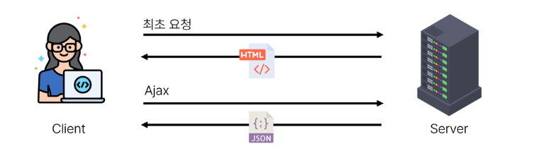
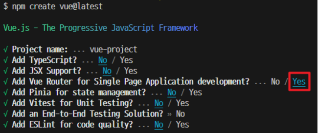
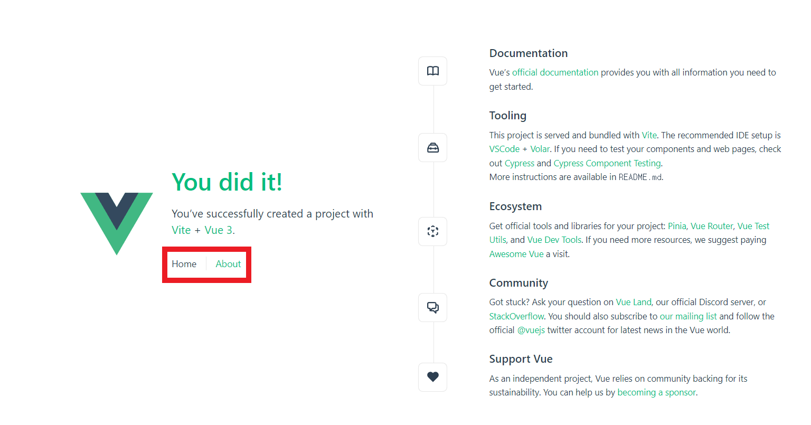
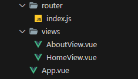
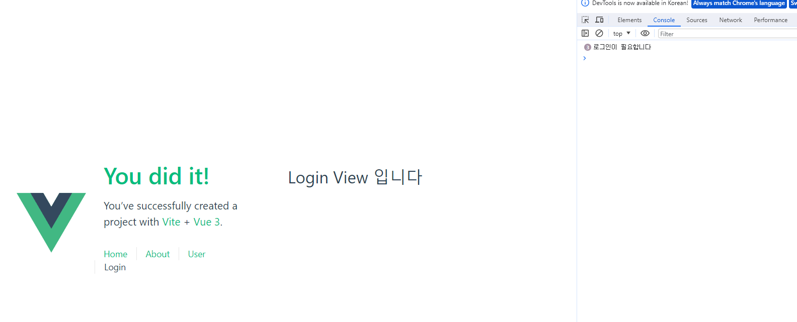
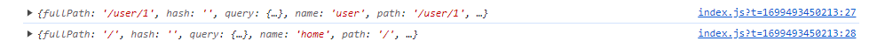
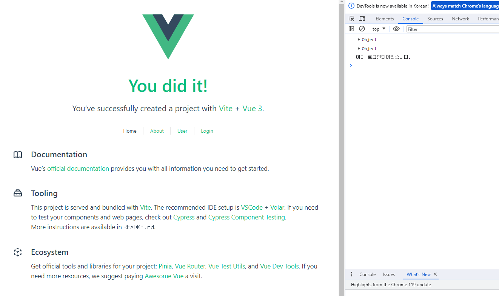
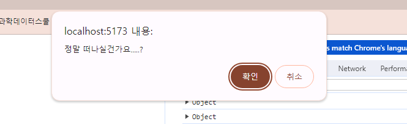
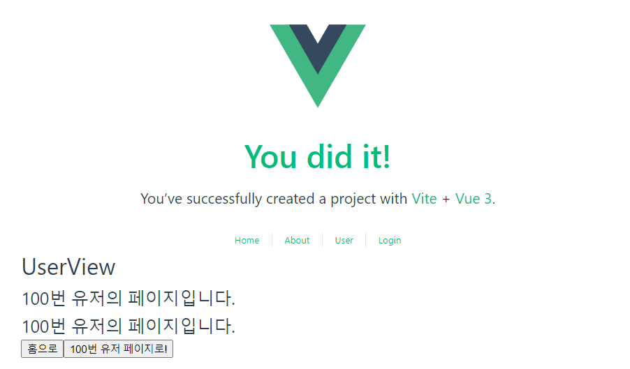

# Router

2023.11.09 (Thu)
-----
## Routing
### 개요
> 네트워크에서 경로를 선택하는 프로세스<br>
> 웹 애플리케이션에서 다른 페이지간의 전환과 경로를 관리하는 기술
<br>


- SSR에서의 Routing 
  - 서버가 사용자가 방문한 URL 경로를 기반으로 응답을 전송
  - 링크를 클릭하면 브라우저는 서버로부터 HTML 응답을 수신하고 새 HTML로 전체 페이지를 다시 로드 
- CSR/SPA에서의 Routing
  - SPA에서 routing은 브라우저의 클라이언트 측에서 수행
  - 클라이언트 측 JavaScript가 새 데이터를 동적으로 가져와 전체 페이지를 다시 로드 하지 않음
  - 페이지는 1개이지만, 링크에 따라 여러 컴포넌트를 렌더링하여 마치 여러 페이지를 사용하는 것처럼 보이도록 해야 함
- 만약 routing이 없다면
  - 유저가 URL을 통한 페이지의 변화를 감지할 수 없음
  - 페이지가 무엇을 렌더링 중인지에 대한 상태를 알 수 없음
    - URL이 1개이기 때문에 새로 고침 시 처음 페이지로 되돌아감
    - 링크를 공유할 시 첫 페이지만 공유 가능
  - 브라우저의 뒤로 가기 기능을 사용할 수 없음
## Vue Router
### 개요
> Vue 공식 라우터(The official Router for Vue.js)<br>
> [Official Guide](https://v3.router.vuejs.org/guide/#html)

**Vue Router 추가**<br>

- Vite로 프로젝트 생성 시 Router 추가<br>

- 서버 실행 후 Router로 인한 프로젝트 변화 확인
  - Home, About 링크에 따라 변경되는 URL과 새로 렌더링 되는 화면

**Vue 프로젝트 구조 변화**<br>

1. App.vue 코드 변화
   - Router Link
      ```
      <template>
      <header>
          <div class="wrapper">
          <nav>
              <RouterLink to="/">Home</RouterLink>
              <RouterLink to="/about">About</RouterLink>
          </nav>
          </div>
        </header>
      </template>
      ```
     - 페이지를 다시 로드하지 않고 URL을 변경하고 URL 생성 및 관련 로직을 처리
     - HTML의 a 태그를 렌더링
   - Router View
    ```
    <template>
      <header>
        ...
      </header>

      <RouterView />
    </template>
    ```
     - URL에 해당하는 컴포넌트를 표시
     - 어디에나 배치하여 레이아웃에 맞출 수 있음
2. router 폴더 생성
   - router/index.js
       - 라우팅에 관련된 정보 및 설정이 작성되는 곳
       - router에 URL과 컴포넌트를 매핑
3. views 폴더 생성
   - RouterView 위치에 렌더링 할 컴포넌트를 배치
   - 기존 components 폴더와 기능적으로 다른 것은 없으며 단순 분류의 의미로 구성됨
   - **일반 컴포넌트와 구분하기 위해 컴포넌트 이름을 View로 끝나도록 작성하는 것을 권장**  

### Basic Routing
- 라우팅 기본
  - index.js에 라우터 관련 설정 작성(주소, 이름, 컴포넌트)
  - RouterLink의 'to'속성으로 index.js에서 정의한 주소 속성 값(path)을 사용
    ```
    // index.js

    const router = createRouter({
    routes: [
        {
        path: '/',
        name: 'home',
        component: HomeView
        },
        ...
    ]
    })
    ```
    ```
    <!-- App.vue -->
    <RouterLink to="/">Home</RouterLink>
    <RouterLink to="/about">About</RouterLink>
    ```
### Named Routes
> 경로에 이름을 지정하는 라우팅
- Named Routes 예시
  - name 속성 값에 경로에 대한 이름을 지정
  - 경로에 연결하려면 RouterLink에 v-bind를 사용해 'to' prop 객체로 전달
    ```
    // index.js

    const router = createRouter({
    routes: [
        {
        path: '/',
        name: 'home',
        component: HomeView
        },
        ...
    ]
    })
    ```
    ```
    <!-- App.vue -->
    <RouterLink :to="{name: 'home'}">Home</RouterLink>
    <RouterLink :to="{name : 'about'}">About</RouterLink>
    ```
- Named Routes 장점
  - 하드 코딩 된 URL을 사용하지 않아도 됨
  - URL 입력 시 오타 방지
 
### Dynamic Route Matching with Params
- 매개변수를 사용한 동적 경로 매칭
  - 주어진 패턴 경로를 동일한 컴포넌트에 매핑 해야 하는 경우 활용

<br>

**매개 변수를 사용한 동적 경로 매칭 활용**<br>

- UserView 컴포넌트 작성
    ```
    <!-- UserView.vue -->

    <template>
        <div>
            <h1>UserView</h1>
        </div>
    </template>
    ```
- UserView 컴포넌트 라우트 등록
  - 매개변수는 콜론(:)으로 표기
    ```
    // index.js

    import UserView from '@/views/UserView.vue'

    const router = createRouter({
    history: createWebHistory(import.meta.env.BASE_URL),
    routes: [
        ...,
        {
        path : '/user/:id',
        name : 'user',
        component: UserView
        },
    ]
    })
    ```
  - 라우트의 매개변수는 컴포넌트에서 $route.params로 참조 가능
      ```
      <!-- UserView.vue -->

      <template>
          <div>
              <h1>UserView</h1>
              <h2>{{  $route.params.id }}번 유저의 페이지입니다.</h2>
          </div>
      </template>
      ```
  - 다만, 다음과 같이 Composition API 방식으로 작성하는 것을 권장
      ```
      <!-- UserView.vue -->

      <script setup>
      import {ref} from 'vue'
      import { useRoute } from 'vue-router';

      const route  = useRoute()
      const userId = ref(route.params.id)
      </script>
      ```
      ```
      <!-- UserView.vue -->
      <template>
          <div>
              <h1>UserView</h1>
              <h2>{{ userId }}번 유저의 페이지입니다.</h2>
          </div>
      </template>
      ```

- App에 RouterLink 등록
    ```
    <!-- App.vue -->

    <RouterLink :to="{name : 'user', params: {id:userId}}">User</RouterLink>
    ```

### Programmatic Navigation
- router의 인스턴스 메서드를 사용해 RouterLink로 a태그를 만드는 것 처럼 프로그래밍으로 네비게이션 관련 작업을 수행할 수 있음

<br>

**router.push()** <br>
- 다른 위치로 이동하기 (Navigate to a different location)
  - 다른 URL로 이동하는 메서드
  - 새 항목을 history stack에 push하므로 사용자가 브라우저 뒤로 가기 버튼을 클릭하면 이전 URL로 이동할 수 있음
  - RouterLink를 클릭했을 때 내부적으로 호출되는 메서드 이므로 Routerlink를 클릭하는 것은 router.push()를 호출하는 것과 같음<br>
    |선언적|프로그래밍적|
    |:---:|:---:|
    |`<RouterLink :to=...>`|`router.push(...)`|


**router.push 활용**<br> 
- UserView 컴포넌트에서 HomeView 컴포넌트로 이동하는 버튼 만들기
    ```
    <!-- UserView.vue -->

    import { useRoute, useRouter } from 'vue-router';

    const router = useRouter()
    const goHome = function () {
        router.push({name : 'home'})
    }
    ```
    ```
    <!-- UserView.vue -->

    <button @click="goHome">홈으로</button>
    ```
- [router.push 인자 활용 참고](http://router.vuejs.org/guide/essentials/navigation.html)
    ```
    // literal string path
    router.push('/users/eduardo')

    // object with path
    router.push({ path: '/users/eduardo' })

    // named route with params to let the router build the url
    router.push({ name: 'user', params: { username: 'eduardo' } })

    // with query, resulting in /register?plan=private
    router.push({ path: '/register', query: { plan: 'private' } })

    // with hash, resulting in /about#team
    router.push({ path: '/about', hash: '#team' })
    ```


**router.replace()**<br>
- 현재 위치 바꾸기 (Replace current location)
  - push 메서드와 달리 history stack에 새로운 항목을 push하지 않고 다른 URL로 이동 (=== 이동 전 URL로 뒤로 가기 불가)<br>
    |선언적|프로그래밍적|
    |:---:|:---:|
    |`<RouterLink :to="..." replace>`|`router.replace(...)`|
- 활용 예시
    ```
    <!-- UserView.vue -->

    import { useRoute, useRouter } from 'vue-router';

    const router = useRouter()
    const goHome = function () {
        router.replace({name : 'home'})
    }
    ```


## Navigation Guard
### 개요
> Vue Router를 통해 특정 URL에 접근할 때 다른 URL로 redirect를 하거나 취소하여 네비게이션을 보호 <br>
> ex) 인증 정보가 없으면 특정 페이지에 접근하지 못하게 함

- Navigation Guard 종류
  - Globally (전역 가드)
    - 애플리케이션 전역에서 동작
    - index.js에서 정의
  - Per-route (라우터 가드)
    - 특정 route에서만 동작
    - index.js의 각 routes에 정의
  - In-component (컴포넌트 가드)
    - 특정 컴포넌트 내에서만 동작
    - 컴포넌트 Script에 정의


### Globally Guard

**router.beforeEach()<br>**
> 다른 URL로 이동하기 직전에 실행되는 함수 (Global Before Guards)

- router.beforeEach 구조
    ```
    router.beforeEach((to,from) =>{
        ...
        return false
    })
    ```
  - to : 이동할 URL 정보가 담긴 Route 객체
  - from : 현재 URL 정보가 담긴 Route 객체
  - 선택적 반환(return) 값
    - false
      - 현재 네비게이션을 취소
      - 브라우저 URL이 변경된 경우(사용자가 수동으로 또는 뒤로 버튼을 통해) from 경로의 URL로 재설정
    - Route Location
      - router.push()를 호출하는 것처럼 경로 위치를 전달하여 다른 위치로 redirect
      - **return이 없다면 'to' URL Route 객체로 이동**
- router.beforeEach 예시
    ```
    // index.js

    router.beforeEach((to, from) => {
    console.log(to)
    console.log(from)
    })
    ```
  - 전역 가드 beforeEach 작성
  - HomeView에서 UserView로 이동 후 각 인자 값 출력 확인하기<br>
    <br>
  - to에는 이동할 URL에 대한 user Route에 대한 정보가, from에는 현재 URL인 home Route에 대한 정보가 들어있음

<br>

**router.beforeEach 활용**<br>
- 사전 준비
  - LoginView 컴포넌트 작성 및 라우트 등록
    ```
    <!-- LoginView.vue -->

    <template>
        <div>
            <h1>Login View 입니다</h1>
        </div>
    </template>
    ```

    ```
    // index.js

    {
        path : '/login',
        name : 'login',
        component : LoginView,
    }
    ```

    ```
    <!-- App.vue -->

    <RouterLink :to="{name : 'login'}">Login</RouterLink>
    ```

- "Login이 되어있지 않다면 페이지 진입을 막고 Login 페이지로 이동시키기" <br>
    
  - 어떤 RouterLink를 클릭해도 LoginView 컴포넌트만 볼 수 있음
  - 만약 로그인이 되어있지 않고, 이동하는 주소 이름이 login이 아니라면 login 페이지로 redirect
  ```
  // index.js

  router.beforeEach((to, from) => {
    const isAuthenticated = false 
    if (!isAuthenticated && to.name != 'login') {
      console.log('로그인이 필요합니다')
      return {name : 'login'}

    }
  })
  ```

### Per-route Guard
**router.beforeEnter()**<br>
> route에 진입했을 때만 실행되는 함수<br>
> 매개변수, 쿼리 값이 변경될때는 실행되지 않고 다른 경로에서 탐색할때만 실행됨

- router.beforeEnter 구조
    ```
    {
    path : '/user/:id',
    name : 'user',
    component: UserView,
    beforeEnter: (to, from) => {
        ...,
        return false
    }
    },
    ```
  - routes 객체에서 정의
  - 함수의 to, from, 선택 반환 인자는 beforeEach와 동일

- router.beforeEnter 예시
    ```
    // index.js

    {
    path : '/user/:id',
    name : 'user',
    component: UserView,
    beforeEnter: (to, from) => {
        console.log(to)
        console.log(from)
    }
    },
    ```
  - 라우터 가드 beforeEnter작성
  - HomeView에서 UserView로 이동 후 각 인자 값 출력 확인하기<br>
  
  - to에는 이동할 URL인 user 라우트에 대한 정보가, from 에는 현재 URL 인 home 라우트에 대한 정보가 들어있음
  - 다른 경로에서 user 라우트를 탐색 했을 때 실행된 것 


**router.beforeEnter 활용**<br>
"이미 로그인 한 상태라면 LoginView 진입을 막고 HomeView로 이동 시키기"
```
// index.js


const isAuthenticated = true
const router = createRouter({
  history: createWebHistory(import.meta.env.BASE_URL),
  routes: [
    ...,
    {
      path : '/login',
      name : 'login',
      component : LoginView,
      beforeEnter : (to, from) => {
        if (isAuthenticated=== true) {
          console.log('이미 로그인되어있습니다.')
          return {name : "home"}
        }
      }

    }
  ]
})
```
- 이미 로그인 상태라면 HomeView로 이동
- 로그인 상태가 아니라면 LoginView로 이동<br>



### In-component Guard
- 컴포넌트 가드 종류
  - onBeforeRouteLeave
    - 현재 라우트에서 다른 라우트로 이동하기 전에 실행
    - 사용자가 현재 페이지를 떠나는 동작에 대한 로직을 처리
  - onBeforeRouteUpdate
    - 이미 렌더링된 컴포넌트가 같은 라우트 내에서 업데이트 되기 전에 실행
    - 라우트 업데이트 시 추가적인 로직을 처리


**onBeforeRouteLeave 활용**<br>
- "사용자가 UserView를 떠날 시 팝업 창 출력하기"<br>
    
    ```
    <!-- UserView.vue -->

    import { useRoute, useRouter, onBeforeRouteLeave, onBeforeRouteUpdate } from 'vue-router';

    onBeforeRouteLeave((to,from) => {
        const answer = window.confirm('정말 떠나실건가요.....?') 
        if (answer === false) {
            return false
        } 
    })
    ```

**onBeforeRouteUpdate 활용**<br>
- "UserView 페이지에서 다른 id를 가진 User의 UserView 페이지로 이동하기"<br>
    
    ```
    <!-- UserView.vue -->

    <button @click="goAnotherUser">100번 유저 페이지로!</button>
    ```
    ```
    <!-- UserView.vue -->

    <script setup>
    import { useRoute, useRouter, onBeforeRouteLeave, onBeforeRouteUpdate } from 'vue-router';

    const goAnotherUser = function () {
        router.push({name : 'user', params : {id : 100}})
    }


    <!-- onBeforeRouteUpdate에서 userId를 변경하지 않으면 userId는 갱신되지 않음 (컴포넌트가 재사용되었기 때문) -->
    onBeforeRouteUpdate((to, from) => {
        userId.value = to.params.id
    })
    </script>
    ```

### 참고
- Lazy Loading Routes
    ```
    path: '/about',
    name: 'about',
    // route level code-splitting
    // this generates a separate chunk (About.[hash].js) for this route
    // which is lazy-loaded when the route is visited.
    component: () => import('../views/AboutView.vue')
    ```
  - 첫 빌드 시 해당 컴포넌트를 로드하지 않고, **해당 경로를 처음으로 방문할 때만 컴포넌트를 로드** 하는 것 
  - 기존에 "정적 가져오기 방식"을 "동적 가져오기 방식" 으로 변경하는 것과 같음