# State Management

2023.11.13 (Mon)
-----
## State Management
### 개요

**State Management**
> 상태 관리<br>
> Vue 컴포넌트는 이미 반응형 상태를 관리하고 있음<br>
> 상태 === 데이터
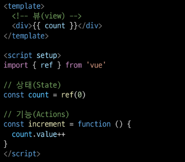
- 컴포넌트 구조의 단순화
  - 상태(State):앱 구동에 필요한 기본 데이터
  - 뷰(View): 상태를 선언적으로 매핑하여 시각화
  - 기능(Actions): 뷰에서 사용자 입력에 대해 반응적으로 상태를 변경할 수 있게 정의된 동작<br>
  > **단방향 데이터 흐름**의 간단한 표현<br>
  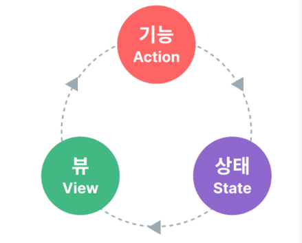

- 상태 관리의 단순성이 무너지는 시점
  - "여러 컴포넌트가 상태를 공유할 때"
    - 여러 뷰가 동일한 상태에 종속되는 경우
    - 서로 다른 뷰의 기능이 동일한 상태를 변경시켜야 하는 경우
  1. 여러 뷰가 동일한 상태에 종속되는 경우<br>
     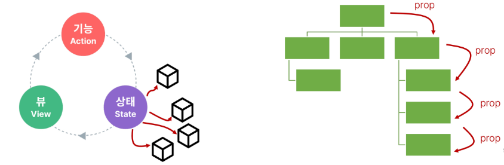
     1. 공유 상태를 공통 조상 컴포넌트로 "끌어올린" 다음 props로 전달하는 것
     2. 하지만 계층 구조가 깊어질 경우 비효율적, 관리가 어려워짐
  2. 서로 다른 뷰의 기능이 동일한 상태를 변경시켜야 하는 경우<br>
     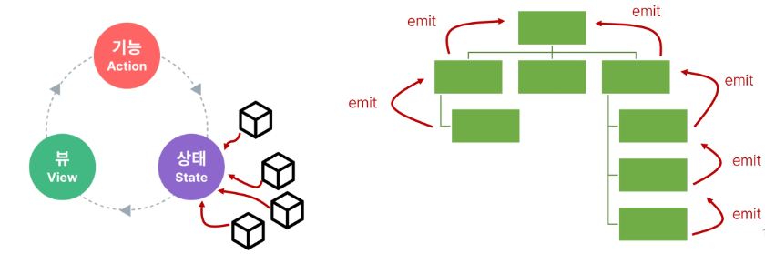
     1. 발신(emit)된 이벤트를 통해 상태의 여러 복사본을 변경 및 동기화 하는 것
     2. 마찬가지로 관리의 패턴이 깨지기 쉽고 유지 관리할 수 없는 코드가 됨 

- 해결책
  - 각 컴포넌트의 공유 상태를 추출하여, 전역에서 참조할 수 있는 저장소에서 관리
  - 컴포넌트 트리는 하나의 큰 "뷰"가 되고 모든 컴포넌트는 트리 계층 구조에 관계 없이 상태에 접근하거나 기능을 사용할 수 있음
  - Vue의 공식 상태 관리 라이브러리 === "Pinia"


## State Management Library (Pinia)
### [Pinia](https://pinia.vuejs.org/)
> Vue 공식 상태 관리 라이브러리
### Pinia 구성 요소
1. store<br>
    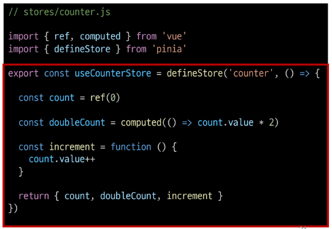
   1. 중앙저장소
   2. 모든 컴포넌트가 공유하는 상태, 기능등이 작성됨
2. state<br>
    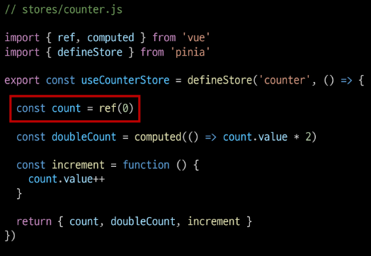
   1. 반응형 상태 (데이터)
   2. ref() === state
1. getters<br>
    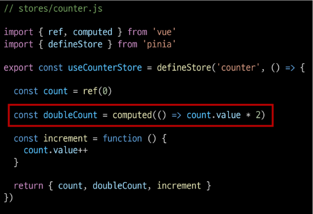
   1. 계산된 값
   2. computed() == getters
2. actions<br>
    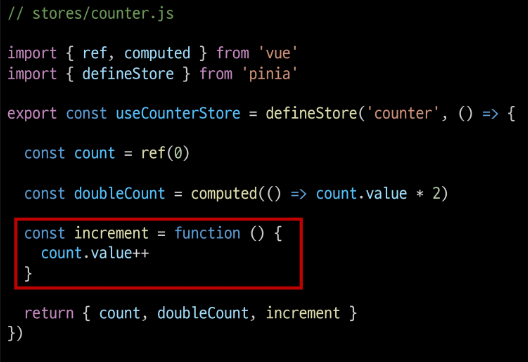
   1. 메서드
   2. function() === actions
3. plugin<br>
   1. 애플리케이션의 상태 관리에 필요한 추가 기능을 제공하거나 확장하는 도구나 모듈
   2. 애플리케이션의 상태 관리를 더욱 간편하고 유연하게 만들어주며 패키지 매니저 설치 이후 별도 설정을 통해 추가 됨

- Pinia 구성 요소 종합
  - Pinia는 store라는 저장소를 가짐
  - store는 state, getters, actions로 이루어지며 각각 ref(), computed(), function()과 동일함


### Pinia 구성 요소 활용
- State
    ```
    <!-- App.vue -->

    import { useCounterStore } from '@/stores/counter'

    const store = useCounterStore()

    // state 참조 및 변경
    console.log(store.count)
    const newNumber = store.count + 1
    ```
    ```
    <!-- App.vue -->

    <div>
        <p>state : {{ store.count }}</p>  
        <p>new_state : {{ newNumber }}</p>
    </div>
    ```
  - Store 인스턴스로 state에 접근하여 직접 읽고 쓸 수 있음
    ```
    // impossible
    // const store.count = 100 // 불가능

    // possible
    // store.count = 100 // not recommended
    ```
  - 만약 store에 state를 정의하지 않았다면 컴포넌트에서 새로 추가할 수 없음
    ```
    // impossible
    // store.ssafy = 100 // 중앙저장소에 없는 컴포넌트 추가 불가능
    ```

- Getters 
  - store의 모든 getters를 state 처럼 직접 접근할 수 있음
    ```
    <!-- App.vue -->

    // getters 참조
    console.log(store.doubleCount)
    ```
    ```
    <!-- App.vue -->

    <p> doubleCount : {{ store.doubleCount }}</p>
    ```

- Actions
  - store의 모든 actions를 직접 접근 및 호출할 수 있음
  - getters와 달리 state의 조작, 비동기, API 호출이나 다른 로직을 진행할 수 있음
    ```
    <!-- App.vue -->

    // actions 호출
    store.increment()
    ```
    ```
    <!-- App.vue -->

    <button @click = "store.increment"> +++ </button>
    ```
## Pinia 실습
### 개요
**Pinia를 활용한 Todo 프로젝트 구현**<br>
- Todo CRUD
- Todo 개수 계산
  - 전체 Todo
  - 완료된 Todo
  - 미완료된 Todo


**컴포넌트 구성**<br>
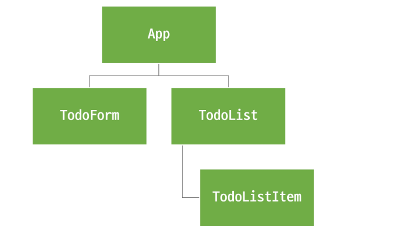


### 사전 준비
- 초기 생성된 컴포넌트 모두 삭제 (App.vue 제외)
- src/assets 내부 파일 모두 삭제
- main.js `import './assets/main.css` 삭제
- TodoListItem 컴포넌트 작성
    ```
    <!-- TodoListItem.vue -->
    <template>
        <div>
            Todolistitem
        </div>
    </template>
    ```
- TodoList 컴포넌트 작성
  - TodoListItem 컴포넌트 등록
    ```
    <!-- TodoList.vue -->

    <template>
        <div>
            <h1>TodoList</h1>
            <TodoListItem />
        </div>
    </template>

    <script setup>
    import TodoListItem from '@/components/TodoListItem.vue';
    </script>
    ```

- TodoForm 컴포넌트 작성
    ```
    <!-- TodoForm.vue -->

    <template>
        <div>
            TodoForm
        </div>
    </template>
    ```

- App 컴포넌트에 TodoList, TodoForm 컴포넌트 등록
    ```
    <!-- App.vue -->

    <template>
        <div>
            <h1> Todo PJT</h1>
            <TodoForm />
            <TodoList />
        </div>
    </template>

    <script setup>
    import TodoForm from '@/components/TodoForm.vue';
    import TodoList from '@/components/TodoList.vue';
    </script>
    ```
- 컴포넌트 구성 확인<br>
    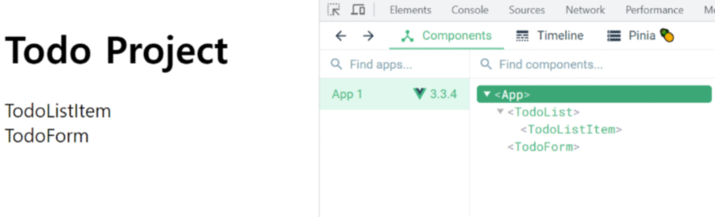
### Read Todo
- store에 임시 todos 목록 상태를 정의
    ```
    // stores/counter.js

    import { ref, computed } from 'vue'
    import { defineStore } from 'pinia'

    export const useCounterStore = defineStore('counter', () => {

        let id = 0
        const todos = ref([
            {id : id++, text :'todo 1', isDone : false},
            {id : id++, text :'todo 2', isDone : false}
        ])

        return { todos }
    })
    ```

- store의 todos 상태를 참조
  - 하위 컴포넌트인 TodoListItem을 반복하면서 개별 todo를 props로 전달
    ```
    <!-- TodoList.vue -->

    import TodoListItem from '@/components/TodoListItem.vue';
    import { useCounterStore } from '@/stores/counter';

    const store = useCounterStore()
    ```
    ```
    <!-- TodoList.vue -->

    <template>
        <div>
            <h1>TodoList</h1>
            <TodoListItem 
            v-for = "todo in store.todos"
            :key = "todo.id"
            :todo = "todo"
            />
        </div>
    </template>
    ```
- props 정의 후 데이터 출력 확인
    ```
    <!-- TodoListItem.vue -->

    <template>
        <div>

            Todolistitem
            {{ todo.text }}

        </div>
    </template>

    <script setup>
    defineProps({
        todo : Object
    })
    </script>
    ```
    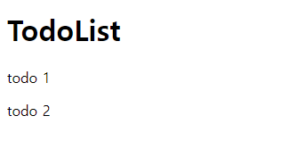

### Create Todo
- todos 목록에 todo를 생성 및 추가하는 addTodo 액션 정의
    ```
    // stores/counter.js

    const addTodo = function (todoText) {
        todos.value.push({
            id : id ++,
            text : todoText,
            isDone : false
        })
    }

    return { todos, addTodo }
    ```
- TodoForm에서 실시간으로 입력되는 사용자 데이터를 양방향 바인딩하여 반응형 변수로 할당

    ```
    <!-- TodoForm.vue -->

    import {ref} from 'vue'

    const todoText = ref('')
    ```
    ```
    <!-- TodoForm.vue -->

    <template>
        <div>
            TodoForm
            <form >
                <input type="text" v-model = "todoText">
                <input type="submit">
            </form>
        </div>
    </template>
    ```
- submit 이벤트가 발생했을 때 사용자 입력 텍스트를 인자로 전달하여 store에 정의한 addTodo 액션 메서드를 호출
    ```
    <!-- TodoForm.vue -->

    import { useCounterStore } from '@/stores/counter';

    const store = useCounterStore()

    const createTodo = function(todoText) {
        store.addTodo(todoText)
    }
    ```
    ```
    <!-- TodoForm.vue -->

    <template>
        <div>
            TodoForm
            <form @submit.prevent = "createTodo(todoText)">
                <input type="text" v-model = "todoText">
                <input type="submit">
            </form>
        </div>
    </template>
    ```
- form 요소를 선택하여 todo 입력 후 input 데이터를 초기화 할 수 있도록 처리
    ```
    <!-- TodoForm.vue -->

    <template>
        <div>
            TodoForm
            <form @submit.prevent = "createTodo(todoText)" ref ="formElem">
                <input type="text" v-model = "todoText">
                <input type="submit">
            </form>
        </div>
    </template>
    ```


    ```
    <!-- TodoForm.vue -->

    import { useCounterStore } from '@/stores/counter';
    import {ref} from 'vue'

    const todoText = ref('')
    const store = useCounterStore()
    const formElem = ref(null)

    const createTodo = function(todoText) {
        store.addTodo(todoText)
        formElem.value.reset()
    }
    ```
### Delete Todo
- todos 목록에서 특정 todo를 삭제하는 deleteTodo 액션 정의
    ```
    // stores/counter.js

    const deleteTodo = function(){
        console.log('delete')
    }

    return { todos, addTodo ,deleteTodo}
    ```
- 각 todo에 삭제 버튼을 작성
  - 버튼을 클릭하면 선택된 todo의 id를 인자로 전달해 deleteTodo 메서드 호출
    ```
    <!-- TodoListItem.vue -->

    import { useCounterStore } from '../stores/counter';

    const store = useCounterStore()
    ```
    ```
    <!-- TodoListItem.vue -->

    <template>
        <div>
            <p>{{ todo.text }}</p>
            <button @click="store.deleteTodo(todo.id)">Delete</button>
        </div>
    </template>
    ```
- 전달받은 todo의 id 값을 활용해 선택된 todo의 인덱스를 구함
  - 특정 인덱스 todo를 삭제 후 todos 배열을 재설정
    ```
    // stores/counter.js

    const deleteTodo = function(todoId){
        const index = todos.value.findIndex((todo) => todo.id === todoId)
        todos.value.splice(index, 1)
        // console.log('delete')
    }

    return { todos, addTodo ,deleteTodo}
    ```


### Update Todo
- 각 todo 상태의 isDone 속성을 변경하여 todo의 완료 유무 처리하기
  - 완료된 todo에는 취소선 스타일 적용하기
  - todos 목록에서 특정 todo의 isDone 속성을 변경하는 updateTodo 액션 정의
    ```
    // stores/counter.js

    const updateTodo = function(){
        console.log('update')
    }

    return { todos, addTodo ,deleteTodo, updateTodo}
    ```

- todo 내용을 클릭하면 선택된 todo의 id를 인자로 전달해 updateTodo 메서드를 호출
    ```
    <!-- TodoListItem.vue -->

    <template>
        <div>
            <span @click="store.updateTodo(todo.id)">
                {{ todo.text }}
            </span>
            <button @click="store.deleteTodo(todo.id)">Delete</button>
        </div>
    </template>
    ```

- 전달받은 todo의 id값을 활용해 선택된 todo와 동일 todo를 목록에서 검색
  - 일치하는 todo데이터의 isDone 속성 값을 반대로 재할당 후 새로운 todo 목록 반환
    ```
    // stores/counter.js

    const updateTodo = function(todoId){
        todos.value = todos.value.map((todo) => {
            if (todo.id === todoId) {
                todo.isDone = !todo.isDone
            }
            return todo
        })
        console.log('update')
    }
    ```

- todo 객체의 isDone 속성 값에 따라 스타일 바인딩 적용하기
    ```
    <!-- TodoListItem.vue -->

    <style  scoped>
    .is-done {
        text-decoration: line-through;
    }
    </style>
    ```
    ```
    <!-- TodoListItem.vue -->

    <template>
        <div>
            <span @click="store.updateTodo(todo.id)" :class="{'is-done' :todo.isDone}">
                {{ todo.text }}
            </span>
            <button @click="store.deleteTodo(todo.id)">Delete</button>
        </div>
    </template>
    ```
### Computed Todo ; 완료된 todo 개수 계산
- todos 배열의 길이 값을 반환하는 함수 doneTodosCount 작성(getters)

    ```
    // stores/counter.js

    const doneTodosCount = computed(() => {
        return todos.value.filter((todo) => isDone)
    })

    return { todos, addTodo ,deleteTodo, updateTodo, doneTodosCount}
    ```
- App 컴포넌트에서 doneTodosCount getter를 참조
    ```
    <!-- App.vue -->

    import { useCounterStore } from '@/stores/counter'

    const store = useCounterStore()
    ```

    ```
    <!-- App.vue -->

    <template>
        <div>
            <h1> Todo PJT</h1>
            <h2> 완료된 Todo : {{ store.doneTodosCount }}</h2>
            <TodoForm />
            <TodoList />
        </div>
    </template>
    ```
### Local Storage
> 브라우저 내에 key-value 쌍을 저장하는 웹 스토리지 객체

- Local Storage 특징
  - 페이지를 새로 고침하고 브라우저를 다시 실행해도 데이터가 유지
  - 쿠키와 다르게 네트워크 요청 시 서버로 전송되지 않음
  - 여러 탭이나 창 간에 데이터를 공유할 수 있음
- Local Storage 사용 목적
  - 웹 애플리케이션에서 사용자 설정, 상태 정보, 캐시 데이터 등을 클라이언트 측에서 보관하여 웹사이트의 성능을 향상시키고 사용자 경험을 개선하기 위함
- pinia-plugin-persistedstate
  - Pinia의 플러그인(plugin)중 하나
  - 웹 애플리케이션의 상태(state)를 브라우저의 local storage나 session storage에 영구적으로 저장하고 복원하는 기능을 제공
  - [참고](http://prazdevs.github.io/pinia-plugin-persistedstate/)
- pinia-plugin-persistedstate 설정
  - 설치 및 등록
    ```
    npm i pinia-plugin-persistedstate
    ```
    ```
    // main.js

    import { createApp } from 'vue'
    import { createPinia } from 'pinia'
    import App from './App.vue'

    // 등록
    import piniaPluginPersistedstate from 'pinia-plugin-persistedstate' 

    const app = createApp(App)
    const pinia = createPinia()

    pinia.use(piniaPluginPersistedstate)

    // app.use(createPinia())
    app.use(pinia)

    app.mount('#app')
    ```
  - 활용
    - defineStore의 3번째 인자로 관련 객체 추가
    ```
    // counter.js

    import { ref, computed } from 'vue'
    import { defineStore } from 'pinia'

    export const useCounterStore = defineStore('counter', () => {
        ...
        return { todos, addTodo, deleteTodo, updateTodo, doneTodosCount }
    }, { persist: true })
    ```

  - 적용 결과
    - 브라우저의 Local Storge에 저장되는 todos 상태<br>
    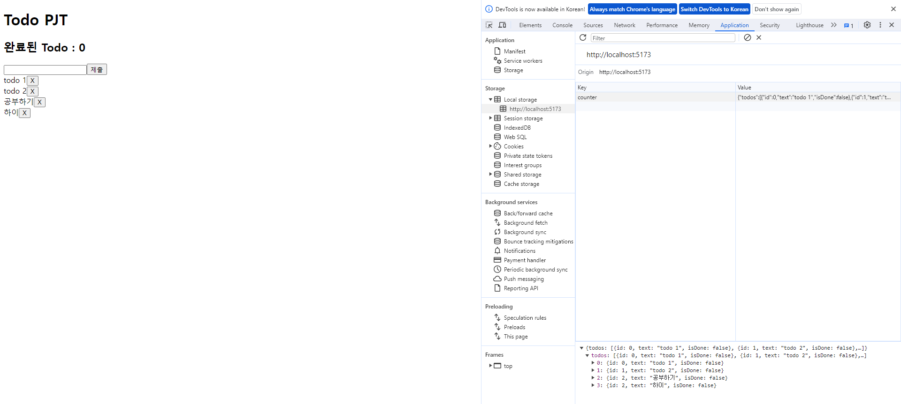

### 참고

- 그럼 이제 모든 데이터를 store에서 관리해야 할까?
  - Pinia를 사용한다고 해서 모든 데이터를 state에 넣어야 하는 것은 아님
  - 필요한 경우 pass props, emit event를 사용하여 상태를 관리할 수 있음
  - 상황에 따라 적절하게 사용하는 것이 필요

- Pinia, 언제 사용해야 할까?
  - Pinia는 공유된 상태를 관리하는 데 유용하지만, 개념에 대한 이해와 시작하는 비용이 큼
  - 애플리케이션이 단순하다면 Pinia가 없는 것이 더 효율적일 수 있음
  - 그러나 중대형 규모의 SPA를 구축하는 경우 Pinia는 자연스럽게 선택할 수 있는 단계가 오게 됨
    > 결과적으로 역할에 적절한 상황에 활용했을 때 Pinia 효용을 극대화 할 수 있음