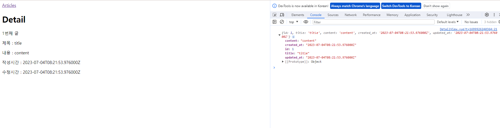

# Vue with DRF 1

2023.11.14 (Tue)
-----
## 프로젝트 개요

### DRF 프로젝트 안내

**Skeleton code 살펴보기**<br>
- Model 클래스 확인
    ```
    # articles/models.py

    from django.db import models
    from django.conf import settings


    class Article(models.Model):
        # user = models.ForeignKey(
        #     settings.AUTH_USER_MODEL, on_delete=models.CASCADE
        # )
        title = models.CharField(max_length=100)
        content = models.TextField()
        created_at = models.DateTimeField(auto_now_add=True)
        updated_at = models.DateTimeField(auto_now=True)
    ```
    ```
    # accounts/models.py

    from django.db import models
    from django.contrib.auth.models import AbstractUser


    # Create your models here.
    class User(AbstractUser):
        pass
    ```
- URL 확인
    ```
    # my_api/urls.py

    urlpatterns = [
        path('admin/', admin.site.urls),
        path('api/v1/', include('articles.urls')),
        # path('accounts/', include('dj_rest_auth.urls')),
        # path('accounts/signup/', include('dj_rest_auth.registration.urls')),
    ]
    ```
    ```
    # articles/url.py

    urlpatterns = [
        path('articles/', views.article_list),
        path('articles/<int:article_pk>/', views.article_detail),
    ]
    ```
- Serializers 확인
    ```
    # articles/serializers.py

    from rest_framework import serializers
    from .models import Article


    class ArticleListSerializer(serializers.ModelSerializer):
        class Meta:
            model = Article
            fields = ('id', 'title', 'content')


    class ArticleSerializer(serializers.ModelSerializer):
        class Meta:
            model = Article
            fields = '__all__'
            # read_only_fields = ('user',)
    ```

- views.py import 부분 확인
    ```
    # articles/views.py

    from rest_framework.response import Response
    from rest_framework.decorators import api_view
    from rest_framework import status

    # permission Decorators
    # from rest_framework.decorators import permission_classes
    # from rest_framework.permissions import IsAuthenticated

    from django.shortcuts import get_object_or_404, get_list_or_404

    from .serializers import ArticleListSerializer, ArticleSerializer
    from .models import Article
    ```
- View 함수 확인
    ```
    # articles/views.py

    @api_view(['GET', 'POST'])
    # @permission_classes([IsAuthenticated])
    def article_list(request):
        if request.method == 'GET':
            articles = get_list_or_404(Article)
            serializer = ArticleListSerializer(articles, many=True)
            return Response(serializer.data)

        elif request.method == 'POST':
            serializer = ArticleSerializer(data=request.data)
            if serializer.is_valid(raise_exception=True):
                serializer.save()
                # serializer.save(user=request.user)
                return Response(serializer.data, status=status.HTTP_201_CREATED)


    @api_view(['GET'])
    def article_detail(request, article_pk):
        article = get_object_or_404(Article, pk=article_pk)

        if request.method == 'GET':
            serializer = ArticleSerializer(article)
            print(serializer.data)
            return Response(serializer.data)
    ```
- settings.py 확인
    ```
    # settings.py

    INSTALLED_APPS = [
        'articles',
        'accounts',
        'rest_framework',
        # 'rest_framework.authtoken',
        # 'dj_rest_auth',
        # 'corsheaders',
        # 'django.contrib.sites',
        # 'allauth',
        # 'allauth.account',
        # 'allauth.socialaccount',
        # 'dj_rest_auth.registration',
        'django.contrib.admin',
        'django.contrib.auth',
        'django.contrib.contenttypes',
        'django.contrib.sessions',
        'django.contrib.messages',
        'django.contrib.staticfiles',
    ]

    # SITE_ID = 1

    # REST_FRAMEWORK = {
    #     # Authentication
    #     'DEFAULT_AUTHENTICATION_CLASSES': [
    #         'rest_framework.authentication.TokenAuthentication',
    #     ],
    #     # permission
    #     'DEFAULT_PERMISSION_CLASSES': [
    #         'rest_framework.permissions.AllowAny',
    #     ],
    # }

    MIDDLEWARE = [
        'django.middleware.security.SecurityMiddleware',
        'django.contrib.sessions.middleware.SessionMiddleware',
        # 'corsheaders.middleware.CorsMiddleware',
        'django.middleware.common.CommonMiddleware',
        'django.middleware.csrf.CsrfViewMiddleware',
        'django.contrib.auth.middleware.AuthenticationMiddleware',
        'django.contrib.messages.middleware.MessageMiddleware',
        'django.middleware.clickjacking.XFrameOptionsMiddleware',
    ]

    # CORS_ALLOWED_ORIGINS = [
    #     'http://127.0.0.1:5173',
    #     'http://localhost:5173',
    # ]
    ```
- Fixtures 확인
    ```
    # fixtures/articles.json

    [
    {
        "model": "articles.article",
        "pk": 1,
        "fields": {
            "title": "title",
            "content": "content",
            "created_at": "2023-07-04T08:21:53.976Z",
            "updated_at": "2023-07-04T08:21:53.976Z"
        }
    },
    ...
    ]
    ```
- 가상환경 생성 및 활성화
    ```
    python -m venv venv
    source venv/Scripts/activate
    ```
- 패키지 설치
    ```
    pip install -r requirements.txt
    ```
- Migration 진행
    ```
    python manage.py makemigrations
    python manage.py migrate
    ```
- Fixtures 데이터 로드
    ```
    python manage.py loaddata.articles.json
    ```
- Django 서버 실행 후, 전체 게시글 조회<br>
    

### Vue 프로젝트 안내
- Vite를 사용해 Pinia 및 Vue Router가 추가 되어있음
- pinia-plugin-persistedstate가 설치 및 등록 되어있음
- 컴포넌트 구조<br>
    
- 프로젝트 구조 <br>
    

**Skeleton code 살펴보기**<br>
- App 컴포넌트
    ```
    <!-- App.vue -->

    <template>
    <header>
        <nav>
        </nav>
    </header>
    <RouterView />
    </template>

    <script setup>
    import { RouterView } from 'vue-router'
    </script>

    <style scoped>
    </style>
    ```
- route에 등록된 컴포넌트 (Article, Create, Detail, LogIn, SignUp)

    ```
    <!-- views/...vue -->

    <template>
    <div>
    </div>
    </template>

    <script setup>

    </script>

    <style>

    </style>
    ```
- ArticleList 컴포넌트
    ```
    <!-- components/ArticleList.vue -->

    <template>
    <div>
        <h3>Article List</h3>
        <ArticleListItem />
    </div>
    </template>

    <script setup>
    import ArticleListItem from '@/components/ArticleListItem.vue'
    </script>
    ```
- ArticleListItem 컴포넌트
    ```
    <!-- components/ArticleListItem.vue -->

    <template>
    <div>
    </div>
    </template>

    <script setup>
    </script>
    ```
- routes 현황
    ```
    // router/index.js

    import { createRouter, createWebHistory } from 'vue-router'
    // import ArticleView from '@/views/ArticleView.vue'
    // import DetailView from '@/views/DetailView.vue'
    // import CreateView from '@/views/CreateView.vue'
    // import SignUpView from '@/views/SignUpView.vue'
    // import LogInView from '@/views/LogInView.vue'

    const router = createRouter({
    history: createWebHistory(import.meta.env.BASE_URL),
    routes: [
        // {
        //   path: '/',
        //   name: 'ArticleView',
        //   component: ArticleView
        // },
        ...
    ]
    })

    export default router
    ```
- store 현황
    ```
    // store/counter.js

    import { ref, computed } from 'vue'
    import { defineStore } from 'pinia'

    export const useCounterStore = defineStore('counter', () => {
    return { }
    }, { persist: true })
    ```
- main.js
    ```
    // src/main.js

    import piniaPluginPersistedstate from 'pinia-plugin-persistedstate'
    import { createApp } from 'vue'
    import { createPinia } from 'pinia'
    import App from './App.vue'
    import router from './router'

    const app = createApp(App)
    const pinia = createPinia()

    pinia.use(piniaPluginPersistedstate)
    // app.use(createPinia())
    app.use(pinia)
    app.use(router)

    app.mount('#app')
    ```

- 패키지 설치
    ```
    npm install
    ```
- 서버 실행
    ```
    npm run dev
    ```

## 메인 페이지 구현
### state 참조 및 출력
- 개요
  - ArticleView 컴포넌트에 ArticleList 컴포넌트와 ArticleListItem 컴포넌트 등록 및 출력하기
  - ArticleList와 ArticleListItem은 각각 게시글 출력을 담당

**state 참조 및 출력**<br>
- ArticleView route 관련 코드 주석 해제
    ```
    // router/index.js

    import { createRouter, createWebHistory } from 'vue-router'
    import ArticleView from '@/views/ArticleView.vue'

    const router = createRouter({
    history: createWebHistory(import.meta.env.BASE_URL),
    routes: [
        {
        path: '/',
        name: 'ArticleView',
        component: ArticleView
        },
    ]
    })
    ```
- App 컴포넌트에 ArticleView 컴포넌트로 이동하는 RouterLink 작성
    ```
    <!-- App.vue -->

    <template>
    <header>
        <nav>
            <RouterLink :to="{name:'ArticleView'}">Articles</RouterLink>
        </nav>
    </header>
    <RouterView />
    </template>

    <script setup>
    import { RouterView, RouterLink } from 'vue-router'
    </script>
    ```
- ArticleView 컴포넌트에 ArticleList 컴포넌트 등록
    ```
    <!-- views/ArticleView.vue -->

    <template>
    <div>
        <h1>Article Page</h1>
        <ArticleList />
    </div>
    </template>

    <script setup>
    import ArticleList from '@/components/ArticleList.vue';

    </script>
    ```
- store에 임시 데이터 articles 배열 작성하기
    ```
    // store/counter.js

    import { ref, computed } from 'vue'
    import { defineStore } from 'pinia'

    export const useCounterStore = defineStore('counter', () => {
        const articles = ref([
            {id:1 , title : 'Article 1', content: 'Content of article 1'},
            {id:2 , title : 'Article 2', content: 'Content of article 2'},
        ])
    

        return { articles }
    }, { persist: true })
    ```
- ArticleList 컴포넌트에서 게시글 목록 출력
  - store의 articles 데이터 참조
  - v-for을 활용하여 하위 컴포넌트에서 사용할 article 단일 객체 정보를 props로 전달
    ```
    <!-- components/ArticleList.vue -->

    <template>
    <div>
        <h3>Article List</h3>
        <ArticleListItem 
        v-for = "article in store.articles"
        :key = "article.id"
        :article = "article"
        />
    </div>
    </template>

    <script setup>
    import { useCounterStore } from '@/stores/counter';
    import ArticleListItem from '@/components/ArticleListItem.vue'

    const store = useCounterStore()
    </script>
    ```
- ArticleListItem 컴포넌트는 내려 받은 props를 정의 후 출력
    ```
    <!-- components/ArticleListItem.vue -->

    <template>
    <div>
        <h5>{{ article.id }}</h5>
        <p> {{ article.title }}</p>
        <p> {{ article.content }}</p>
    </div>
    </template>

    <script setup>
    defineProps({
        article : Object
    })
    </script>
    ```
- 메인 페이지 게시글 목록 출력 확인<br>
    

### state with DRF
> 임시 데이터가 아닌 DRF 서버에 직접 요청하여 데이터를 응답 받아 store에 저장 후 출력하기

- DRF 서버로의 AJAX 요청을 위한 axios 설치 및 관련 코드 작성
    ```
    # Vue 서버 종료 -> 설치 -> 서버 재실행
    npm install axios
    ```
    ```
    # store/counter.js

    import { ref, computed } from 'vue'
    import { defineStore } from 'pinia'
    import axios from 'axios'

    export const useCounterStore = defineStore('counter', () => {
        const articles = ref([])
        const API_URL = 'http://127.0.0.1:8000'
        return { articles ,API_URL }
    }, { persist: true })
    ```
- DRF 서버로 요청을 보내고 응답 데이터를 처리하는 getArticles 함수 작성
    ```
    // store/counter.js

    import { ref, computed } from 'vue'
    import { defineStore } from 'pinia'
    import axios from 'axios'

    export const useCounterStore = defineStore('counter', () => {
        const articles = ref([])
        const API_URL = 'http://127.0.0.1:8000'
        const getArticles = function () {
            axios({
                method : 'get',
                url : `${API_URL}/api/v1/articles/`
            })
            .then(res => {
                console.log(res)
                console.log(res.data)
            })
            .catch(err => console.log(err))
        }

        return { articles , API_URL, getArticles }
    }, { persist: true })
    ```
- ArticleView 컴포넌트가 마운트 될 때 getArticles 함수가 실행되도록 함
  - 해당 컴포넌트가 렌더링될 때 항상 최신 게시글 목록을 불러오기 위함
    ```
    <!-- views/Articleview.vue -->

    <script setup>
    import { onMounted } from 'vue';
    import { useCounterStore } from '../stores/counter';
    import ArticleList from '@/components/ArticleList.vue';

    const store = useCounterStore()

    onMounted(() => {
        store.getArticles()
    })
    </script>
    ```
- Vue와 DRF 서버를 모두 실행한 후 응답 데이터 확인
  - 에러 발생<br>
    
  - CORS policy에 의해 차단되었다

## CORS Policy
### CORS
- SOP(Same-origin policy) ; 동일 출처 정책
  - 어떤 출처(Origin)에서 불러온 문서나 스크립트가 다른 출처에서 가져온 리소스와 상호 작용하는 것을 제안하는 보안 방식
  - [참고](https://developer.mozilla.org/en-US/docs/Web/Security/Same-origin_policy)
  > 웹 애플리케이션의 도메인이 다른 도메인의 리소스에 접근하는 것을 제어하여 사용자의 개인 정보와 데이터의 보안을 보호하고, 잠재적인 보안 위협을 방지<br>
  > 잠재적으로 해로울 수 있는 문서를 분리함으로써 공격받을 수 있는 경로를 줄임
- Origin(출처) 
  - URL의 Protocol, Host, Port를 모두 포함하여 "출처"라고 부름
  - 아래 세 영역이 일치하는 경우에만 동일 출처(Same-origin)로 인정<br>
  

- CORS policy의 등장
  - 기본적으로 웹 브라우저는 같은 출처에서만 요청하는 것을 허용하며, 다른 출처로의 요청은 보안상의 이유로 차단됨
    - SOP에 의해 다른 출처의 리소스와 상호작용 하는 것이 기본적으로 제한되기 때문
  - 하지만 현대 웹 애플리케이션은 다양한 출처로부터 리소스를 요청하는 경우가 많기 때문에 CORS 정책이 필요하게 되었음
  - **CORS는 웹 서버가 리소스에 대한 서로 다른 출처 간 접근을 허용하도록 선택할 수 있는 기능을 제공**

- CORS(Cross-Origin Resource Sharing) ; 교차 출처 리소스 공유
  - 특정 출처(Origin)에서 실행 중인 웹 애플리케이션이 다른 출처의 자원에 접근할 수 있는 권한을 부여하도록 브라우저에 알려주는 체제
  - 만약 다른 출처의 리소스를 가져오기 위해서는 이를 제공하는 서버가 브라우저에게 다른 출처지만 접근해도 된다는 사실을 알려야 함 -> **CORS policy (교차 출처 리소스 공유 정책)**

- CORS policy ; 교차 출처 리소스 공유 정책
  - 다른 출처에서 온 리소스를 공유하는 것에 대한 정책
  - 서버에서 결정되며, 브라우저가 해당 정책을 확인하여 요청이 허용되는지 여부를 결정
  - 다른 출처의 리소스를 불러오려면 그 출처에서 올바른 CORS header를 포함한 응답을 반환해야 함
  - [참고](https://developer.mozilla.org/ko/docs/Web/HTTP/CORS)
- CORS 적용 방법<br>
    

### CORS Headers 설정
- Django에서는 django-cors-headers 라이브러리를 활용
  - 손쉽게 응답 객체에 CORS header를 추가해주는 라이브러리
  - [참고](https://github.com/adamchainz/django-cors-headers)

**django-cors-headers 사용하기<br>**
- 설치
    ```
    pip install django-cors-headers
    ```
- 관련 코드 주석 해제
    ```
    # settings.py

    INSTALLED_APPS = [
        ...
        'corsheaders',
        ...
    ]

    MIDDLEWARE = [
        'django.middleware.security.SecurityMiddleware',
        'django.contrib.sessions.middleware.SessionMiddleware',
        'corsheaders.middleware.CorsMiddleware',
        ...
    ]
    ```
- CORS를 허용할 Vue 프로젝트의 Domain 등록
    ```
    # settings.py

    CORS_ALLOWED_ORIGINS = [
        'http://127.0.0.1:5173',
        'http://localhost:5173',
    ]
    ```
- 메인 페이지에서 DRF 응답 데이터 재확인<br>
    
- 응답 객체에서 'Access-Control-Allow-Origin' Header 확인<br>
    

## Article CR 구현
### 전체 게시글 조회
**전체 게시글 목록 저장 및 출력<br>**
- store에 게시글 목록 데이터 저장
    ```
    // store/counter.js

    export const useCounterStore = defineStore('counter', () => {
        const articles = ref([])
        const API_URL = 'http://127.0.0.1:8000'
        const getArticles = function () {
            axios({
                method : 'get',
                url : `${API_URL}/api/v1/articles/`
            })
            .then(res => {
                // console.log(res)
                // console.log(res.data)
                articles.value = res.data

            })
            .catch(err => console.log(err))
        }

        return { articles , API_URL, getArticles }
    }, { persist: true })
    ```
- stroe에 저장된 게시글 목록 출력 확인
  - pinia-plugin-persistedstate에 의해 브라우저의 Local Storage에 저장됨 <br>
    

### 단일 게시글 조회
- DetailVue 관련 route 주석 해제
    ```
    // router/index.js

    import { createRouter, createWebHistory } from 'vue-router'
    import ArticleView from '@/views/ArticleView.vue'
    import DetailView from '@/views/DetailView.vue'


    const router = createRouter({
    history: createWebHistory(import.meta.env.BASE_URL),
    routes: [
        {
        path: '/',
        name: 'ArticleView',
        component: ArticleView
        },
        {
        path: '/articles/:id',
        name: 'DetailView',
        component: DetailView
        },
    ```
- ArticleListItem에 DetailView 컴포넌트로 가기 위한 RouterLink 작성
    ```
    <!-- components/ArticleListItem.vue -->

    <template>
    <div>
        <h5>{{ article.id }}</h5>
        <p> {{ article.title }}</p>
        <p> {{ article.content }}</p>
        <RouterLink :to="{name : 'DetailView', params: {id : article.id}}">
        [DETAIL]
        </RouterLink>

        <hr>
    </div>
    </template>

    <script setup>
    import { RouterLink } from 'vue-router';
    defineProps({
        article : Object
    })
    </script>
    ```
- DetailView가 마운트 될 때 특정 게시글을 조회하는 AJAX 요청 진행
    ```
    // views/DetailView.vue

    <template>
    <div>
    </div>
    </template>

    <script setup>
    import axios from 'axios';
    import { onMounted } from 'vue';
    import { useRoute } from 'vue-router';
    import { useCounterStore } from '../stores/counter';

    const store = useCounterStore()
    const route = useRoute()

    onMounted(()=>{
        axios({
            method:'get',
            url : `${store.API_URL}/api/v1/articles/${route.params.id}/`,
        })
        .then((res) =>{
            console.log(res.data)
        })
        .catch(err => console.log(err))
    })


    </script>
    ```
- 응답 데이터 확인<br>
    
- 응답 데이터 저장 후 출력
    ```
    // views/DetailView.vue

    <template>
    <div>
        <h1>Detail</h1>
        <div v-if = "article">
            <p>{{ article.id }}번째 글</p>
            <p>제목 : {{ article.title }}</p>
            <p>내용 : {{ article.content }}</p>
            <p>작성시간 : {{ article.created_at }} </p>
            <p>수정시간 : {{ article.updated_at }}</p>

        </div>
    </div>
    </template>
    ```

    ```
    // views/DetailView.vue

    <script setup>
    import axios from 'axios';
    import { onMounted, ref } from 'vue';
    import { useRoute } from 'vue-router';
    import { useCounterStore } from '../stores/counter';

    const store = useCounterStore()
    const route = useRoute()
    const article = ref(null)
    onMounted(()=>{
        axios({
            method:'get',
            url : `${store.API_URL}/api/v1/articles/${route.params.id}/`,
        })
        .then((res) =>{
            //console.log(res.data)
            article.value = res.data
        })
        .catch(err => console.log(err))
    })
    </script>
    ```

- 결과 확인<br>
    

### 게시글 작성
- CreateView 관련 route 주석 해제
    ```
    // router/index.js

    import { createRouter, createWebHistory } from 'vue-router'
    import ArticleView from '@/views/ArticleView.vue'
    import DetailView from '@/views/DetailView.vue'
    import CreateView from '@/views/CreateView.vue'

    const router = createRouter({
    history: createWebHistory(import.meta.env.BASE_URL),
    routes: [
        {
        path: '/',
        name: 'ArticleView',
        component: ArticleView
        },
        {
        path: '/articles/:id',
        name: 'DetailView',
        component: DetailView
        },
        {
        path: '/create',
        name: 'CreateView',
        component: CreateView
        },
        ...
    })
    ```
- ArticleView에 CreateView 컴포넌트로 가기 위한 RouterLink 작성
    ```
    <!-- views/ArticleView.vue -->

    import { onMounted } from 'vue';
    import { useCounterStore } from '../stores/counter';
    import { RouterLink } from 'vue-router';
    import ArticleList from '@/components/ArticleList.vue';
    ```
    ```
    <!-- views/ArticleView.vue -->

    <template>
    <div>
        <h1>Article Page</h1>
        <RouterLink :to="{name:'CreateView'}">
        [CREATE]</RouterLink>
        <ArticleList />
    </div>
    </template>
    ```
- v-model을 사용해 사용자 입력 데이터를 양방향 바인딩
  - v-model의 trim 수식어를 사용해 사용자 입력 데이터의 공백을 제거
    ```
    <!-- views/CreateView.vue -->

    <template>
    <div>
        <h1>게시글 작성</h1>
        <label for="title">제목 :</label>
        <input type="text" id = "title" v-model.trim = "title"><br>
        <label for="content">내용 : </label>
        <textarea name="content" id="content" v-model.trim = "content"></textarea><br>
        <input type="submit">
    </div>
    </template>
    ```

    ```
    <!-- views/CreateView.vue -->

    <script setup>
    import { ref } from 'vue';

    const title = ref(null)
    const content = ref(null)
    </script>
    ```
- 양방향 바인딩 데이터 입력 확인<br>
    
- 게시글 생성 요청을 담당하는 createArticle 함수 작성
  - 게시글 생성이 성공한다면 ArticleView 컴포넌트로 이동
    ```
    // views/CreateView.vue

    <script setup>
    import { ref } from 'vue';
    import axios from 'axios';
    import { useCounterStore } from '../stores/counter';
    import { useRouter } from 'vue-router';

    const title = ref(null)
    const content = ref(null)
    const store = useCounterStore()
    const router = useRouter()

    const createArticle = function () {
        axios({
            method : "post",
            url : `${store.API_URL}/api/v1/articles/`,
            data : {
                title : title.value,
                content : content.value
            }
        }).then(() => {
            router.push({name : 'ArticleView'})
        }).catch(err => console.log(err))
    }
    </script>
    ```

- submit 이벤트가 발생하면 createArticle 함수를 호출
  - v-on의 prevent 수식어를 사용해 submit 이벤트의 기본 동작(새로고침) 취소

    ```
    // views/CreateView.vue

    <template>
    <div>
        <h1>게시글 작성</h1>
        <form @submit.prevent = "createArticle">
            <label for="title">제목 :</label>
            <input type="text" id = "title" v-model.trim = "title"><br>
            <label for="content">내용 : </label>
            <textarea name="content" id="content" v-model.trim = "content"></textarea><br>
            <input type="submit">
        </form>
    </div>
    </template>
    ```
- 게시글 생성 결과 확인<br>
    

- 서버 측 DB 확인<br>
    